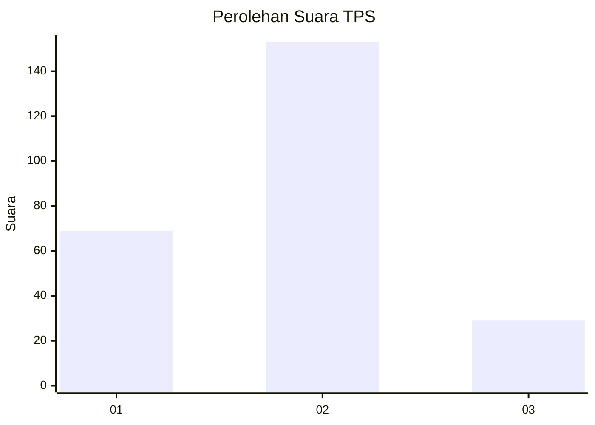
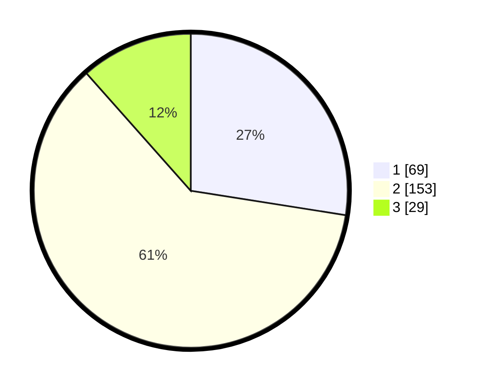

# Hasil

## Grafik

## Tabel

| No. | Nama Paslon    | Suara | Suara (raw) | Persentase |
|:--- |:-------------- | -----:| -----------:| ----------:|
| 1   | ANIES MUHAIMIN | 69    | [69][p-1]   | 27,49      |
| 2   | PRABOWO GIBRAN | 153   | [153][p-2]  | 60,96      |
| 3   | GANJAR MAHFUD  | 29    | [29][p-3]   | 11,55      |

[p-1]: https://github.com/gigit-pemilu/pemilu-2024/blob/main/pilpres/hitung-suara/sub/35-jawa-timur/sub/25-gresik/sub/14-kebomas/sub/1008-sidomukti/sub/008-tps/sub/paslon-1.txt
[p-2]: https://github.com/gigit-pemilu/pemilu-2024/blob/main/pilpres/hitung-suara/sub/35-jawa-timur/sub/25-gresik/sub/14-kebomas/sub/1008-sidomukti/sub/008-tps/sub/paslon-2.txt
[p-3]: https://github.com/gigit-pemilu/pemilu-2024/blob/main/pilpres/hitung-suara/sub/35-jawa-timur/sub/25-gresik/sub/14-kebomas/sub/1008-sidomukti/sub/008-tps/sub/paslon-3.txt

## Foto C Plano

https://sirekap-obj-formc.kpu.go.id/ff79/pemilu/ppwp/35/25/14/10/08/3525141008008-20240214-205525--6b7093e5-399d-4290-a069-02796c99f7d7.jpg

https://sirekap-obj-formc.kpu.go.id/ff79/pemilu/ppwp/35/25/14/10/08/3525141008008-20240214-205904--1617b10c-ffeb-4587-a3a0-6b80b654bac7.jpg

https://sirekap-obj-formc.kpu.go.id/ff79/pemilu/ppwp/35/25/14/10/08/3525141008008-20240214-210122--53e8e341-fbf5-4f62-9b3a-a11810f1377e.jpg

## Metadata

| Key        | Value               |
| ---------- | ------------------- |
| Time Stamp | 2024-02-15 09:00:24 |

