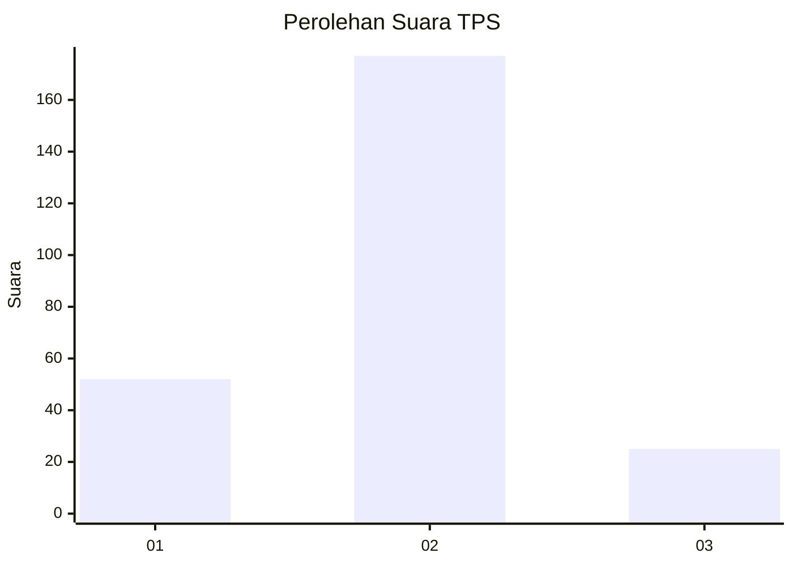

# Hasil

## Grafik

## Tabel

| No. | Nama Paslon    | Suara | Suara (raw) | Persentase |
|:--- |:-------------- | -----:| -----------:| ----------:|
| 1   | ANIES MUHAIMIN | 52    | [52][p-1]   | 20,47      |
| 2   | PRABOWO GIBRAN | 177   | [177][p-2]  | 69,69      |
| 3   | GANJAR MAHFUD  | 25    | [25][p-3]   | 9,84       |

[p-1]: https://github.com/gigit-pemilu/pemilu-2024-35-jawa-timur/blob/main/pilpres/hitung-suara/sub/35-jawa-timur/sub/25-gresik/sub/14-kebomas/sub/1008-sidomukti/sub/009-tps/sub/paslon-1.txt
[p-2]: https://github.com/gigit-pemilu/pemilu-2024-35-jawa-timur/blob/main/pilpres/hitung-suara/sub/35-jawa-timur/sub/25-gresik/sub/14-kebomas/sub/1008-sidomukti/sub/009-tps/sub/paslon-2.txt
[p-3]: https://github.com/gigit-pemilu/pemilu-2024-35-jawa-timur/blob/main/pilpres/hitung-suara/sub/35-jawa-timur/sub/25-gresik/sub/14-kebomas/sub/1008-sidomukti/sub/009-tps/sub/paslon-3.txt

## Foto C Plano

https://sirekap-obj-formc.kpu.go.id/fc5a/pemilu/ppwp/35/25/14/10/08/3525141008009-20240215-020758--7ad59389-d23b-40e0-a04e-d66c28de6bce.jpg

https://sirekap-obj-formc.kpu.go.id/fc5a/pemilu/ppwp/35/25/14/10/08/3525141008009-20240215-020925--5cf0ecb5-7907-4a0c-b20d-589721db33b5.jpg

https://sirekap-obj-formc.kpu.go.id/fc5a/pemilu/ppwp/35/25/14/10/08/3525141008009-20240215-020948--72709b38-a07a-47c3-9744-e46aba448e6f.jpg

## Metadata

| Key        | Value               |
| ---------- | ------------------- |
| Time Stamp | 2024-02-16 12:51:22 |

