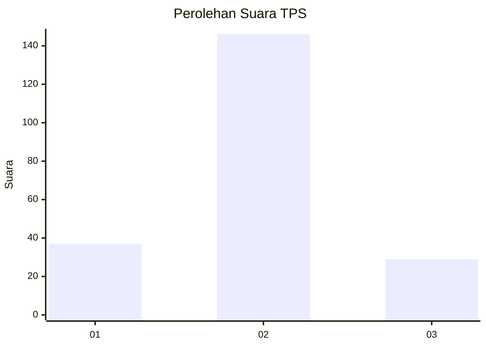
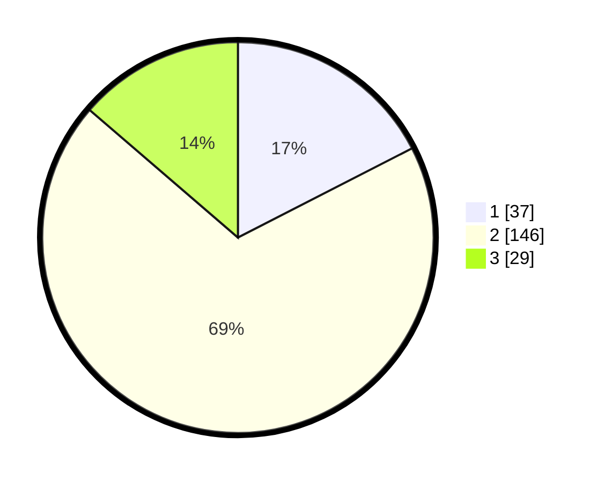

# Hasil

## Grafik

## Tabel

| No. | Nama Paslon    | Suara | Suara (raw) | Persentase |
|:--- |:-------------- | -----:| -----------:| ----------:|
| 1   | ANIES MUHAIMIN | 37    | [37][p-1]   | 17,45      |
| 2   | PRABOWO GIBRAN | 146   | [146][p-2]  | 68,87      |
| 3   | GANJAR MAHFUD  | 29    | [29][p-3]   | 13,68      |

[p-1]: https://github.com/gigit-pemilu/pemilu-2024/blob/main/pilpres/hitung-suara/sub/35-jawa-timur/sub/25-gresik/sub/14-kebomas/sub/1010-kebomas/sub/006-tps/sub/paslon-1.txt
[p-2]: https://github.com/gigit-pemilu/pemilu-2024/blob/main/pilpres/hitung-suara/sub/35-jawa-timur/sub/25-gresik/sub/14-kebomas/sub/1010-kebomas/sub/006-tps/sub/paslon-2.txt
[p-3]: https://github.com/gigit-pemilu/pemilu-2024/blob/main/pilpres/hitung-suara/sub/35-jawa-timur/sub/25-gresik/sub/14-kebomas/sub/1010-kebomas/sub/006-tps/sub/paslon-3.txt

## Foto C Plano

https://sirekap-obj-formc.kpu.go.id/c19d/pemilu/ppwp/35/25/14/10/10/3525141010006-20240214-201913--1f065f94-59b9-4e7b-9cf2-7d5976b51767.jpg

https://sirekap-obj-formc.kpu.go.id/c19d/pemilu/ppwp/35/25/14/10/10/3525141010006-20240214-202251--ead86dfd-d01b-40c2-9a1b-e650617781bf.jpg

https://sirekap-obj-formc.kpu.go.id/c19d/pemilu/ppwp/35/25/14/10/10/3525141010006-20240214-202552--d1f1b5a0-e918-4a9f-8d69-55690c71abbd.jpg

## Metadata

| Key        | Value               |
| ---------- | ------------------- |
| Time Stamp | 2024-02-16 12:51:22 |

