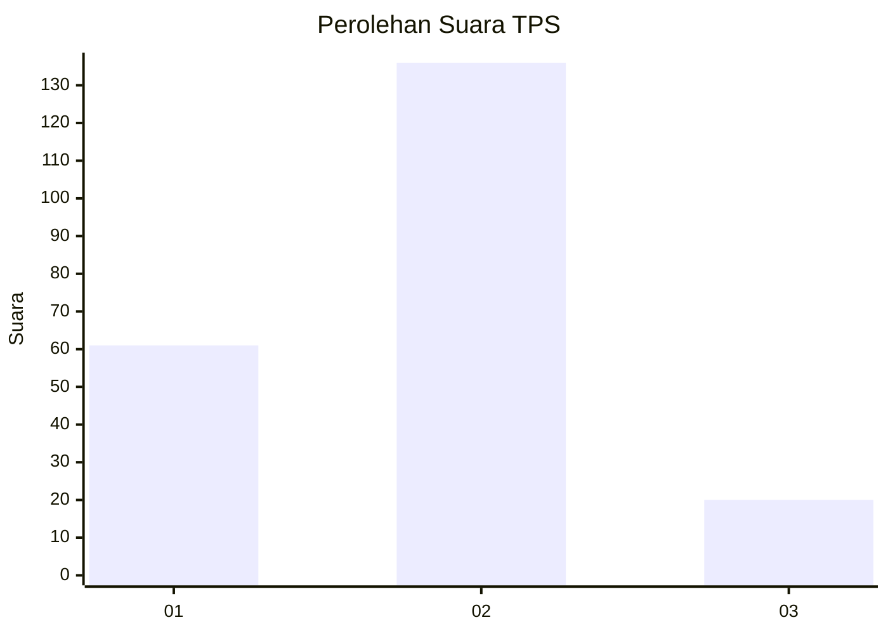
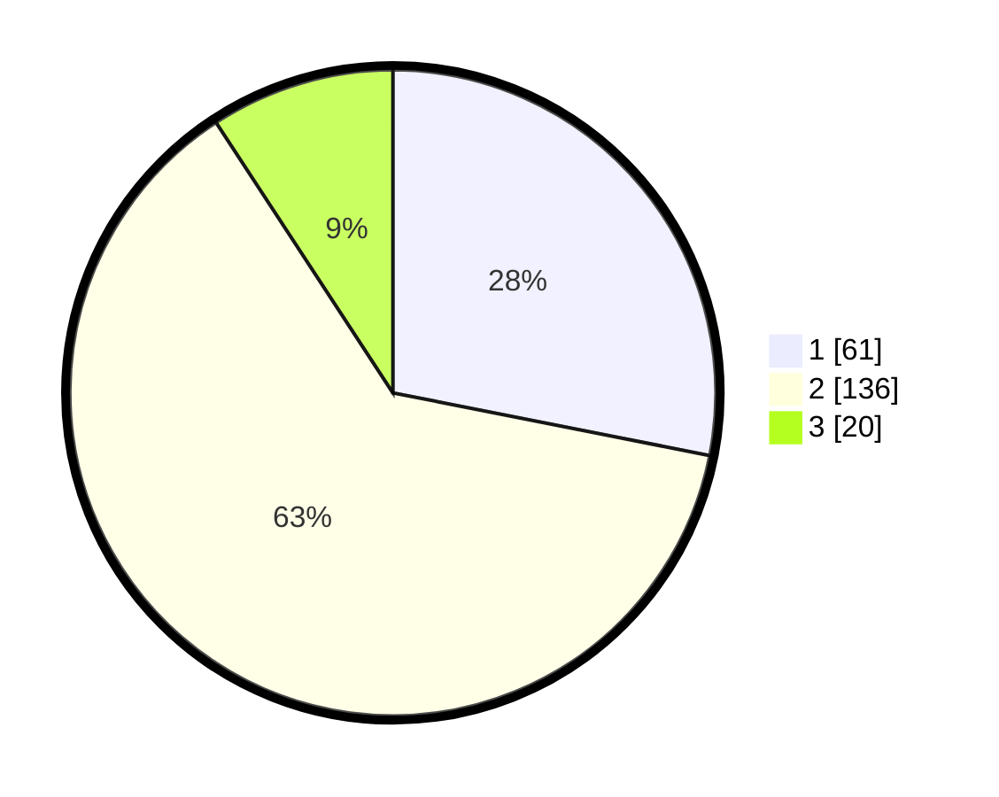

# Hasil

## Grafik

## Tabel

| No. | Nama Paslon    | Suara | Suara (raw) | Persentase |
|:--- |:-------------- | -----:| -----------:| ----------:|
| 1   | ANIES MUHAIMIN | 61    | [61][p-1]   | 28,11      |
| 2   | PRABOWO GIBRAN | 136   | [136][p-2]  | 62,67      |
| 3   | GANJAR MAHFUD  | 20    | [20][p-3]   | 9,22       |

[p-1]: https://github.com/gigit-pemilu/pemilu-2024/blob/main/pilpres/hitung-suara/sub/35-jawa-timur/sub/25-gresik/sub/14-kebomas/sub/1011-kawis-anyar/sub/005-tps/sub/paslon-1.txt
[p-2]: https://github.com/gigit-pemilu/pemilu-2024/blob/main/pilpres/hitung-suara/sub/35-jawa-timur/sub/25-gresik/sub/14-kebomas/sub/1011-kawis-anyar/sub/005-tps/sub/paslon-2.txt
[p-3]: https://github.com/gigit-pemilu/pemilu-2024/blob/main/pilpres/hitung-suara/sub/35-jawa-timur/sub/25-gresik/sub/14-kebomas/sub/1011-kawis-anyar/sub/005-tps/sub/paslon-3.txt

## Foto C Plano

https://sirekap-obj-formc.kpu.go.id/5e23/pemilu/ppwp/35/25/14/10/11/3525141011005-20240215-043351--a98bbf05-ad21-43c9-9a2f-5b5d1ed1e20b.jpg

https://sirekap-obj-formc.kpu.go.id/5e23/pemilu/ppwp/35/25/14/10/11/3525141011005-20240215-043450--3afa7eda-ca78-49af-9914-c80a5cba5d0e.jpg

https://sirekap-obj-formc.kpu.go.id/5e23/pemilu/ppwp/35/25/14/10/11/3525141011005-20240215-043542--1f831f53-7f34-4bf0-ac72-8c62635b70b1.jpg

## Metadata

| Key        | Value               |
| ---------- | ------------------- |
| Time Stamp | 2024-02-16 11:00:29 |

