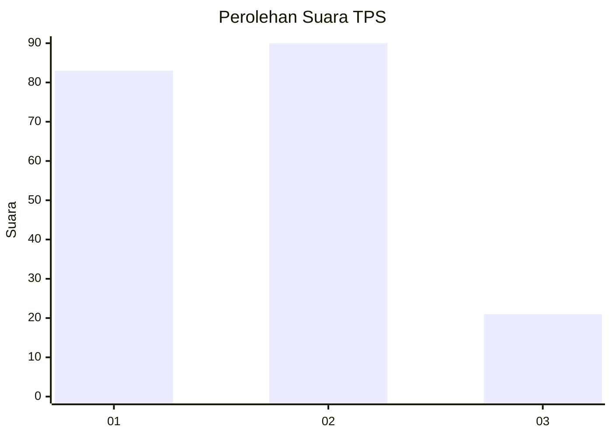
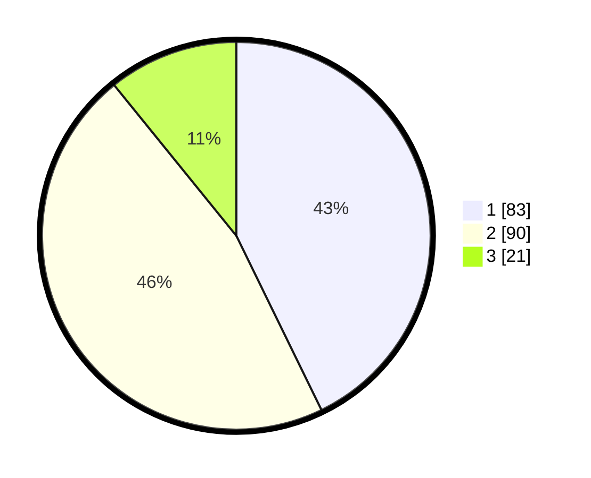

# Hasil

## Grafik

## Tabel

| No. | Nama Paslon    | Suara | Suara (raw) | Persentase |
|:--- |:-------------- | -----:| -----------:| ----------:|
| 1   | ANIES MUHAIMIN | 83    | [83][p-1]   | 42,78      |
| 2   | PRABOWO GIBRAN | 90    | [90][p-2]   | 46,39      |
| 3   | GANJAR MAHFUD  | 21    | [21][p-3]   | 10,82      |

[p-1]: https://github.com/gigit-pemilu/pemilu-2024/blob/main/pilpres/hitung-suara/sub/35-jawa-timur/sub/25-gresik/sub/14-kebomas/sub/1012-ngargosari/sub/005-tps/sub/paslon-1.txt
[p-2]: https://github.com/gigit-pemilu/pemilu-2024/blob/main/pilpres/hitung-suara/sub/35-jawa-timur/sub/25-gresik/sub/14-kebomas/sub/1012-ngargosari/sub/005-tps/sub/paslon-2.txt
[p-3]: https://github.com/gigit-pemilu/pemilu-2024/blob/main/pilpres/hitung-suara/sub/35-jawa-timur/sub/25-gresik/sub/14-kebomas/sub/1012-ngargosari/sub/005-tps/sub/paslon-3.txt

## Foto C Plano

https://sirekap-obj-formc.kpu.go.id/f59b/pemilu/ppwp/35/25/14/10/12/3525141012005-20240215-013355--bd6b4a9f-45c6-4d73-a215-dd8f0f749ad5.jpg

https://sirekap-obj-formc.kpu.go.id/f59b/pemilu/ppwp/35/25/14/10/12/3525141012005-20240215-013945--8be3d940-9858-44a5-b9be-827f43a619fd.jpg

https://sirekap-obj-formc.kpu.go.id/f59b/pemilu/ppwp/35/25/14/10/12/3525141012005-20240215-014239--5c8ca681-fbf5-42e0-9da2-4c6d4f469d07.jpg

## Metadata

| Key        | Value               |
| ---------- | ------------------- |
| Time Stamp | 2024-02-15 15:00:29 |

