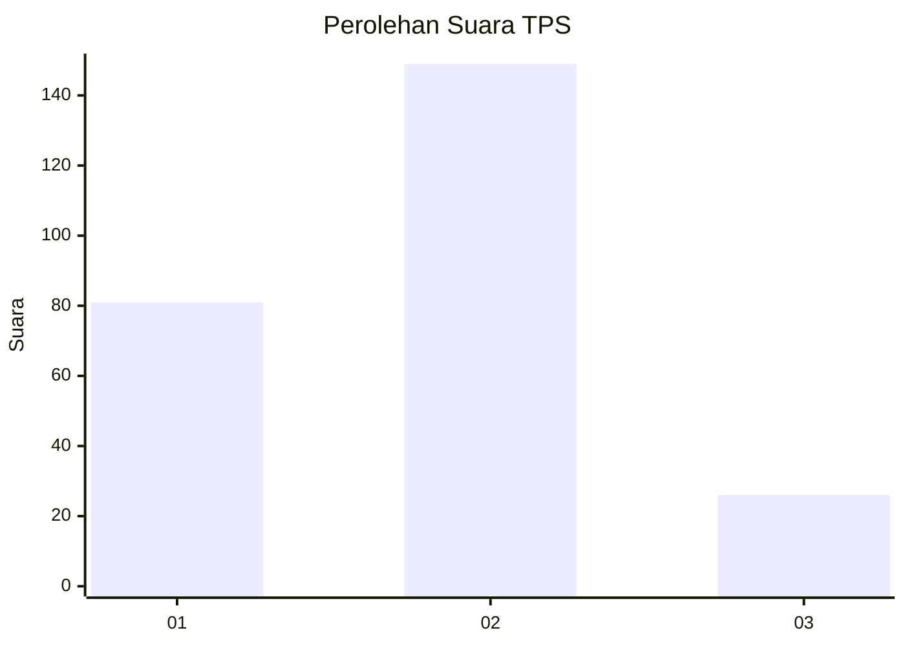
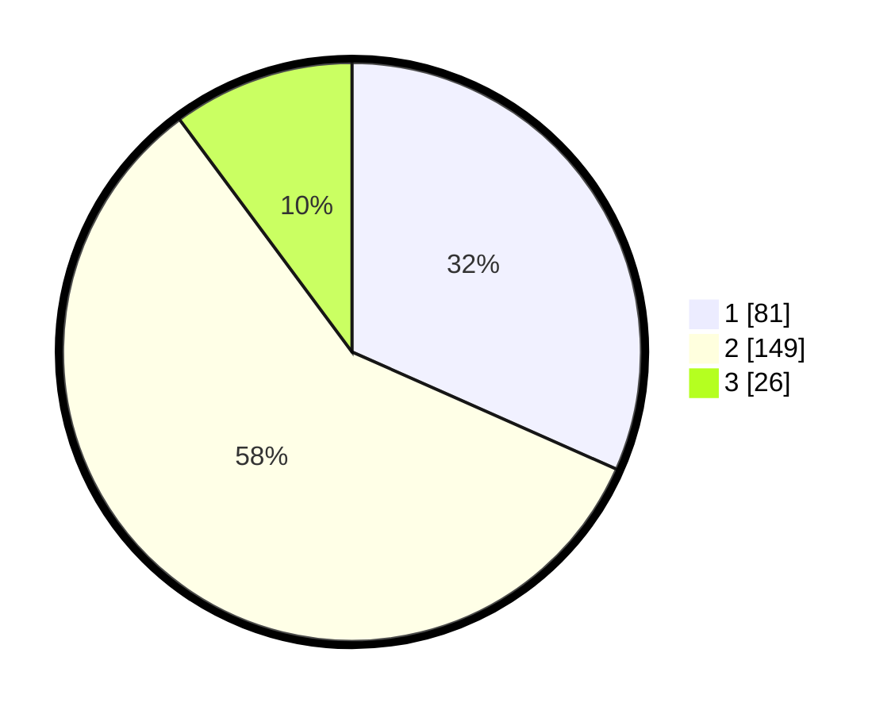

# Hasil

## Grafik

## Tabel

| No. | Nama Paslon    | Suara | Suara (raw) | Persentase |
|:--- |:-------------- | -----:| -----------:| ----------:|
| 1   | ANIES MUHAIMIN | 81    | [81][p-1]   | 31,64      |
| 2   | PRABOWO GIBRAN | 149   | [149][p-2]  | 58,20      |
| 3   | GANJAR MAHFUD  | 26    | [26][p-3]   | 10,16      |

[p-1]: https://github.com/gigit-pemilu/pemilu-2024/blob/main/pilpres/hitung-suara/sub/35-jawa-timur/sub/25-gresik/sub/14-kebomas/sub/1014-gending/sub/004-tps/sub/paslon-1.txt
[p-2]: https://github.com/gigit-pemilu/pemilu-2024/blob/main/pilpres/hitung-suara/sub/35-jawa-timur/sub/25-gresik/sub/14-kebomas/sub/1014-gending/sub/004-tps/sub/paslon-2.txt
[p-3]: https://github.com/gigit-pemilu/pemilu-2024/blob/main/pilpres/hitung-suara/sub/35-jawa-timur/sub/25-gresik/sub/14-kebomas/sub/1014-gending/sub/004-tps/sub/paslon-3.txt

## Foto C Plano

https://sirekap-obj-formc.kpu.go.id/cded/pemilu/ppwp/35/25/14/10/14/3525141014004-20240215-022511--4dcf3c45-1db6-49d5-b7f8-8dea54f29be6.jpg

https://sirekap-obj-formc.kpu.go.id/cded/pemilu/ppwp/35/25/14/10/14/3525141014004-20240214-222114--36ac6673-d0e3-4c66-83ef-a3be94f51e90.jpg

https://sirekap-obj-formc.kpu.go.id/cded/pemilu/ppwp/35/25/14/10/14/3525141014004-20240214-222151--64b2653e-d28c-44b9-8322-98bf7e9b5292.jpg

## Metadata

| Key        | Value               |
| ---------- | ------------------- |
| Time Stamp | 2024-02-16 13:00:29 |

