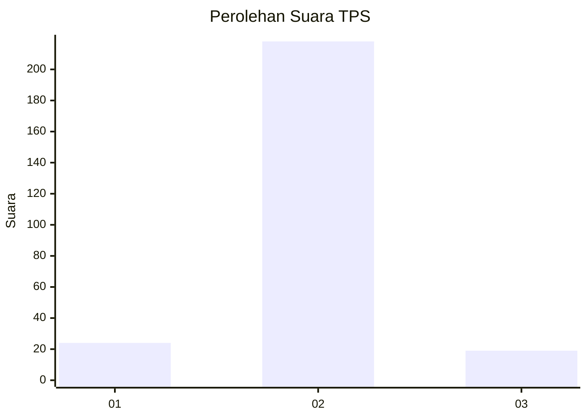
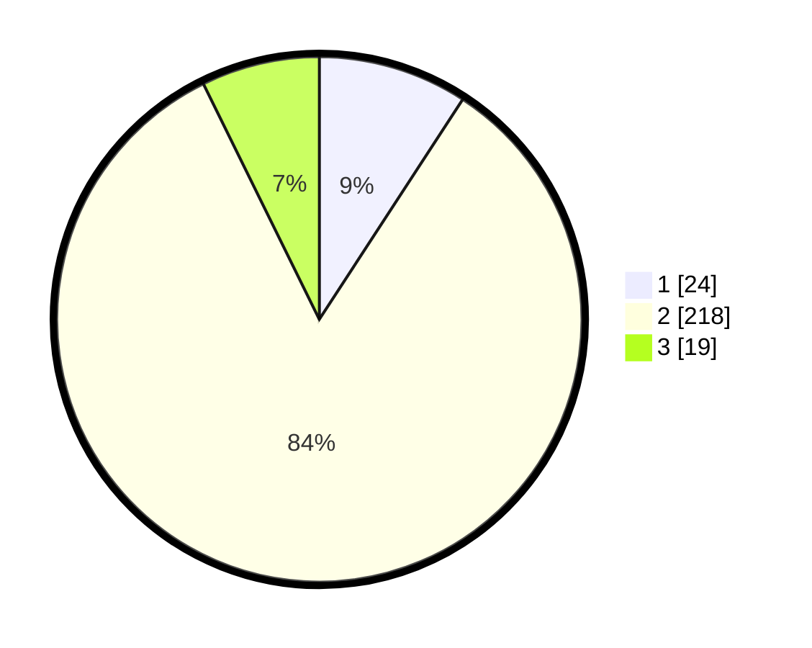

# Hasil

## Grafik

## Tabel

| No. | Nama Paslon    | Suara | Suara (raw) | Persentase |
|:--- |:-------------- | -----:| -----------:| ----------:|
| 1   | ANIES MUHAIMIN | 24    | [24][p-1]   | 9,20       |
| 2   | PRABOWO GIBRAN | 218   | [218][p-2]  | 83,52      |
| 3   | GANJAR MAHFUD  | 19    | [19][p-3]   | 7,28       |

[p-1]: https://github.com/gigit-pemilu/pemilu-2024/blob/main/pilpres/hitung-suara/sub/35-jawa-timur/sub/25-gresik/sub/14-kebomas/sub/2001-dahanrejo/sub/005-tps/sub/paslon-1.txt
[p-2]: https://github.com/gigit-pemilu/pemilu-2024/blob/main/pilpres/hitung-suara/sub/35-jawa-timur/sub/25-gresik/sub/14-kebomas/sub/2001-dahanrejo/sub/005-tps/sub/paslon-2.txt
[p-3]: https://github.com/gigit-pemilu/pemilu-2024/blob/main/pilpres/hitung-suara/sub/35-jawa-timur/sub/25-gresik/sub/14-kebomas/sub/2001-dahanrejo/sub/005-tps/sub/paslon-3.txt

## Foto C Plano

https://sirekap-obj-formc.kpu.go.id/fb5b/pemilu/ppwp/35/25/14/20/01/3525142001005-20240215-023539--e7a7cfbf-922e-4293-9bdd-abc5f15c76d0.jpg

https://sirekap-obj-formc.kpu.go.id/fb5b/pemilu/ppwp/35/25/14/20/01/3525142001005-20240215-022349--16520e98-1337-4d28-b1e4-2754ce5c8a06.jpg

https://sirekap-obj-formc.kpu.go.id/fb5b/pemilu/ppwp/35/25/14/20/01/3525142001005-20240215-023639--53b11afb-f34e-4fcc-8927-c8cd971b032b.jpg

## Metadata

| Key        | Value               |
| ---------- | ------------------- |
| Time Stamp | 2024-02-15 12:00:28 |

