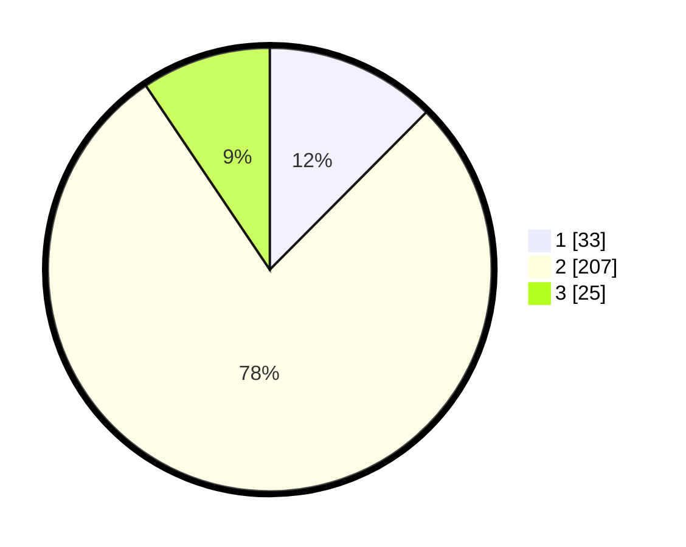

# Hasil

## Grafik

## Tabel

| No. | Nama Paslon    | Suara | Suara (raw) | Persentase |
|:--- |:-------------- | -----:| -----------:| ----------:|
| 1   | ANIES MUHAIMIN | 33    | [33][p-1]   | 12,45      |
| 2   | PRABOWO GIBRAN | 207   | [207][p-2]  | 78,11      |
| 3   | GANJAR MAHFUD  | 25    | [25][p-3]   | 9,43       |

[p-1]: https://github.com/gigit-pemilu/pemilu-2024-35-jawa-timur/blob/main/pilpres/hitung-suara/sub/35-jawa-timur/sub/25-gresik/sub/14-kebomas/sub/2002-kembangan/sub/008-tps/sub/paslon-1.txt
[p-2]: https://github.com/gigit-pemilu/pemilu-2024-35-jawa-timur/blob/main/pilpres/hitung-suara/sub/35-jawa-timur/sub/25-gresik/sub/14-kebomas/sub/2002-kembangan/sub/008-tps/sub/paslon-2.txt
[p-3]: https://github.com/gigit-pemilu/pemilu-2024-35-jawa-timur/blob/main/pilpres/hitung-suara/sub/35-jawa-timur/sub/25-gresik/sub/14-kebomas/sub/2002-kembangan/sub/008-tps/sub/paslon-3.txt

## Foto C Plano

https://sirekap-obj-formc.kpu.go.id/009f/pemilu/ppwp/35/25/14/20/02/3525142002008-20240215-033419--852dfab8-4e06-47ee-a4bc-89bad71db861.jpg

https://sirekap-obj-formc.kpu.go.id/009f/pemilu/ppwp/35/25/14/20/02/3525142002008-20240215-033441--5b643dbd-e64e-43ae-9a26-64e01282e333.jpg

https://sirekap-obj-formc.kpu.go.id/009f/pemilu/ppwp/35/25/14/20/02/3525142002008-20240215-033522--91bf7446-f46e-4e8a-94d5-959bd655c715.jpg

## Metadata

| Key        | Value               |
| ---------- | ------------------- |
| Time Stamp | 2024-02-16 14:00:34 |

