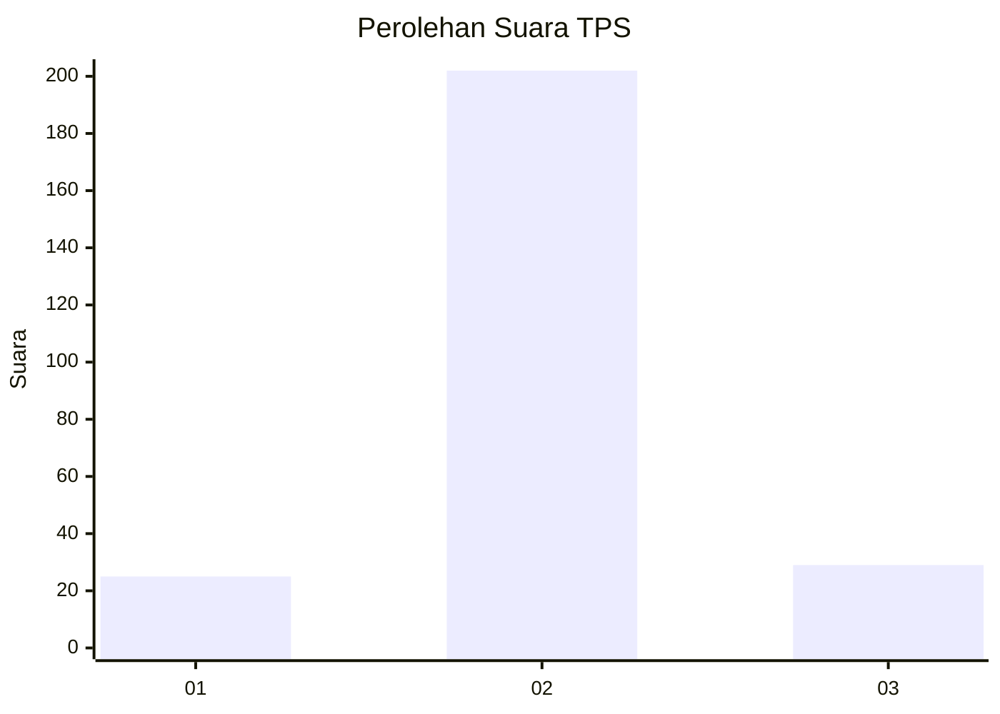
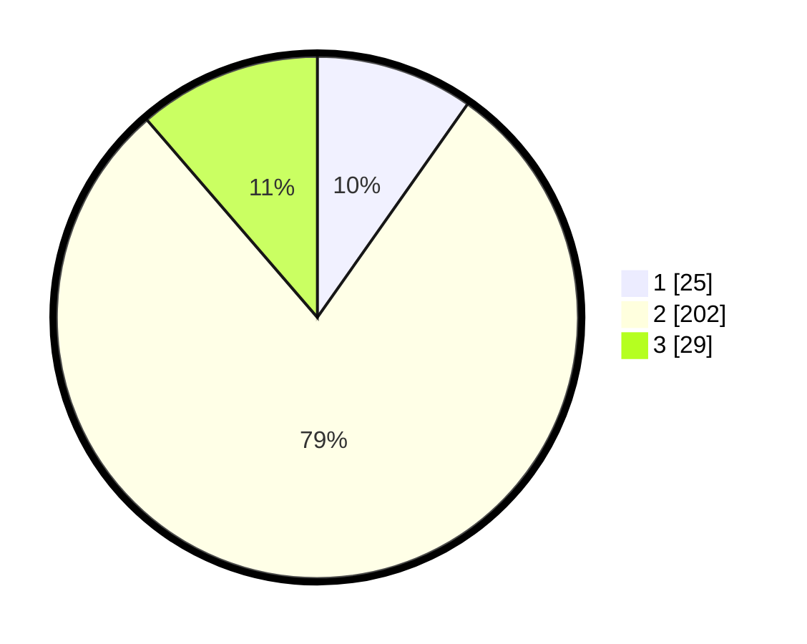

# Hasil

## Grafik

## Tabel

| No. | Nama Paslon    | Suara | Suara (raw) | Persentase |
|:--- |:-------------- | -----:| -----------:| ----------:|
| 1   | ANIES MUHAIMIN | 25    | [25][p-1]   | 9,77       |
| 2   | PRABOWO GIBRAN | 202   | [202][p-2]  | 78,91      |
| 3   | GANJAR MAHFUD  | 29    | [29][p-3]   | 11,33      |

[p-1]: https://github.com/gigit-pemilu/pemilu-2024/blob/main/pilpres/hitung-suara/sub/35-jawa-timur/sub/25-gresik/sub/14-kebomas/sub/2003-kedayang/sub/002-tps/sub/paslon-1.txt
[p-2]: https://github.com/gigit-pemilu/pemilu-2024/blob/main/pilpres/hitung-suara/sub/35-jawa-timur/sub/25-gresik/sub/14-kebomas/sub/2003-kedayang/sub/002-tps/sub/paslon-2.txt
[p-3]: https://github.com/gigit-pemilu/pemilu-2024/blob/main/pilpres/hitung-suara/sub/35-jawa-timur/sub/25-gresik/sub/14-kebomas/sub/2003-kedayang/sub/002-tps/sub/paslon-3.txt

## Foto C Plano

https://sirekap-obj-formc.kpu.go.id/9f1e/pemilu/ppwp/35/25/14/20/03/3525142003002-20240215-144701--20c7a3ab-3fc5-4ece-84d8-775495fe840d.jpg

https://sirekap-obj-formc.kpu.go.id/9f1e/pemilu/ppwp/35/25/14/20/03/3525142003002-20240215-144724--98d91229-1ec3-4528-aadf-3a7bc4ed2a31.jpg

https://sirekap-obj-formc.kpu.go.id/9f1e/pemilu/ppwp/35/25/14/20/03/3525142003002-20240215-144739--f42f2ff6-5831-4a7c-9b85-5f8fd7dbd49c.jpg

## Metadata

| Key        | Value               |
| ---------- | ------------------- |
| Time Stamp | 2024-02-16 12:51:22 |

