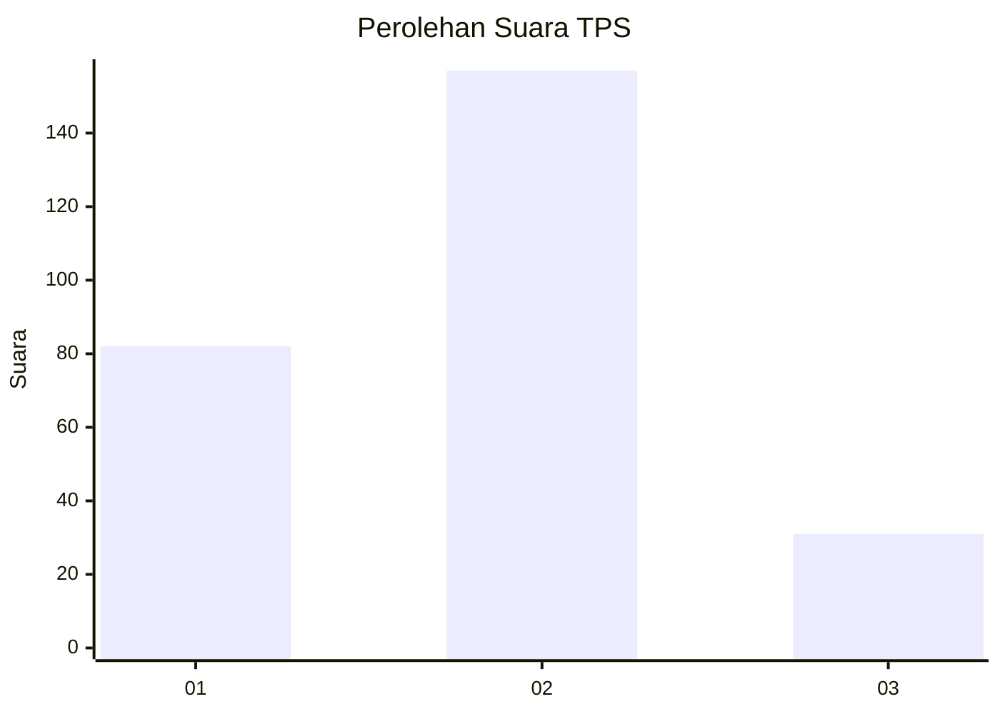
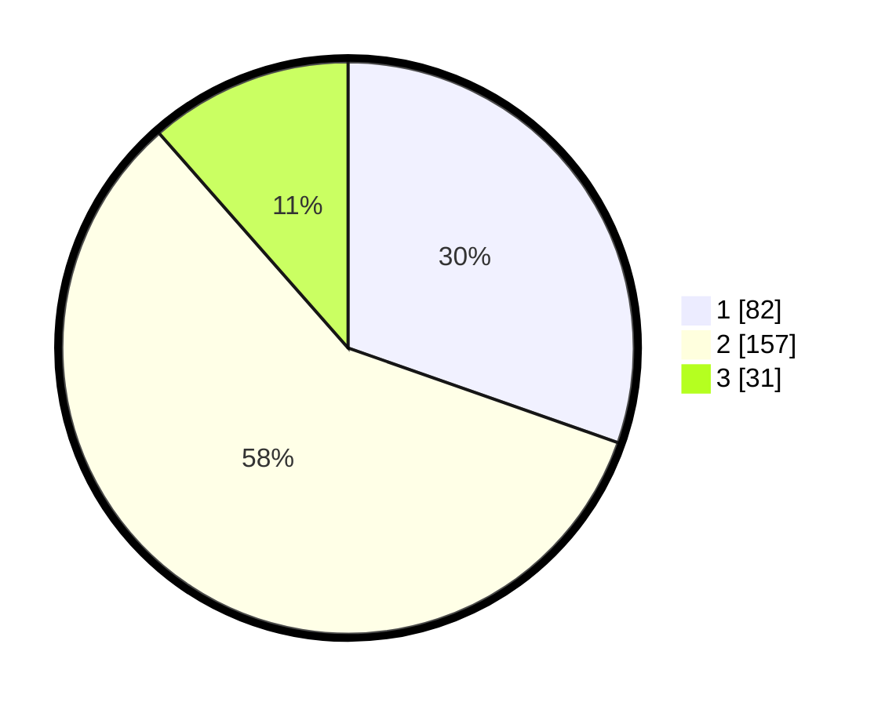

# Hasil

## Grafik

## Tabel

| No. | Nama Paslon    | Suara | Suara (raw) | Persentase |
|:--- |:-------------- | -----:| -----------:| ----------:|
| 1   | ANIES MUHAIMIN | 82    | [82][p-1]   | 30,37      |
| 2   | PRABOWO GIBRAN | 157   | [157][p-2]  | 58,15      |
| 3   | GANJAR MAHFUD  | 31    | [31][p-3]   | 11,48      |

[p-1]: https://github.com/gigit-pemilu/pemilu-2024-35-jawa-timur/blob/main/pilpres/hitung-suara/sub/35-jawa-timur/sub/25-gresik/sub/14-kebomas/sub/2004-randuagung/sub/002-tps/sub/paslon-1.txt
[p-2]: https://github.com/gigit-pemilu/pemilu-2024-35-jawa-timur/blob/main/pilpres/hitung-suara/sub/35-jawa-timur/sub/25-gresik/sub/14-kebomas/sub/2004-randuagung/sub/002-tps/sub/paslon-2.txt
[p-3]: https://github.com/gigit-pemilu/pemilu-2024-35-jawa-timur/blob/main/pilpres/hitung-suara/sub/35-jawa-timur/sub/25-gresik/sub/14-kebomas/sub/2004-randuagung/sub/002-tps/sub/paslon-3.txt

## Foto C Plano

https://sirekap-obj-formc.kpu.go.id/2c46/pemilu/ppwp/35/25/14/20/04/3525142004002-20240214-235421--1a94ea71-ec03-433d-bdb3-232a476f6cd1.jpg

https://sirekap-obj-formc.kpu.go.id/2c46/pemilu/ppwp/35/25/14/20/04/3525142004002-20240214-235944--2dc41609-8a93-4cf5-ba29-f40a8af7ddd7.jpg

https://sirekap-obj-formc.kpu.go.id/2c46/pemilu/ppwp/35/25/14/20/04/3525142004002-20240215-000415--7623a86a-0d2f-49c1-ba46-a03370acc31a.jpg

## Metadata

| Key        | Value               |
| ---------- | ------------------- |
| Time Stamp | 2024-02-16 14:00:34 |

