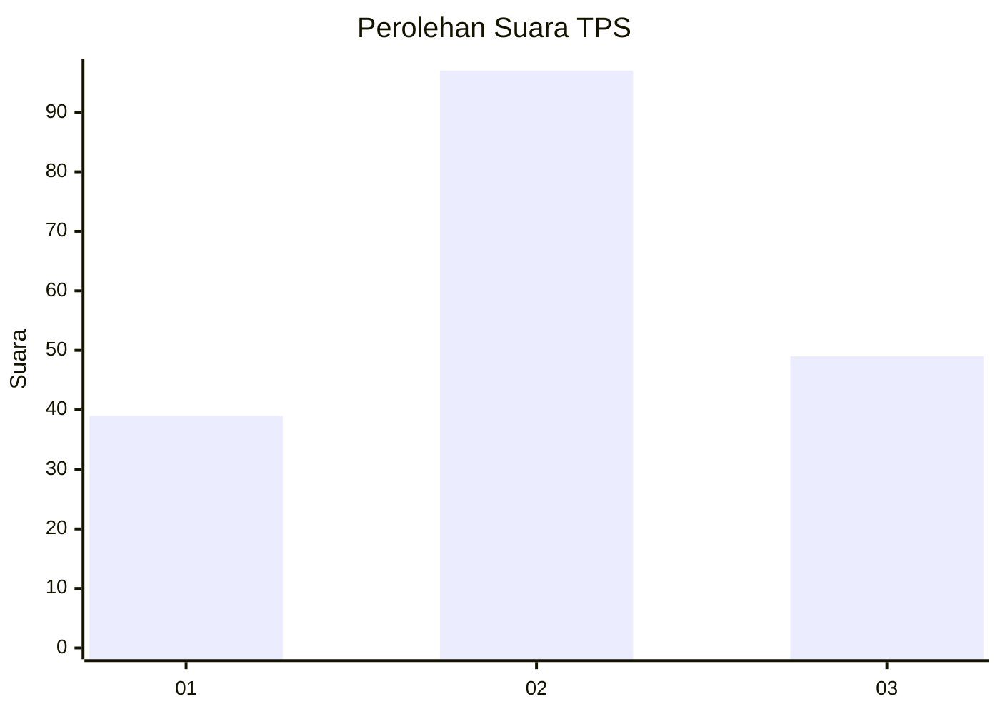
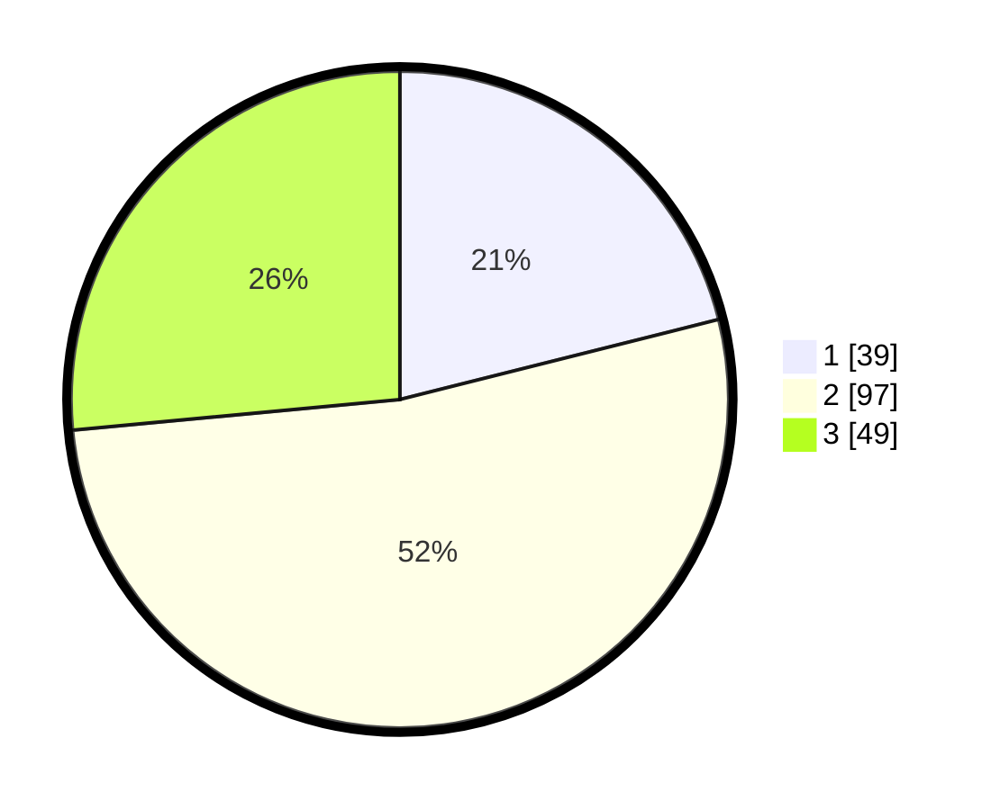

# Hasil

## Grafik

## Tabel

| No. | Nama Paslon    | Suara | Suara (raw) | Persentase |
|:--- |:-------------- | -----:| -----------:| ----------:|
| 1   | ANIES MUHAIMIN | 39    | [39][p-1]   | 21,08      |
| 2   | PRABOWO GIBRAN | 97    | [97][p-2]   | 52,43      |
| 3   | GANJAR MAHFUD  | 49    | [49][p-3]   | 26,49      |

[p-1]: https://github.com/gigit-pemilu/pemilu-2024/blob/main/pilpres/hitung-suara/sub/35-jawa-timur/sub/25-gresik/sub/14-kebomas/sub/2004-randuagung/sub/013-tps/sub/paslon-1.txt
[p-2]: https://github.com/gigit-pemilu/pemilu-2024/blob/main/pilpres/hitung-suara/sub/35-jawa-timur/sub/25-gresik/sub/14-kebomas/sub/2004-randuagung/sub/013-tps/sub/paslon-2.txt
[p-3]: https://github.com/gigit-pemilu/pemilu-2024/blob/main/pilpres/hitung-suara/sub/35-jawa-timur/sub/25-gresik/sub/14-kebomas/sub/2004-randuagung/sub/013-tps/sub/paslon-3.txt

## Foto C Plano

https://sirekap-obj-formc.kpu.go.id/1c0b/pemilu/ppwp/35/25/14/20/04/3525142004013-20240214-205233--c902a2bf-3883-4660-8d7d-7aa9eea6c0a0.jpg

https://sirekap-obj-formc.kpu.go.id/1c0b/pemilu/ppwp/35/25/14/20/04/3525142004013-20240214-205411--de61dc57-5ba3-436e-aace-a6d7811d8e82.jpg

https://sirekap-obj-formc.kpu.go.id/1c0b/pemilu/ppwp/35/25/14/20/04/3525142004013-20240214-205708--f01f393e-ba0a-4a38-965b-3fa0a4bf2349.jpg

## Metadata

| Key        | Value               |
| ---------- | ------------------- |
| Time Stamp | 2024-02-16 14:00:34 |

