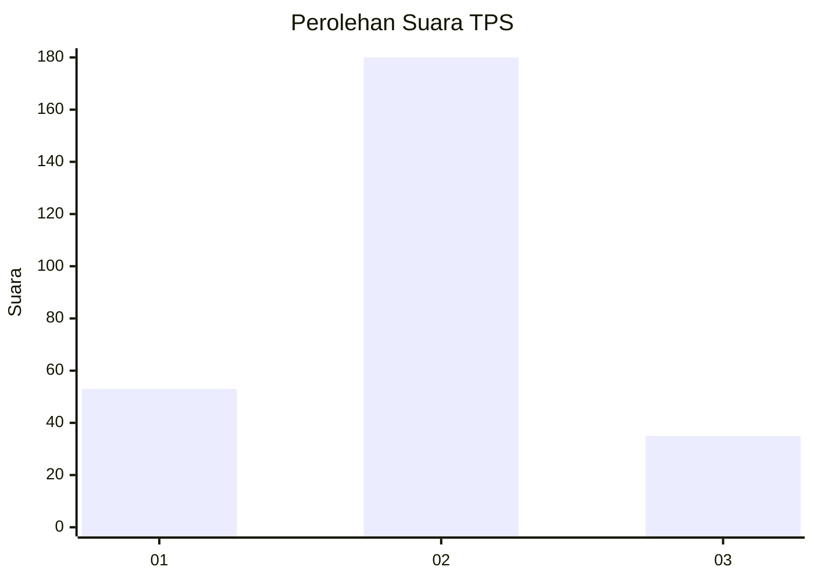
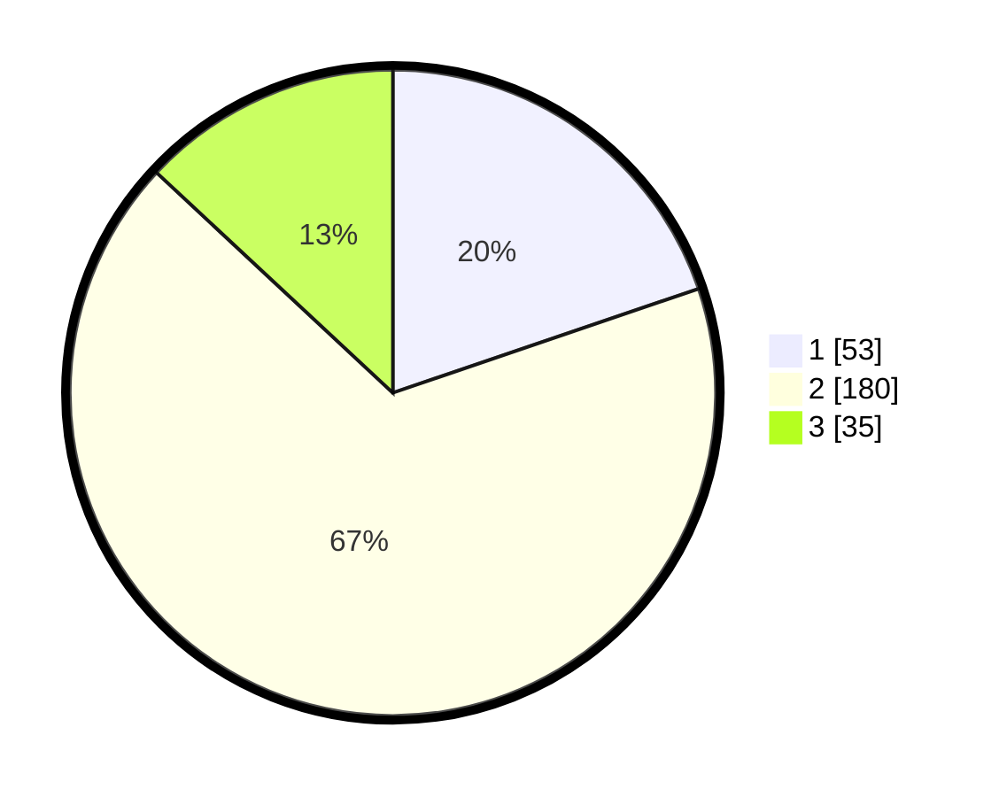

# Hasil

## Grafik

## Tabel

| No. | Nama Paslon    | Suara | Suara (raw) | Persentase |
|:--- |:-------------- | -----:| -----------:| ----------:|
| 1   | ANIES MUHAIMIN | 53    | [53][p-1]   | 19,78      |
| 2   | PRABOWO GIBRAN | 180   | [180][p-2]  | 67,16      |
| 3   | GANJAR MAHFUD  | 35    | [35][p-3]   | 13,06      |

[p-1]: https://github.com/gigit-pemilu/pemilu-2024/blob/main/pilpres/hitung-suara/sub/35-jawa-timur/sub/25-gresik/sub/14-kebomas/sub/2004-randuagung/sub/020-tps/sub/paslon-1.txt
[p-2]: https://github.com/gigit-pemilu/pemilu-2024/blob/main/pilpres/hitung-suara/sub/35-jawa-timur/sub/25-gresik/sub/14-kebomas/sub/2004-randuagung/sub/020-tps/sub/paslon-2.txt
[p-3]: https://github.com/gigit-pemilu/pemilu-2024/blob/main/pilpres/hitung-suara/sub/35-jawa-timur/sub/25-gresik/sub/14-kebomas/sub/2004-randuagung/sub/020-tps/sub/paslon-3.txt

## Foto C Plano

https://sirekap-obj-formc.kpu.go.id/01b3/pemilu/ppwp/35/25/14/20/04/3525142004020-20240216-091730--4ab0ed10-241f-4b34-93b3-5beea4ab36ad.jpg

https://sirekap-obj-formc.kpu.go.id/01b3/pemilu/ppwp/35/25/14/20/04/3525142004020-20240214-220817--4bda3943-7c2c-43b2-9293-297fa3f72461.jpg

https://sirekap-obj-formc.kpu.go.id/01b3/pemilu/ppwp/35/25/14/20/04/3525142004020-20240214-220935--8047244d-cf36-4ad5-af46-974effee3a75.jpg

## Metadata

| Key        | Value               |
| ---------- | ------------------- |
| Time Stamp | 2024-02-17 10:30:03 |

