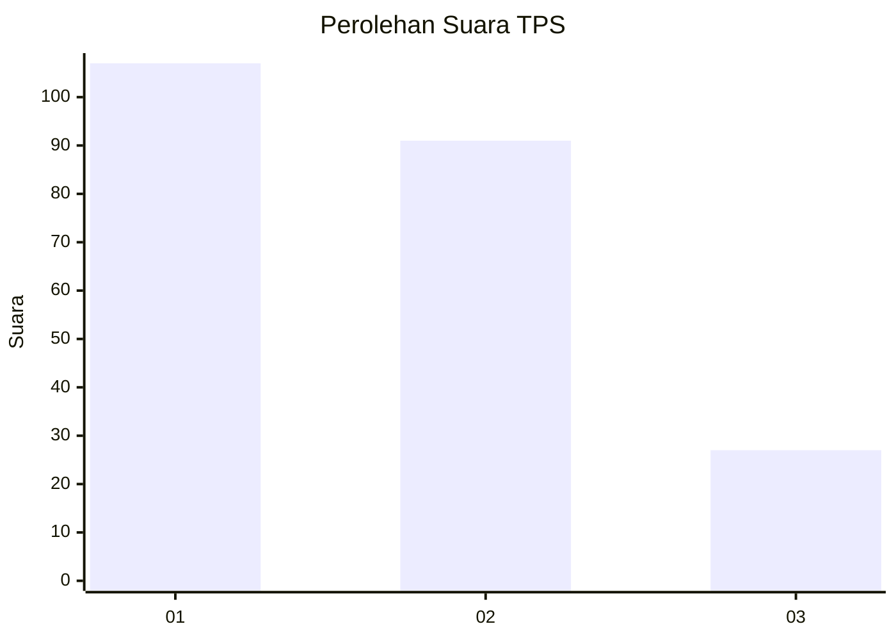
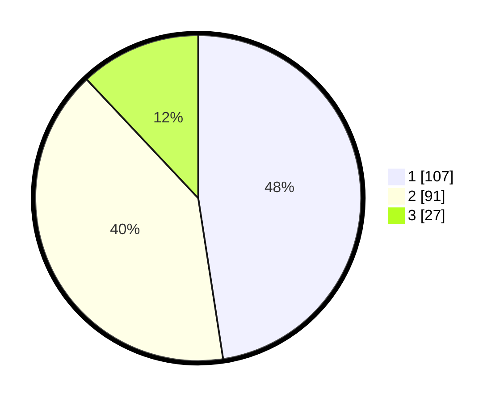

# Hasil

## Grafik

## Tabel

| No. | Nama Paslon    | Suara | Suara (raw) | Persentase |
|:--- |:-------------- | -----:| -----------:| ----------:|
| 1   | ANIES MUHAIMIN | 107   | [107][p-1]  | 47,56      |
| 2   | PRABOWO GIBRAN | 91    | [91][p-2]   | 40,44      |
| 3   | GANJAR MAHFUD  | 27    | [27][p-3]   | 12,00      |

[p-1]: https://github.com/gigit-pemilu/pemilu-2024/blob/main/pilpres/hitung-suara/sub/35-jawa-timur/sub/25-gresik/sub/14-kebomas/sub/2004-randuagung/sub/026-tps/sub/paslon-1.txt
[p-2]: https://github.com/gigit-pemilu/pemilu-2024/blob/main/pilpres/hitung-suara/sub/35-jawa-timur/sub/25-gresik/sub/14-kebomas/sub/2004-randuagung/sub/026-tps/sub/paslon-2.txt
[p-3]: https://github.com/gigit-pemilu/pemilu-2024/blob/main/pilpres/hitung-suara/sub/35-jawa-timur/sub/25-gresik/sub/14-kebomas/sub/2004-randuagung/sub/026-tps/sub/paslon-3.txt

## Foto C Plano

https://sirekap-obj-formc.kpu.go.id/d3e2/pemilu/ppwp/35/25/14/20/04/3525142004026-20240215-005054--baf811fe-91a0-4f21-9758-78934346edd7.jpg

https://sirekap-obj-formc.kpu.go.id/d3e2/pemilu/ppwp/35/25/14/20/04/3525142004026-20240215-005319--aea2cb25-980e-48d0-8e9c-8354f2e43cb2.jpg

https://sirekap-obj-formc.kpu.go.id/d3e2/pemilu/ppwp/35/25/14/20/04/3525142004026-20240215-005438--f2aba2a6-7e23-4a46-9ffb-cd518e132f00.jpg

## Metadata

| Key        | Value               |
| ---------- | ------------------- |
| Time Stamp | 2024-02-16 14:30:33 |

