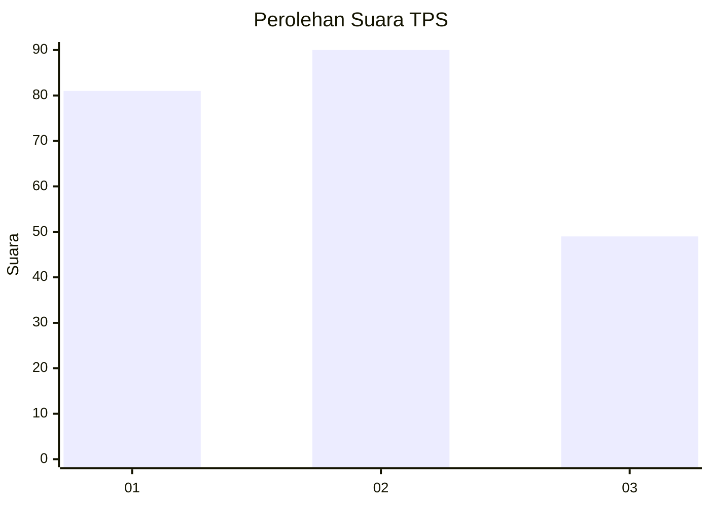
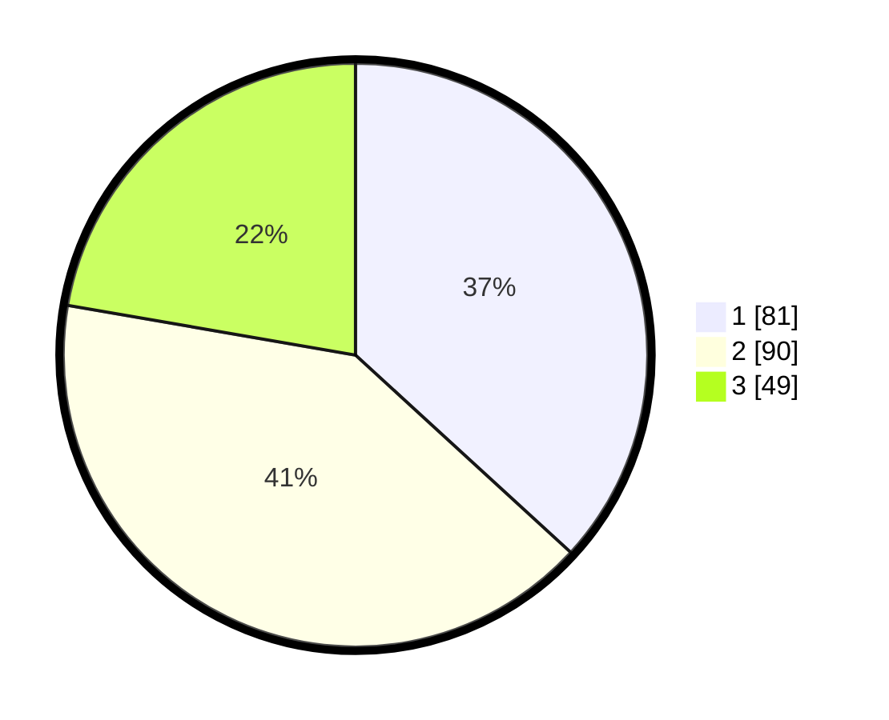

# Hasil

## Grafik

## Tabel

| No. | Nama Paslon    | Suara | Suara (raw) | Persentase |
|:--- |:-------------- | -----:| -----------:| ----------:|
| 1   | ANIES MUHAIMIN | 81    | [81][p-1]   | 36,82      |
| 2   | PRABOWO GIBRAN | 90    | [90][p-2]   | 40,91      |
| 3   | GANJAR MAHFUD  | 49    | [49][p-3]   | 22,27      |

[p-1]: https://github.com/gigit-pemilu/pemilu-2024-35-jawa-timur/blob/main/pilpres/hitung-suara/sub/35-jawa-timur/sub/25-gresik/sub/14-kebomas/sub/2004-randuagung/sub/029-tps/sub/paslon-1.txt
[p-2]: https://github.com/gigit-pemilu/pemilu-2024-35-jawa-timur/blob/main/pilpres/hitung-suara/sub/35-jawa-timur/sub/25-gresik/sub/14-kebomas/sub/2004-randuagung/sub/029-tps/sub/paslon-2.txt
[p-3]: https://github.com/gigit-pemilu/pemilu-2024-35-jawa-timur/blob/main/pilpres/hitung-suara/sub/35-jawa-timur/sub/25-gresik/sub/14-kebomas/sub/2004-randuagung/sub/029-tps/sub/paslon-3.txt

## Foto C Plano

https://sirekap-obj-formc.kpu.go.id/dd41/pemilu/ppwp/35/25/14/20/04/3525142004029-20240214-221745--165716c5-022b-4303-90c5-cbb778b9b661.jpg

https://sirekap-obj-formc.kpu.go.id/dd41/pemilu/ppwp/35/25/14/20/04/3525142004029-20240214-221800--fd3e838d-43d2-4391-a94b-4fff6fa90e82.jpg

https://sirekap-obj-formc.kpu.go.id/dd41/pemilu/ppwp/35/25/14/20/04/3525142004029-20240214-221807--f1a1f937-36b9-4320-bffd-3aab361ad31d.jpg

## Metadata

| Key        | Value               |
| ---------- | ------------------- |
| Time Stamp | 2024-02-16 14:30:33 |

