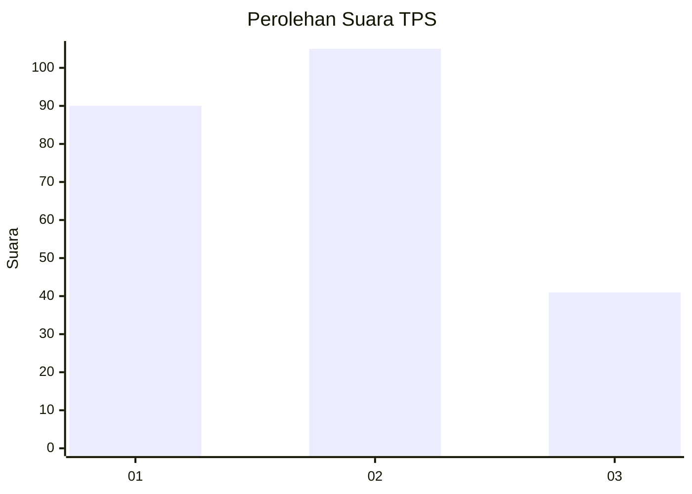
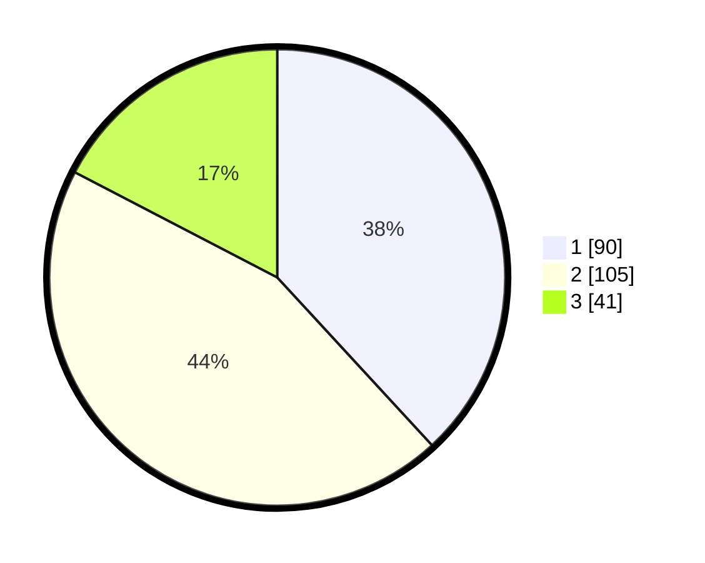

# Hasil

## Grafik

## Tabel

| No. | Nama Paslon    | Suara | Suara (raw) | Persentase |
|:--- |:-------------- | -----:| -----------:| ----------:|
| 1   | ANIES MUHAIMIN | 90    | [90][p-1]   | 38,14      |
| 2   | PRABOWO GIBRAN | 105   | [105][p-2]  | 44,49      |
| 3   | GANJAR MAHFUD  | 41    | [41][p-3]   | 17,37      |

[p-1]: https://github.com/gigit-pemilu/pemilu-2024-35-jawa-timur/blob/main/pilpres/hitung-suara/sub/35-jawa-timur/sub/25-gresik/sub/14-kebomas/sub/2004-randuagung/sub/032-tps/sub/paslon-1.txt
[p-2]: https://github.com/gigit-pemilu/pemilu-2024-35-jawa-timur/blob/main/pilpres/hitung-suara/sub/35-jawa-timur/sub/25-gresik/sub/14-kebomas/sub/2004-randuagung/sub/032-tps/sub/paslon-2.txt
[p-3]: https://github.com/gigit-pemilu/pemilu-2024-35-jawa-timur/blob/main/pilpres/hitung-suara/sub/35-jawa-timur/sub/25-gresik/sub/14-kebomas/sub/2004-randuagung/sub/032-tps/sub/paslon-3.txt

## Foto C Plano

https://sirekap-obj-formc.kpu.go.id/c4fb/pemilu/ppwp/35/25/14/20/04/3525142004032-20240214-220758--650dce7a-e9b5-4216-80eb-f18e330eb503.jpg

https://sirekap-obj-formc.kpu.go.id/c4fb/pemilu/ppwp/35/25/14/20/04/3525142004032-20240214-211122--bac061cc-36be-4f6a-9f36-7bd2707834dc.jpg

https://sirekap-obj-formc.kpu.go.id/c4fb/pemilu/ppwp/35/25/14/20/04/3525142004032-20240214-220919--4426ae7f-17f0-4a0d-bbc6-219d057eeabb.jpg

## Metadata

| Key        | Value               |
| ---------- | ------------------- |
| Time Stamp | 2024-02-15 22:40:13 |

