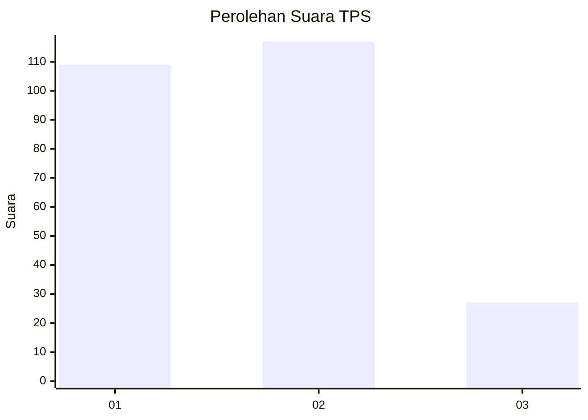
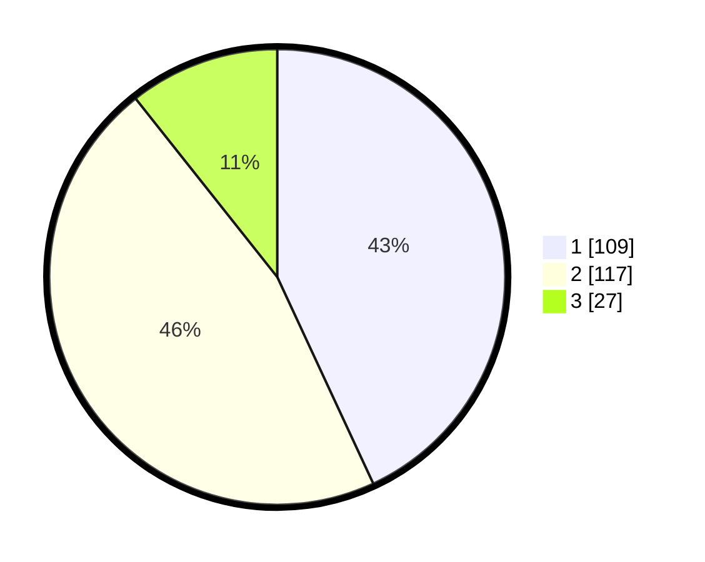

# Hasil

## Grafik

## Tabel

| No. | Nama Paslon    | Suara | Suara (raw) | Persentase |
|:--- |:-------------- | -----:| -----------:| ----------:|
| 1   | ANIES MUHAIMIN | 109   | [109][p-1]  | 43,08      |
| 2   | PRABOWO GIBRAN | 117   | [117][p-2]  | 46,25      |
| 3   | GANJAR MAHFUD  | 27    | [27][p-3]   | 10,67      |

[p-1]: https://github.com/gigit-pemilu/pemilu-2024/blob/main/pilpres/hitung-suara/sub/35-jawa-timur/sub/25-gresik/sub/14-kebomas/sub/2004-randuagung/sub/039-tps/sub/paslon-1.txt
[p-2]: https://github.com/gigit-pemilu/pemilu-2024/blob/main/pilpres/hitung-suara/sub/35-jawa-timur/sub/25-gresik/sub/14-kebomas/sub/2004-randuagung/sub/039-tps/sub/paslon-2.txt
[p-3]: https://github.com/gigit-pemilu/pemilu-2024/blob/main/pilpres/hitung-suara/sub/35-jawa-timur/sub/25-gresik/sub/14-kebomas/sub/2004-randuagung/sub/039-tps/sub/paslon-3.txt

## Foto C Plano

https://sirekap-obj-formc.kpu.go.id/5ca5/pemilu/ppwp/35/25/14/20/04/3525142004039-20240215-040658--3fee346a-8eab-499e-a661-03485848ac08.jpg

https://sirekap-obj-formc.kpu.go.id/5ca5/pemilu/ppwp/35/25/14/20/04/3525142004039-20240214-195913--0aba0962-3c39-4a1c-aeca-fa4e7f91f3f0.jpg

https://sirekap-obj-formc.kpu.go.id/5ca5/pemilu/ppwp/35/25/14/20/04/3525142004039-20240215-041115--fd1896ac-83e0-4938-9320-30995d5e0efb.jpg

## Metadata

| Key        | Value               |
| ---------- | ------------------- |
| Time Stamp | 2024-02-16 12:51:22 |

