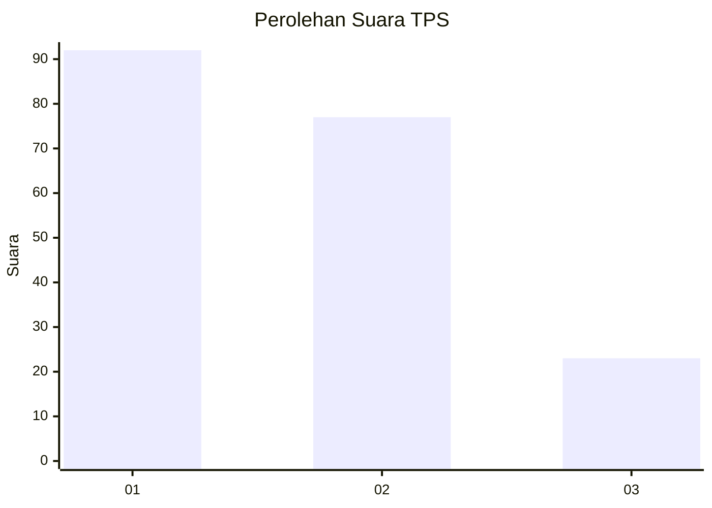
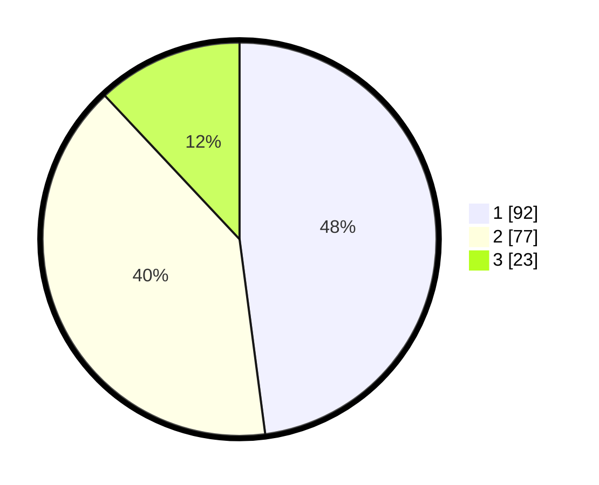

# Hasil

## Grafik

## Tabel

| No. | Nama Paslon    | Suara | Suara (raw) | Persentase |
|:--- |:-------------- | -----:| -----------:| ----------:|
| 1   | ANIES MUHAIMIN | 92    | [92][p-1]   | 47,92      |
| 2   | PRABOWO GIBRAN | 77    | [77][p-2]   | 40,10      |
| 3   | GANJAR MAHFUD  | 23    | [23][p-3]   | 11,98      |

[p-1]: https://github.com/gigit-pemilu/pemilu-2024/blob/main/pilpres/hitung-suara/sub/35-jawa-timur/sub/25-gresik/sub/14-kebomas/sub/2004-randuagung/sub/042-tps/sub/paslon-1.txt
[p-2]: https://github.com/gigit-pemilu/pemilu-2024/blob/main/pilpres/hitung-suara/sub/35-jawa-timur/sub/25-gresik/sub/14-kebomas/sub/2004-randuagung/sub/042-tps/sub/paslon-2.txt
[p-3]: https://github.com/gigit-pemilu/pemilu-2024/blob/main/pilpres/hitung-suara/sub/35-jawa-timur/sub/25-gresik/sub/14-kebomas/sub/2004-randuagung/sub/042-tps/sub/paslon-3.txt

## Foto C Plano

https://sirekap-obj-formc.kpu.go.id/0e02/pemilu/ppwp/35/25/14/20/04/3525142004042-20240214-211713--3503ee5a-ef6c-4039-9783-e29707aa2697.jpg

https://sirekap-obj-formc.kpu.go.id/0e02/pemilu/ppwp/35/25/14/20/04/3525142004042-20240214-211829--6023d42c-485a-4e27-af0d-76ba2922b1e9.jpg

https://sirekap-obj-formc.kpu.go.id/0e02/pemilu/ppwp/35/25/14/20/04/3525142004042-20240214-211942--83771fbe-6d3f-4a3c-86f4-b3a04c57767d.jpg

## Metadata

| Key        | Value               |
| ---------- | ------------------- |
| Time Stamp | 2024-02-16 14:30:33 |

