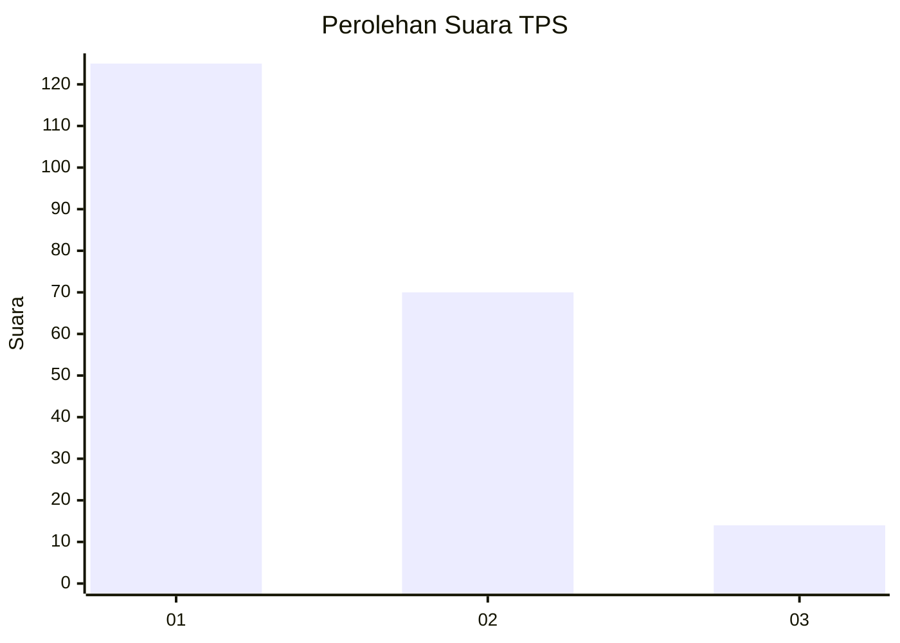
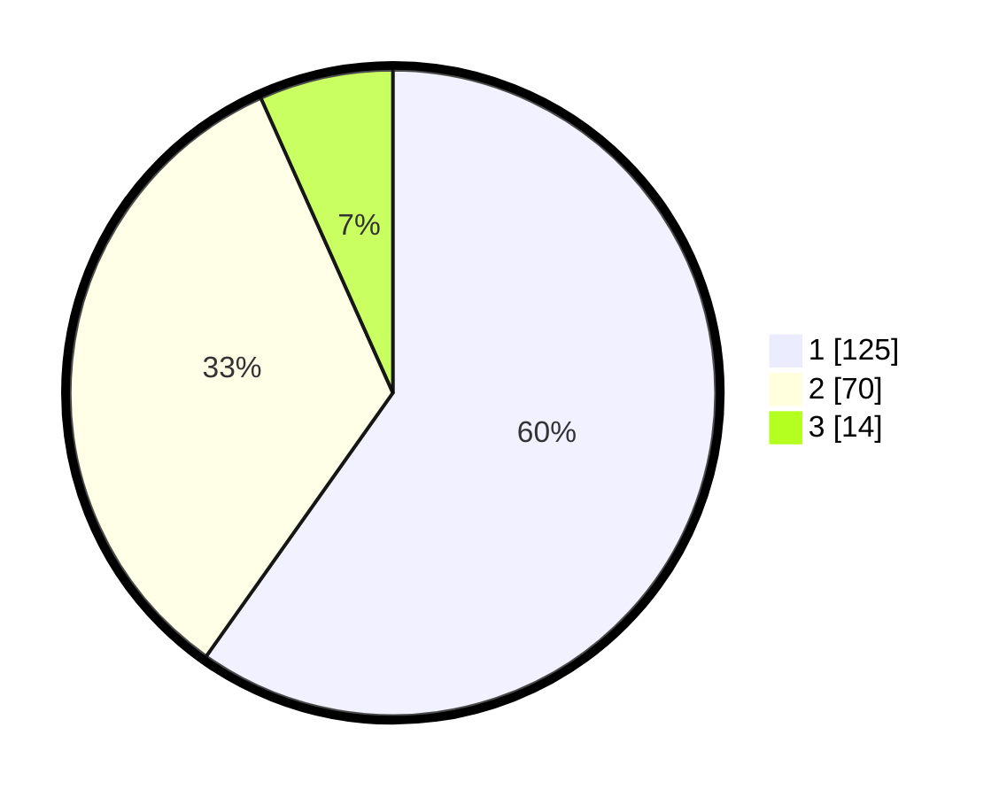

# Hasil

## Grafik

## Tabel

| No. | Nama Paslon    | Suara | Suara (raw) | Persentase |
|:--- |:-------------- | -----:| -----------:| ----------:|
| 1   | ANIES MUHAIMIN | 125   | [125][p-1]  | 59,81      |
| 2   | PRABOWO GIBRAN | 70    | [70][p-2]   | 33,49      |
| 3   | GANJAR MAHFUD  | 14    | [14][p-3]   | 6,70       |

[p-1]: https://github.com/gigit-pemilu/pemilu-2024-35-jawa-timur/blob/main/pilpres/hitung-suara/sub/35-jawa-timur/sub/25-gresik/sub/14-kebomas/sub/2009-giri/sub/003-tps/sub/paslon-1.txt
[p-2]: https://github.com/gigit-pemilu/pemilu-2024-35-jawa-timur/blob/main/pilpres/hitung-suara/sub/35-jawa-timur/sub/25-gresik/sub/14-kebomas/sub/2009-giri/sub/003-tps/sub/paslon-2.txt
[p-3]: https://github.com/gigit-pemilu/pemilu-2024-35-jawa-timur/blob/main/pilpres/hitung-suara/sub/35-jawa-timur/sub/25-gresik/sub/14-kebomas/sub/2009-giri/sub/003-tps/sub/paslon-3.txt

## Foto C Plano

https://sirekap-obj-formc.kpu.go.id/be84/pemilu/ppwp/35/25/14/20/09/3525142009003-20240214-215405--19608711-e9de-49e6-89f7-31b60b174c7d.jpg

https://sirekap-obj-formc.kpu.go.id/be84/pemilu/ppwp/35/25/14/20/09/3525142009003-20240214-215456--4f809e63-49fb-49ff-b338-47a2a30e196f.jpg

https://sirekap-obj-formc.kpu.go.id/be84/pemilu/ppwp/35/25/14/20/09/3525142009003-20240214-215614--960ae785-494d-4e1e-84d1-6651eb0fe823.jpg

## Metadata

| Key        | Value               |
| ---------- | ------------------- |
| Time Stamp | 2024-02-15 18:00:26 |

