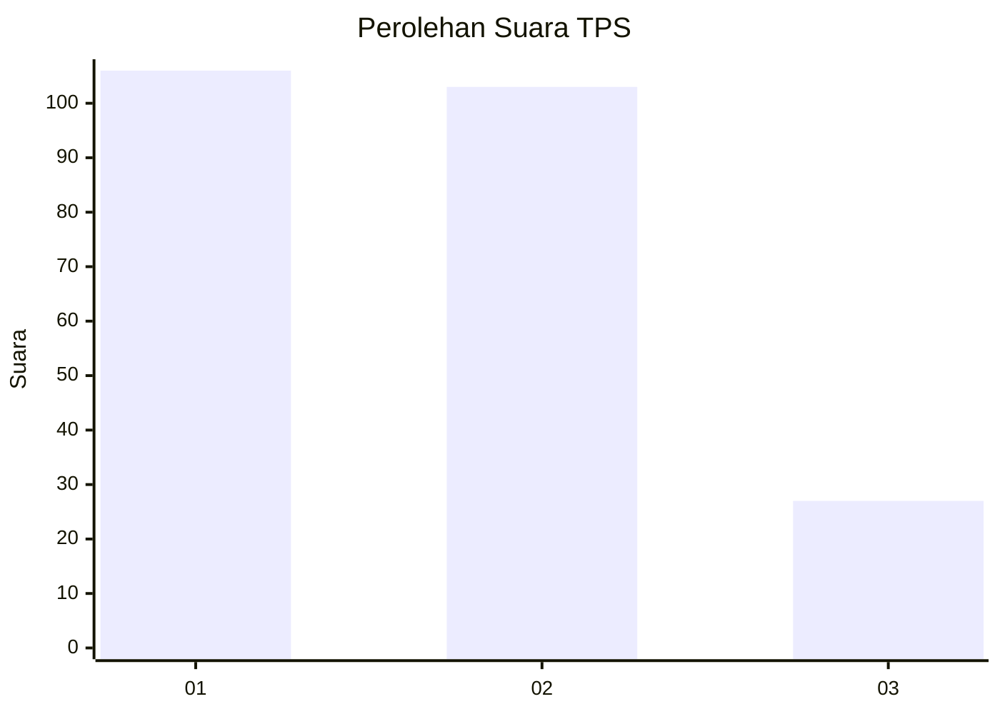
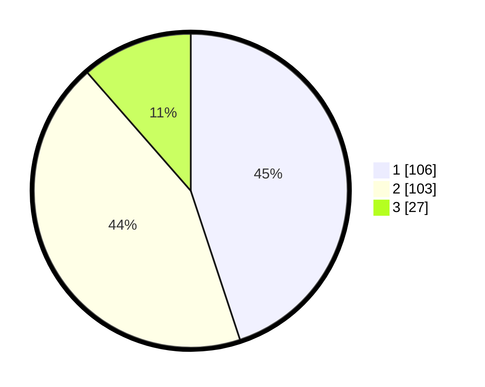

# Hasil

## Grafik

## Tabel

| No. | Nama Paslon    | Suara | Suara (raw) | Persentase |
|:--- |:-------------- | -----:| -----------:| ----------:|
| 1   | ANIES MUHAIMIN | 106   | [106][p-1]  | 44,92      |
| 2   | PRABOWO GIBRAN | 103   | [103][p-2]  | 43,64      |
| 3   | GANJAR MAHFUD  | 27    | [27][p-3]   | 11,44      |

[p-1]: https://github.com/gigit-pemilu/pemilu-2024-35-jawa-timur/blob/main/pilpres/hitung-suara/sub/35-jawa-timur/sub/25-gresik/sub/14-kebomas/sub/2009-giri/sub/007-tps/sub/paslon-1.txt
[p-2]: https://github.com/gigit-pemilu/pemilu-2024-35-jawa-timur/blob/main/pilpres/hitung-suara/sub/35-jawa-timur/sub/25-gresik/sub/14-kebomas/sub/2009-giri/sub/007-tps/sub/paslon-2.txt
[p-3]: https://github.com/gigit-pemilu/pemilu-2024-35-jawa-timur/blob/main/pilpres/hitung-suara/sub/35-jawa-timur/sub/25-gresik/sub/14-kebomas/sub/2009-giri/sub/007-tps/sub/paslon-3.txt

## Foto C Plano

https://sirekap-obj-formc.kpu.go.id/e7fa/pemilu/ppwp/35/25/14/20/09/3525142009007-20240215-104824--2b9058fe-e3ec-42ad-aeb5-cc58b7c826f8.jpg

https://sirekap-obj-formc.kpu.go.id/e7fa/pemilu/ppwp/35/25/14/20/09/3525142009007-20240215-104846--13bd56f3-5496-43b1-a67b-76c80196da0b.jpg

https://sirekap-obj-formc.kpu.go.id/e7fa/pemilu/ppwp/35/25/14/20/09/3525142009007-20240215-105037--5e064b06-c7f2-4dcb-83e5-6db232238a99.jpg

## Metadata

| Key        | Value               |
| ---------- | ------------------- |
| Time Stamp | 2024-02-16 14:30:33 |

