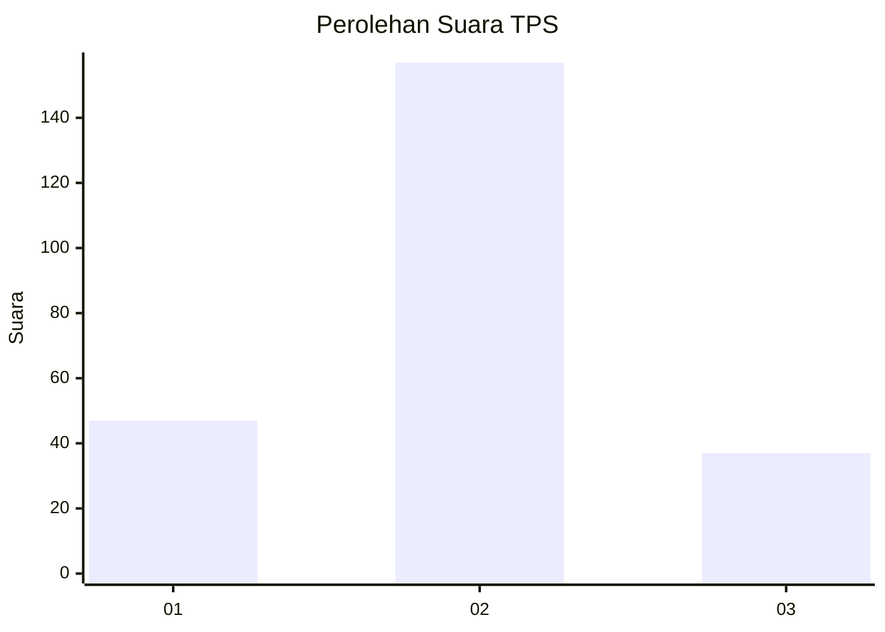
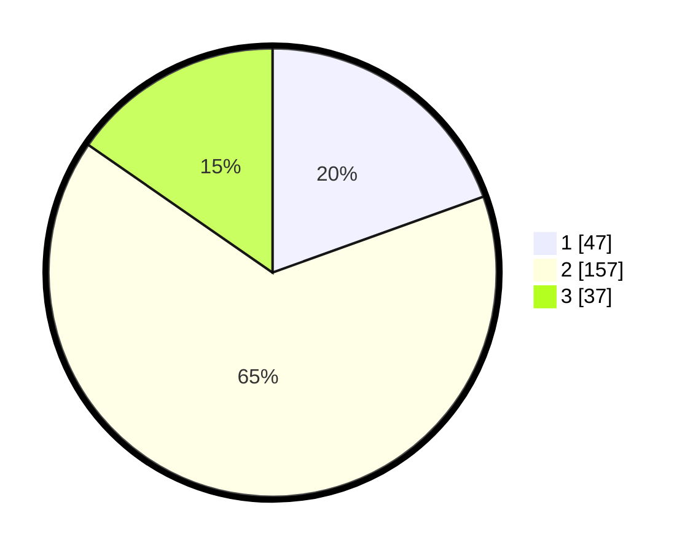

# Hasil

## Grafik

## Tabel

| No. | Nama Paslon    | Suara | Suara (raw) | Persentase |
|:--- |:-------------- | -----:| -----------:| ----------:|
| 1   | ANIES MUHAIMIN | 47    | [47][p-1]   | 19,50      |
| 2   | PRABOWO GIBRAN | 157   | [157][p-2]  | 65,15      |
| 3   | GANJAR MAHFUD  | 37    | [37][p-3]   | 15,35      |

[p-1]: https://github.com/gigit-pemilu/pemilu-2024/blob/main/pilpres/hitung-suara/sub/35-jawa-timur/sub/25-gresik/sub/14-kebomas/sub/2013-segoromadu/sub/003-tps/sub/paslon-1.txt
[p-2]: https://github.com/gigit-pemilu/pemilu-2024/blob/main/pilpres/hitung-suara/sub/35-jawa-timur/sub/25-gresik/sub/14-kebomas/sub/2013-segoromadu/sub/003-tps/sub/paslon-2.txt
[p-3]: https://github.com/gigit-pemilu/pemilu-2024/blob/main/pilpres/hitung-suara/sub/35-jawa-timur/sub/25-gresik/sub/14-kebomas/sub/2013-segoromadu/sub/003-tps/sub/paslon-3.txt

## Foto C Plano

https://sirekap-obj-formc.kpu.go.id/1f6f/pemilu/ppwp/35/25/14/20/13/3525142013003-20240214-212719--323cd2ec-a7a4-4545-a24c-63cda36d8c15.jpg

https://sirekap-obj-formc.kpu.go.id/1f6f/pemilu/ppwp/35/25/14/20/13/3525142013003-20240214-213135--b53ac90c-2f7e-427a-bc99-b7ef0d43ec64.jpg

https://sirekap-obj-formc.kpu.go.id/1f6f/pemilu/ppwp/35/25/14/20/13/3525142013003-20240214-213234--44ac7dde-a8f5-42b7-9f89-3c798e21e6ee.jpg

## Metadata

| Key        | Value               |
| ---------- | ------------------- |
| Time Stamp | 2024-02-16 12:51:22 |

