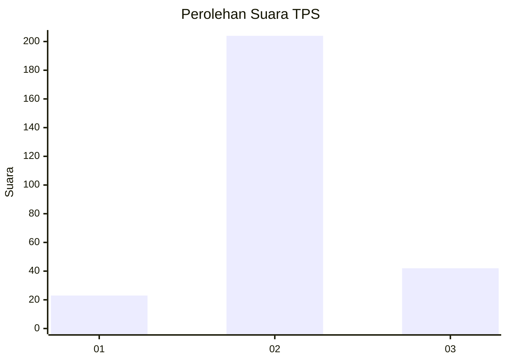
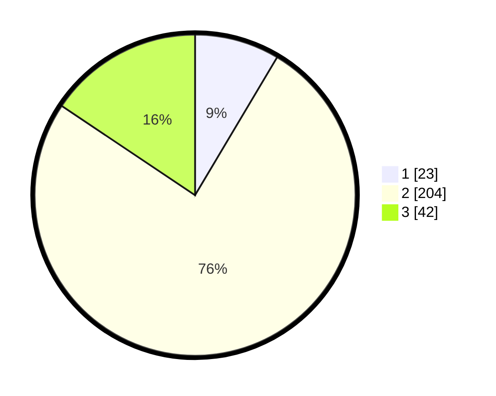

# Hasil

## Grafik

## Tabel

| No. | Nama Paslon    | Suara | Suara (raw) | Persentase |
|:--- |:-------------- | -----:| -----------:| ----------:|
| 1   | ANIES MUHAIMIN | 23    | [23][p-1]   | 8,55       |
| 2   | PRABOWO GIBRAN | 204   | [204][p-2]  | 75,84      |
| 3   | GANJAR MAHFUD  | 42    | [42][p-3]   | 15,61      |

[p-1]: https://github.com/gigit-pemilu/pemilu-2024/blob/main/pilpres/hitung-suara/sub/35-jawa-timur/sub/25-gresik/sub/14-kebomas/sub/2013-segoromadu/sub/004-tps/sub/paslon-1.txt
[p-2]: https://github.com/gigit-pemilu/pemilu-2024/blob/main/pilpres/hitung-suara/sub/35-jawa-timur/sub/25-gresik/sub/14-kebomas/sub/2013-segoromadu/sub/004-tps/sub/paslon-2.txt
[p-3]: https://github.com/gigit-pemilu/pemilu-2024/blob/main/pilpres/hitung-suara/sub/35-jawa-timur/sub/25-gresik/sub/14-kebomas/sub/2013-segoromadu/sub/004-tps/sub/paslon-3.txt

## Foto C Plano

https://sirekap-obj-formc.kpu.go.id/5f86/pemilu/ppwp/35/25/14/20/13/3525142013004-20240215-014805--7b1c8ee9-09e2-4d2e-88cd-57a2e3154def.jpg

https://sirekap-obj-formc.kpu.go.id/5f86/pemilu/ppwp/35/25/14/20/13/3525142013004-20240215-014812--8c0ea2af-b225-415d-8778-f4acd7c134e0.jpg

https://sirekap-obj-formc.kpu.go.id/5f86/pemilu/ppwp/35/25/14/20/13/3525142013004-20240215-014817--e0a73571-3ada-402a-bdb0-8b495065bc94.jpg

## Metadata

| Key        | Value               |
| ---------- | ------------------- |
| Time Stamp | 2024-02-15 09:00:24 |

