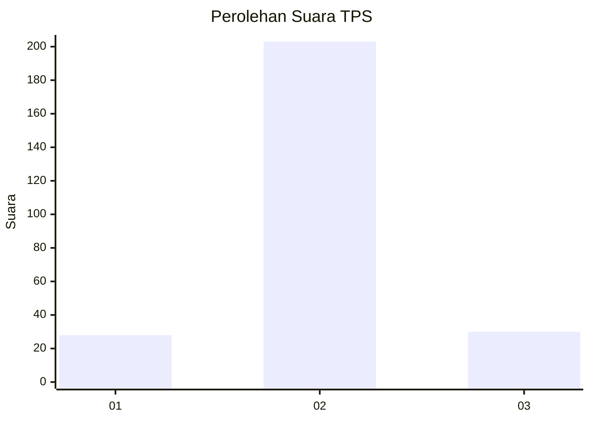
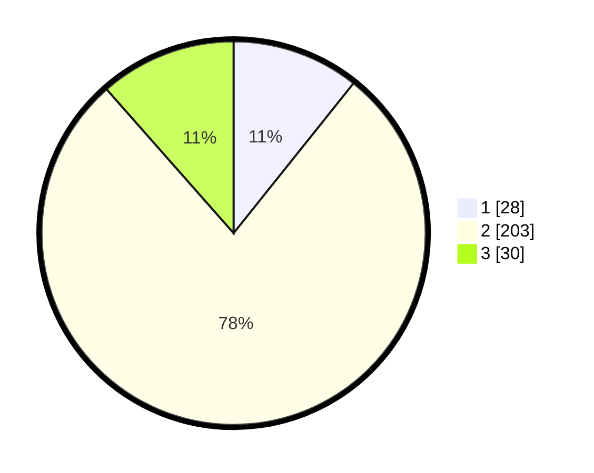

# Hasil

## Grafik

## Tabel

| No. | Nama Paslon    | Suara | Suara (raw) | Persentase |
|:--- |:-------------- | -----:| -----------:| ----------:|
| 1   | ANIES MUHAIMIN | 28    | [28][p-1]   | 10,73      |
| 2   | PRABOWO GIBRAN | 203   | [203][p-2]  | 77,78      |
| 3   | GANJAR MAHFUD  | 30    | [30][p-3]   | 11,49      |

[p-1]: https://github.com/gigit-pemilu/pemilu-2024-35-jawa-timur/blob/main/pilpres/hitung-suara/sub/35-jawa-timur/sub/25-gresik/sub/14-kebomas/sub/2020-prambangan/sub/001-tps/sub/paslon-1.txt
[p-2]: https://github.com/gigit-pemilu/pemilu-2024-35-jawa-timur/blob/main/pilpres/hitung-suara/sub/35-jawa-timur/sub/25-gresik/sub/14-kebomas/sub/2020-prambangan/sub/001-tps/sub/paslon-2.txt
[p-3]: https://github.com/gigit-pemilu/pemilu-2024-35-jawa-timur/blob/main/pilpres/hitung-suara/sub/35-jawa-timur/sub/25-gresik/sub/14-kebomas/sub/2020-prambangan/sub/001-tps/sub/paslon-3.txt

## Foto C Plano

https://sirekap-obj-formc.kpu.go.id/e3bc/pemilu/ppwp/35/25/14/20/20/3525142020001-20240214-203714--4f18a48c-bf01-4a33-8a0e-810c80f8f595.jpg

https://sirekap-obj-formc.kpu.go.id/e3bc/pemilu/ppwp/35/25/14/20/20/3525142020001-20240214-203807--70d5bbb1-fa81-4c57-ab7a-b564bf375f1f.jpg

https://sirekap-obj-formc.kpu.go.id/e3bc/pemilu/ppwp/35/25/14/20/20/3525142020001-20240214-203857--5057b150-f860-4041-8727-4229ad1a97ed.jpg

## Metadata

| Key        | Value               |
| ---------- | ------------------- |
| Time Stamp | 2024-02-16 14:30:33 |

