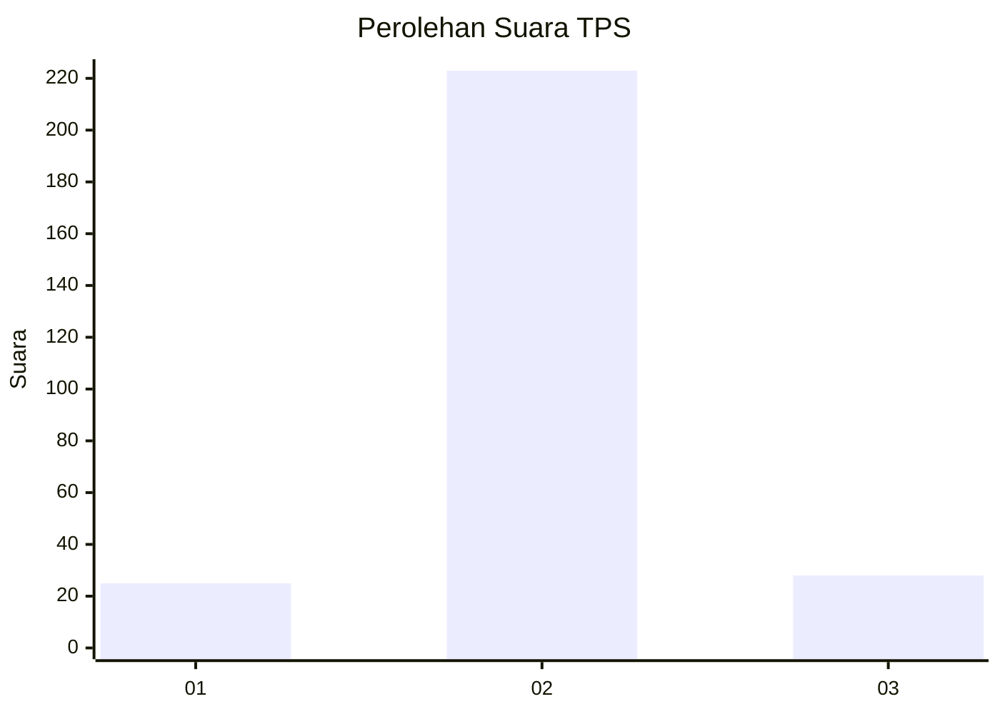
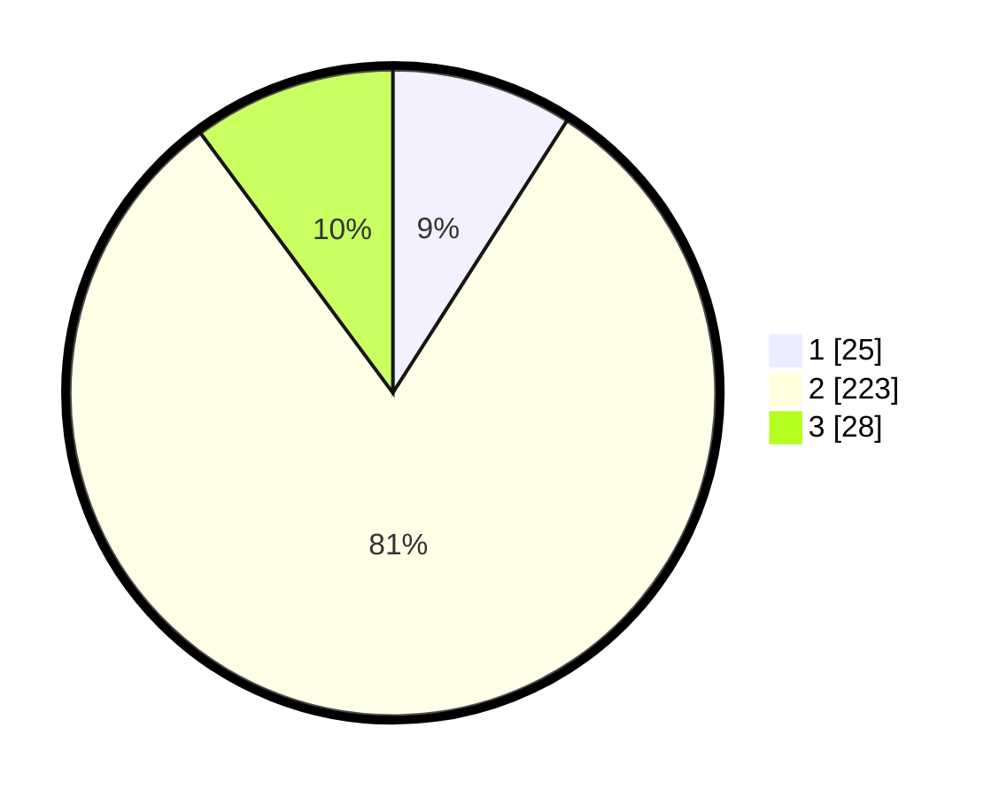

# Hasil

## Grafik

## Tabel

| No. | Nama Paslon    | Suara | Suara (raw) | Persentase |
|:--- |:-------------- | -----:| -----------:| ----------:|
| 1   | ANIES MUHAIMIN | 25    | [25][p-1]   | 9,06       |
| 2   | PRABOWO GIBRAN | 223   | [223][p-2]  | 80,80      |
| 3   | GANJAR MAHFUD  | 28    | [28][p-3]   | 10,14      |

[p-1]: https://github.com/gigit-pemilu/pemilu-2024/blob/main/pilpres/hitung-suara/sub/35-jawa-timur/sub/25-gresik/sub/14-kebomas/sub/2020-prambangan/sub/002-tps/sub/paslon-1.txt
[p-2]: https://github.com/gigit-pemilu/pemilu-2024/blob/main/pilpres/hitung-suara/sub/35-jawa-timur/sub/25-gresik/sub/14-kebomas/sub/2020-prambangan/sub/002-tps/sub/paslon-2.txt
[p-3]: https://github.com/gigit-pemilu/pemilu-2024/blob/main/pilpres/hitung-suara/sub/35-jawa-timur/sub/25-gresik/sub/14-kebomas/sub/2020-prambangan/sub/002-tps/sub/paslon-3.txt

## Foto C Plano

https://sirekap-obj-formc.kpu.go.id/8200/pemilu/ppwp/35/25/14/20/20/3525142020002-20240215-000438--b8ddeeba-405a-4660-8aee-7704e5ef1969.jpg

https://sirekap-obj-formc.kpu.go.id/8200/pemilu/ppwp/35/25/14/20/20/3525142020002-20240215-000618--c5fcc8eb-f62f-4984-aa59-d12ea7f86b7e.jpg

https://sirekap-obj-formc.kpu.go.id/8200/pemilu/ppwp/35/25/14/20/20/3525142020002-20240215-000740--69321aa6-43b3-4175-8797-f91878945e89.jpg

## Metadata

| Key        | Value               |
| ---------- | ------------------- |
| Time Stamp | 2024-02-16 12:51:22 |

