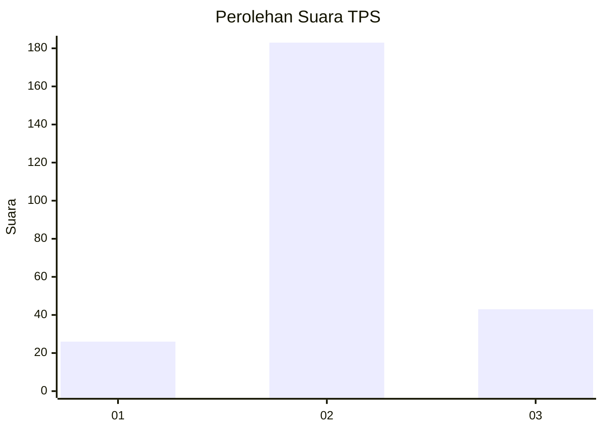
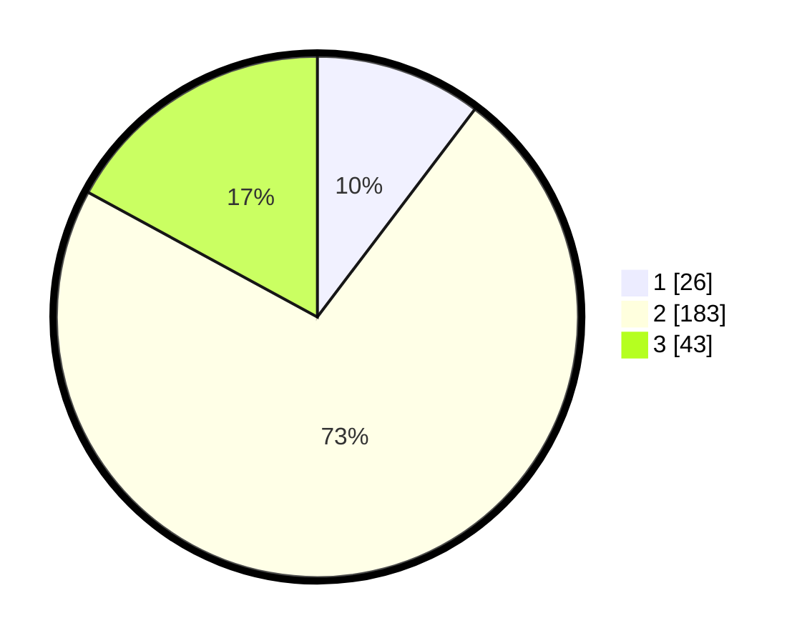

# Hasil

## Grafik

## Tabel

| No. | Nama Paslon    | Suara | Suara (raw) | Persentase |
|:--- |:-------------- | -----:| -----------:| ----------:|
| 1   | ANIES MUHAIMIN | 26    | [26][p-1]   | 10,32      |
| 2   | PRABOWO GIBRAN | 183   | [183][p-2]  | 72,62      |
| 3   | GANJAR MAHFUD  | 43    | [43][p-3]   | 17,06      |

[p-1]: https://github.com/gigit-pemilu/pemilu-2024-35-jawa-timur/blob/main/pilpres/hitung-suara/sub/35-jawa-timur/sub/25-gresik/sub/15-driyorejo/sub/2001-karangandong/sub/006-tps/sub/paslon-1.txt
[p-2]: https://github.com/gigit-pemilu/pemilu-2024-35-jawa-timur/blob/main/pilpres/hitung-suara/sub/35-jawa-timur/sub/25-gresik/sub/15-driyorejo/sub/2001-karangandong/sub/006-tps/sub/paslon-2.txt
[p-3]: https://github.com/gigit-pemilu/pemilu-2024-35-jawa-timur/blob/main/pilpres/hitung-suara/sub/35-jawa-timur/sub/25-gresik/sub/15-driyorejo/sub/2001-karangandong/sub/006-tps/sub/paslon-3.txt

## Foto C Plano

https://sirekap-obj-formc.kpu.go.id/1774/pemilu/ppwp/35/25/15/20/01/3525152001006-20240220-205030--4a2ff06e-2d8b-4858-8f44-cbdb4b33d650.jpg

https://sirekap-obj-formc.kpu.go.id/1774/pemilu/ppwp/35/25/15/20/01/3525152001006-20240220-205042--18d5a972-9d7e-499f-8a0d-bd97d752bbea.jpg

https://sirekap-obj-formc.kpu.go.id/1774/pemilu/ppwp/35/25/15/20/01/3525152001006-20240220-205053--7ab3cfe4-373c-48dd-afcf-f8dac0537d79.jpg

## Metadata

| Key        | Value               |
| ---------- | ------------------- |
| Time Stamp | 2024-02-21 10:00:00 |

## DATA PEMILIH TETAP

Jumlah pemilih dalam DPT: **5**.
 * L: **0**.
 * P: **0**.

## DATA PENGGUNA HAK PILIH

Jumlah pengguna hak pilih dalam DPT: **0**.
 * L: **0**.
 * P: **0**.

Jumlah pengguna hak pilih dalam DPTb: **446**.
 * L: **336**.
 * P: **344**.

Jumlah pengguna hak pilih dalam DPK: **455**.
 * L: **0**.
 * P: **44**.

Jumlah pengguna hak pilih: **460**.
 * L: **10**.
 * P: **146**.

## JUMLAH SUARA SAH DAN TIDAK SAH

JUMLAH SELURUH SUARA SAH: **252**.

JUMLAH SUARA TIDAK SAH: **12**.

JUMLAH SELURUH SUARA SAH DAN SUARA TIDAK SAH: **264**.

