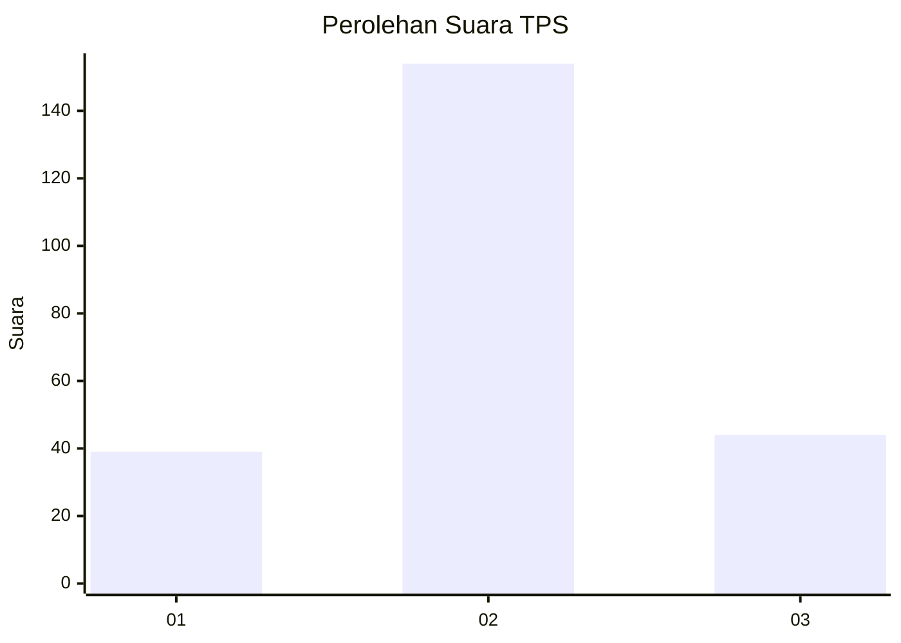
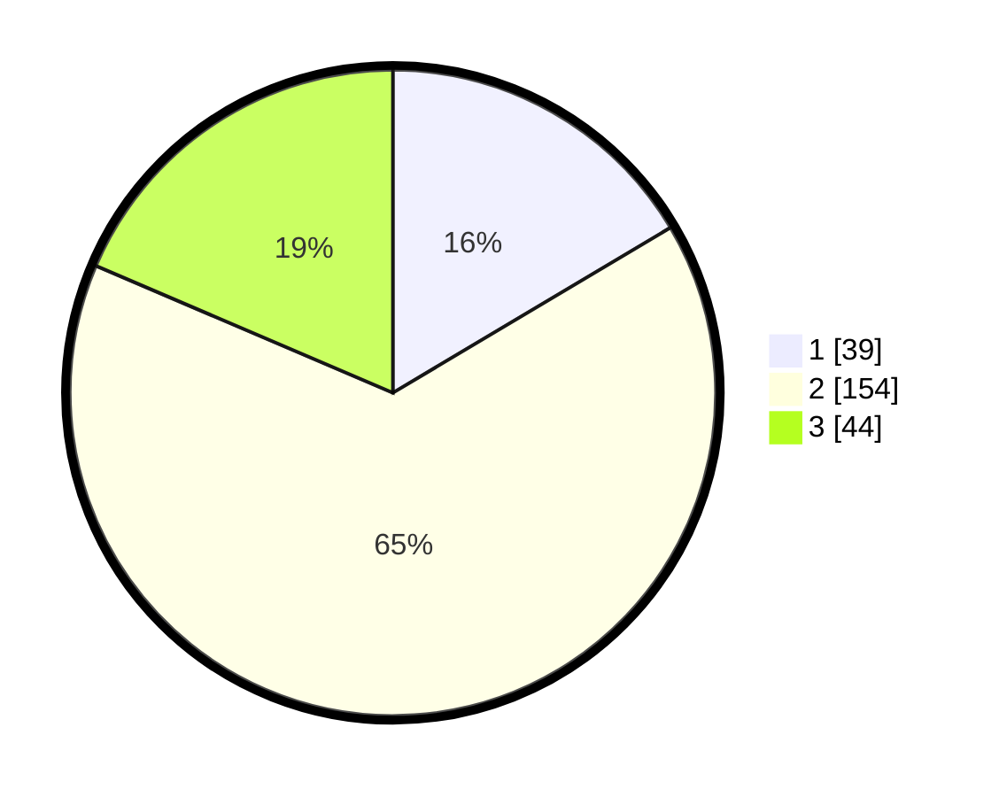

# Hasil

## Grafik

## Tabel

| No. | Nama Paslon    | Suara | Suara (raw) | Persentase |
|:--- |:-------------- | -----:| -----------:| ----------:|
| 1   | ANIES MUHAIMIN | 39    | [39][p-1]   | 16,46      |
| 2   | PRABOWO GIBRAN | 154   | [154][p-2]  | 64,98      |
| 3   | GANJAR MAHFUD  | 44    | [44][p-3]   | 18,57      |

[p-1]: https://github.com/gigit-pemilu/pemilu-2024/blob/main/pilpres/hitung-suara/sub/35-jawa-timur/sub/25-gresik/sub/15-driyorejo/sub/2001-karangandong/sub/009-tps/sub/paslon-1.txt
[p-2]: https://github.com/gigit-pemilu/pemilu-2024/blob/main/pilpres/hitung-suara/sub/35-jawa-timur/sub/25-gresik/sub/15-driyorejo/sub/2001-karangandong/sub/009-tps/sub/paslon-2.txt
[p-3]: https://github.com/gigit-pemilu/pemilu-2024/blob/main/pilpres/hitung-suara/sub/35-jawa-timur/sub/25-gresik/sub/15-driyorejo/sub/2001-karangandong/sub/009-tps/sub/paslon-3.txt

## Foto C Plano

https://sirekap-obj-formc.kpu.go.id/4c19/pemilu/ppwp/35/25/15/20/01/3525152001009-20240220-205847--4b5f265d-00bc-4f4d-8916-1977bff8f57d.jpg

https://sirekap-obj-formc.kpu.go.id/4c19/pemilu/ppwp/35/25/15/20/01/3525152001009-20240220-205859--71f34de7-d8e7-426d-ad79-0ca85a3687f8.jpg

https://sirekap-obj-formc.kpu.go.id/4c19/pemilu/ppwp/35/25/15/20/01/3525152001009-20240220-205908--0a1092da-4115-467b-b38e-219d464eb804.jpg

## Metadata

| Key        | Value               |
| ---------- | ------------------- |
| Time Stamp | 2024-02-21 10:00:00 |

## DATA PEMILIH TETAP

Jumlah pemilih dalam DPT: **77**.
 * L: **50**.
 * P: **655**.

## DATA PENGGUNA HAK PILIH

Jumlah pengguna hak pilih dalam DPT: **577**.
 * L: **50**.
 * P: **777**.

Jumlah pengguna hak pilih dalam DPTb: **0**.
 * L: **57**.
 * P: **475**.

Jumlah pengguna hak pilih dalam DPK: **457**.
 * L: **55**.
 * P: **707**.

Jumlah pengguna hak pilih: **172**.
 * L: **57**.
 * P: **657**.

## JUMLAH SUARA SAH DAN TIDAK SAH

JUMLAH SELURUH SUARA SAH: **237**.

JUMLAH SUARA TIDAK SAH: **25**.

JUMLAH SELURUH SUARA SAH DAN SUARA TIDAK SAH: **262**.

