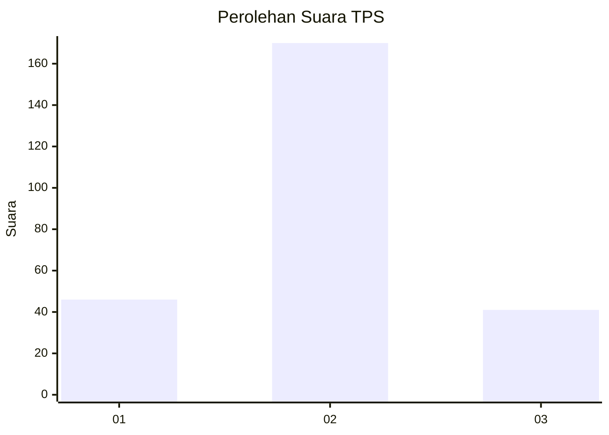
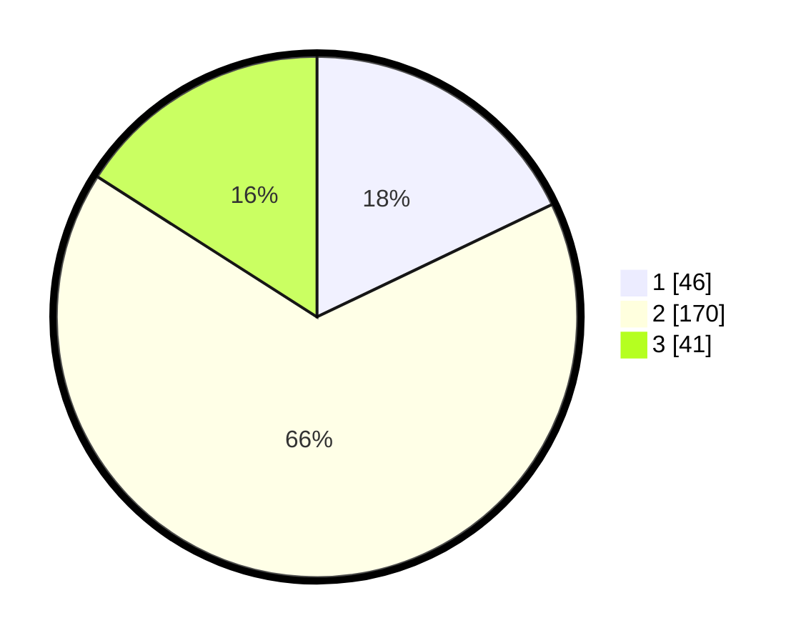

# Hasil

## Grafik

## Tabel

| No. | Nama Paslon    | Suara | Suara (raw) | Persentase |
|:--- |:-------------- | -----:| -----------:| ----------:|
| 1   | ANIES MUHAIMIN | 46    | [46][p-1]   | 17,90      |
| 2   | PRABOWO GIBRAN | 170   | [170][p-2]  | 66,15      |
| 3   | GANJAR MAHFUD  | 41    | [41][p-3]   | 15,95      |

[p-1]: https://github.com/gigit-pemilu/pemilu-2024-35-jawa-timur/blob/main/pilpres/hitung-suara/sub/35-jawa-timur/sub/25-gresik/sub/15-driyorejo/sub/2001-karangandong/sub/012-tps/sub/paslon-1.txt
[p-2]: https://github.com/gigit-pemilu/pemilu-2024-35-jawa-timur/blob/main/pilpres/hitung-suara/sub/35-jawa-timur/sub/25-gresik/sub/15-driyorejo/sub/2001-karangandong/sub/012-tps/sub/paslon-2.txt
[p-3]: https://github.com/gigit-pemilu/pemilu-2024-35-jawa-timur/blob/main/pilpres/hitung-suara/sub/35-jawa-timur/sub/25-gresik/sub/15-driyorejo/sub/2001-karangandong/sub/012-tps/sub/paslon-3.txt

## Foto C Plano

https://sirekap-obj-formc.kpu.go.id/b71e/pemilu/ppwp/35/25/15/20/01/3525152001012-20240220-210957--c5b3aec4-b5ba-4715-8392-531483952638.jpg

https://sirekap-obj-formc.kpu.go.id/b71e/pemilu/ppwp/35/25/15/20/01/3525152001012-20240220-211017--af87cbd6-c7a8-4bb7-86c0-1ad62803b119.jpg

https://sirekap-obj-formc.kpu.go.id/b71e/pemilu/ppwp/35/25/15/20/01/3525152001012-20240220-211026--d683051d-4b6a-486c-9b22-103964b6361b.jpg

## Metadata

| Key        | Value               |
| ---------- | ------------------- |
| Time Stamp | 2024-02-20 22:00:00 |

## DATA PEMILIH TETAP

Jumlah pemilih dalam DPT: **446**.
 * L: **545**.
 * P: **577**.

## DATA PENGGUNA HAK PILIH

Jumlah pengguna hak pilih dalam DPT: **442**.
 * L: **45**.
 * P: **557**.

Jumlah pengguna hak pilih dalam DPTb: **445**.
 * L: **275**.
 * P: **888**.

Jumlah pengguna hak pilih dalam DPK: **445**.
 * L: **775**.
 * P: **588**.

Jumlah pengguna hak pilih: **446**.
 * L: **777**.
 * P: **252**.

## JUMLAH SUARA SAH DAN TIDAK SAH

JUMLAH SELURUH SUARA SAH: **257**.

JUMLAH SUARA TIDAK SAH: **8**.

JUMLAH SELURUH SUARA SAH DAN SUARA TIDAK SAH: **265**.

