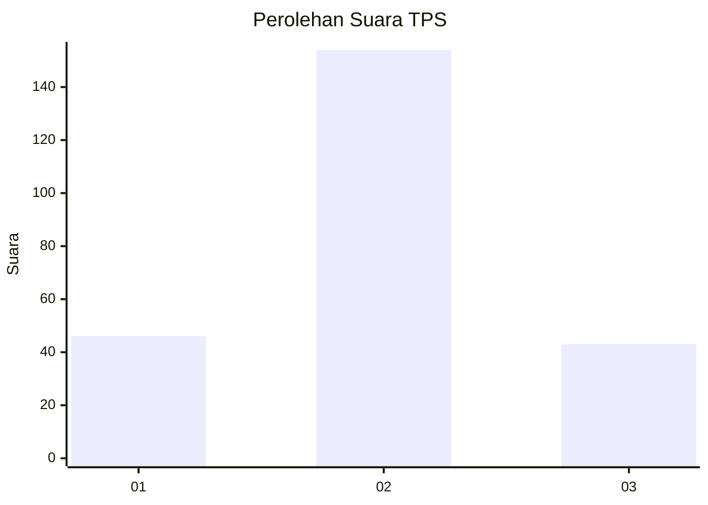
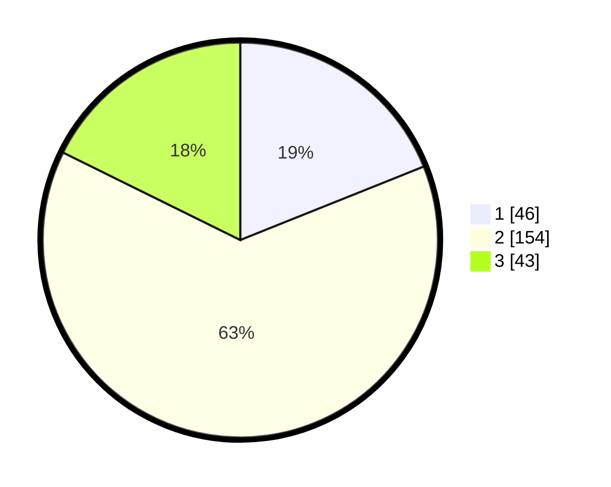

# Hasil

## Grafik

## Tabel

| No. | Nama Paslon    | Suara | Suara (raw) | Persentase |
|:--- |:-------------- | -----:| -----------:| ----------:|
| 1   | ANIES MUHAIMIN | 46    | [46][p-1]   | 18,93      |
| 2   | PRABOWO GIBRAN | 154   | [154][p-2]  | 63,37      |
| 3   | GANJAR MAHFUD  | 43    | [43][p-3]   | 17,70      |

[p-1]: https://github.com/gigit-pemilu/pemilu-2024-35-jawa-timur/blob/main/pilpres/hitung-suara/sub/35-jawa-timur/sub/25-gresik/sub/15-driyorejo/sub/2002-banjaran/sub/017-tps/sub/paslon-1.txt
[p-2]: https://github.com/gigit-pemilu/pemilu-2024-35-jawa-timur/blob/main/pilpres/hitung-suara/sub/35-jawa-timur/sub/25-gresik/sub/15-driyorejo/sub/2002-banjaran/sub/017-tps/sub/paslon-2.txt
[p-3]: https://github.com/gigit-pemilu/pemilu-2024-35-jawa-timur/blob/main/pilpres/hitung-suara/sub/35-jawa-timur/sub/25-gresik/sub/15-driyorejo/sub/2002-banjaran/sub/017-tps/sub/paslon-3.txt

## Foto C Plano

https://sirekap-obj-formc.kpu.go.id/7d4e/pemilu/ppwp/35/25/15/20/02/3525152002017-20240221-084519--c2fb947c-b955-4737-b20c-3467f527e1d9.jpg

https://sirekap-obj-formc.kpu.go.id/7d4e/pemilu/ppwp/35/25/15/20/02/3525152002017-20240214-195529--29602515-22ef-48e1-a1a8-c39ff100093b.jpg

https://sirekap-obj-formc.kpu.go.id/7d4e/pemilu/ppwp/35/25/15/20/02/3525152002017-20240214-200732--250b5b52-aa7f-44ae-9523-587ad92be1b4.jpg

## Metadata

| Key        | Value               |
| ---------- | ------------------- |
| Time Stamp | 2024-02-21 09:00:00 |

## DATA PEMILIH TETAP

Jumlah pemilih dalam DPT: **117**.
 * L: **0**.
 * P: **550**.

## DATA PENGGUNA HAK PILIH

Jumlah pengguna hak pilih dalam DPT: **511**.
 * L: **200**.
 * P: **33**.

Jumlah pengguna hak pilih dalam DPTb: **510**.
 * L: **0**.
 * P: **330**.

Jumlah pengguna hak pilih dalam DPK: **20**.
 * L: **100**.
 * P: **0**.

Jumlah pengguna hak pilih: **0**.
 * L: **0**.
 * P: **0**.

## JUMLAH SUARA SAH DAN TIDAK SAH

JUMLAH SELURUH SUARA SAH: **243**.

JUMLAH SUARA TIDAK SAH: **9**.

JUMLAH SELURUH SUARA SAH DAN SUARA TIDAK SAH: **252**.

