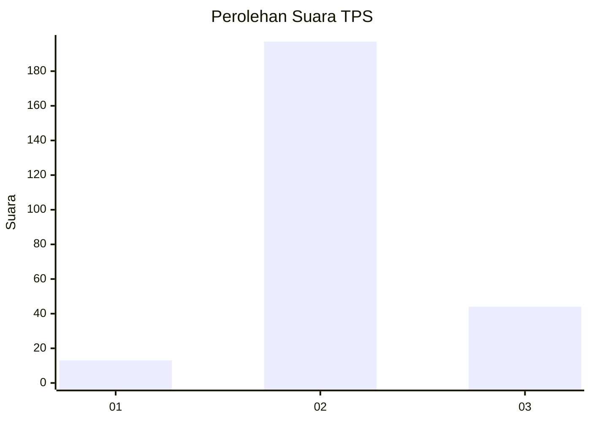

# Hasil

## Grafik

## Tabel

| No. | Nama Paslon    | Suara | Suara (raw) | Persentase |
|:--- |:-------------- | -----:| -----------:| ----------:|
| 1   | ANIES MUHAIMIN | 13    | [13][p-1]   | 5,12       |
| 2   | PRABOWO GIBRAN | 197   | [197][p-2]  | 77,56      |
| 3   | GANJAR MAHFUD  | 44    | [44][p-3]   | 17,32      |

[p-1]: https://github.com/gigit-pemilu/pemilu-2024/blob/main/pilpres/hitung-suara/sub/35-jawa-timur/sub/25-gresik/sub/15-driyorejo/sub/2004-mojosari-rejo/sub/010-tps/sub/paslon-1.txt
[p-2]: https://github.com/gigit-pemilu/pemilu-2024/blob/main/pilpres/hitung-suara/sub/35-jawa-timur/sub/25-gresik/sub/15-driyorejo/sub/2004-mojosari-rejo/sub/010-tps/sub/paslon-2.txt
[p-3]: https://github.com/gigit-pemilu/pemilu-2024/blob/main/pilpres/hitung-suara/sub/35-jawa-timur/sub/25-gresik/sub/15-driyorejo/sub/2004-mojosari-rejo/sub/010-tps/sub/paslon-3.txt

## Foto C Plano

https://sirekap-obj-formc.kpu.go.id/06e1/pemilu/ppwp/35/25/15/20/04/3525152004010-20240215-010930--895b3ccc-fa64-473f-8a3f-7ba8ee31d791.jpg

https://sirekap-obj-formc.kpu.go.id/06e1/pemilu/ppwp/35/25/15/20/04/3525152004010-20240215-011758--56527a3a-9b58-47f9-b270-6e9f9f09321b.jpg

https://sirekap-obj-formc.kpu.go.id/06e1/pemilu/ppwp/35/25/15/20/04/3525152004010-20240215-011843--4be9ac8e-4ffc-4801-a4fb-3456347afc43.jpg

## Metadata

| Key        | Value               |
| ---------- | ------------------- |
| Time Stamp | 2024-02-21 19:00:00 |

## DATA PEMILIH TETAP

Jumlah pemilih dalam DPT: **444**.
 * L: **129**.
 * P: **32**.

## DATA PENGGUNA HAK PILIH

Jumlah pengguna hak pilih dalam DPT: **444**.
 * L: **129**.
 * P: **114**.

Jumlah pengguna hak pilih dalam DPTb: **444**.
 * L: **6**.
 * P: **664**.

Jumlah pengguna hak pilih dalam DPK: **444**.
 * L: **0**.
 * P: **4**.

Jumlah pengguna hak pilih: **644**.
 * L: **129**.
 * P: **133**.

## JUMLAH SUARA SAH DAN TIDAK SAH

JUMLAH SELURUH SUARA SAH: **254**.

JUMLAH SUARA TIDAK SAH: **8**.

JUMLAH SELURUH SUARA SAH DAN SUARA TIDAK SAH: **262**.

