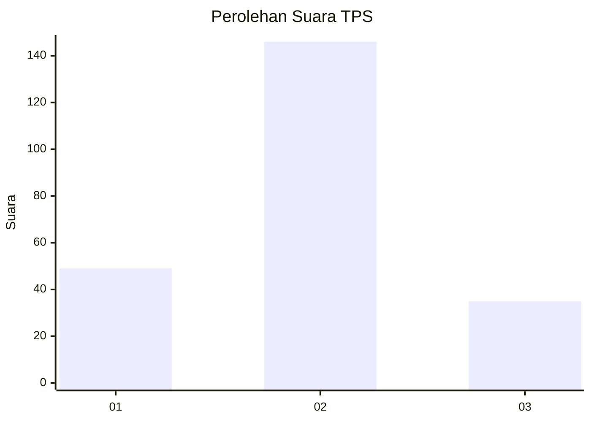
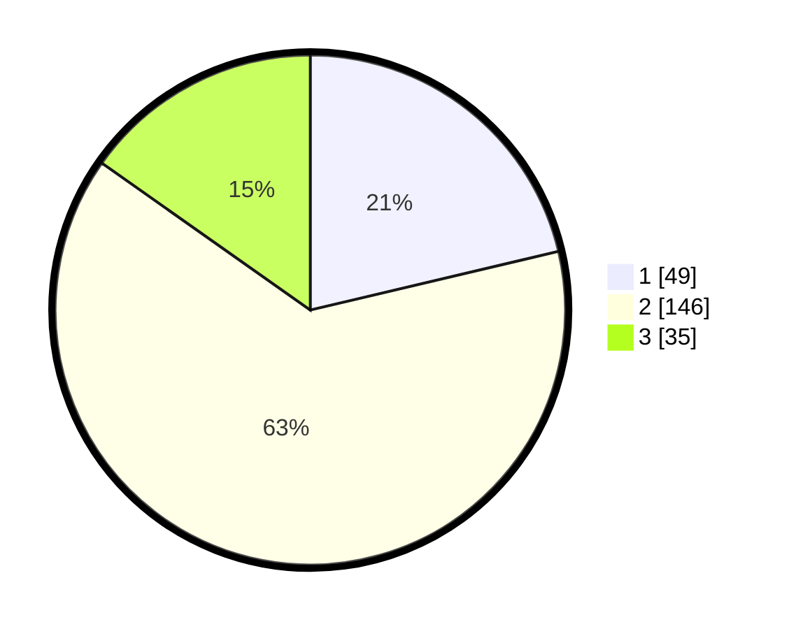

# Hasil

## Grafik

## Tabel

| No. | Nama Paslon    | Suara | Suara (raw) | Persentase |
|:--- |:-------------- | -----:| -----------:| ----------:|
| 1   | ANIES MUHAIMIN | 49    | [49][p-1]   | 21,30      |
| 2   | PRABOWO GIBRAN | 146   | [146][p-2]  | 63,48      |
| 3   | GANJAR MAHFUD  | 35    | [35][p-3]   | 15,22      |

[p-1]: https://github.com/gigit-pemilu/pemilu-2024/blob/main/pilpres/hitung-suara/sub/35-jawa-timur/sub/25-gresik/sub/15-driyorejo/sub/2004-mojosari-rejo/sub/022-tps/sub/paslon-1.txt
[p-2]: https://github.com/gigit-pemilu/pemilu-2024/blob/main/pilpres/hitung-suara/sub/35-jawa-timur/sub/25-gresik/sub/15-driyorejo/sub/2004-mojosari-rejo/sub/022-tps/sub/paslon-2.txt
[p-3]: https://github.com/gigit-pemilu/pemilu-2024/blob/main/pilpres/hitung-suara/sub/35-jawa-timur/sub/25-gresik/sub/15-driyorejo/sub/2004-mojosari-rejo/sub/022-tps/sub/paslon-3.txt

## Foto C Plano

https://sirekap-obj-formc.kpu.go.id/3ab9/pemilu/ppwp/35/25/15/20/04/3525152004022-20240222-164724--036ac389-bd5e-4c55-a09e-2a8a7fb693a5.jpg

https://sirekap-obj-formc.kpu.go.id/3ab9/pemilu/ppwp/35/25/15/20/04/3525152004022-20240222-164732--11dd2fdb-7357-4785-a516-ab759c1c04fa.jpg

https://sirekap-obj-formc.kpu.go.id/3ab9/pemilu/ppwp/35/25/15/20/04/3525152004022-20240222-164738--ef1ffee8-5483-492d-b7af-b13f316c9487.jpg

## Metadata

| Key        | Value               |
| ---------- | ------------------- |
| Time Stamp | 2024-02-24 22:31:28 |

## DATA PEMILIH TETAP

Jumlah pemilih dalam DPT: **701**.
 * L: **776**.
 * P: **287**.

## DATA PENGGUNA HAK PILIH

Jumlah pengguna hak pilih dalam DPT: **101**.
 * L: **406**.
 * P: **224**.

Jumlah pengguna hak pilih dalam DPTb: **101**.
 * L: **440**.
 * P: **0**.

Jumlah pengguna hak pilih dalam DPK: **101**.
 * L: **445**.
 * P: **804**.

Jumlah pengguna hak pilih: **101**.
 * L: **46**.
 * P: **233**.

## JUMLAH SUARA SAH DAN TIDAK SAH

JUMLAH SELURUH SUARA SAH: **230**.

JUMLAH SUARA TIDAK SAH: **3**.

JUMLAH SELURUH SUARA SAH DAN SUARA TIDAK SAH: **233**.

