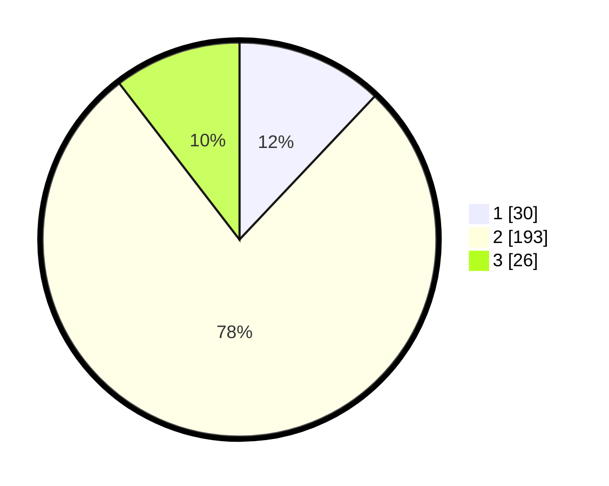

# Hasil

## Grafik

## Tabel

| No. | Nama Paslon    | Suara | Suara (raw) | Persentase |
|:--- |:-------------- | -----:| -----------:| ----------:|
| 1   | ANIES MUHAIMIN | 30    | [30][p-1]   | 12,05      |
| 2   | PRABOWO GIBRAN | 193   | [193][p-2]  | 77,51      |
| 3   | GANJAR MAHFUD  | 26    | [26][p-3]   | 10,44      |

[p-1]: https://github.com/gigit-pemilu/pemilu-2024-35-jawa-timur/blob/main/pilpres/hitung-suara/sub/35-jawa-timur/sub/25-gresik/sub/15-driyorejo/sub/2007-sumput/sub/024-tps/sub/paslon-1.txt
[p-2]: https://github.com/gigit-pemilu/pemilu-2024-35-jawa-timur/blob/main/pilpres/hitung-suara/sub/35-jawa-timur/sub/25-gresik/sub/15-driyorejo/sub/2007-sumput/sub/024-tps/sub/paslon-2.txt
[p-3]: https://github.com/gigit-pemilu/pemilu-2024-35-jawa-timur/blob/main/pilpres/hitung-suara/sub/35-jawa-timur/sub/25-gresik/sub/15-driyorejo/sub/2007-sumput/sub/024-tps/sub/paslon-3.txt

## Foto C Plano

https://sirekap-obj-formc.kpu.go.id/1764/pemilu/ppwp/35/25/15/20/07/3525152007024-20240217-210040--b9d6ea22-beb4-430b-9968-99337f03f02a.jpg

https://sirekap-obj-formc.kpu.go.id/1764/pemilu/ppwp/35/25/15/20/07/3525152007024-20240217-193427--6c7304ec-9ce1-4a8a-b4e3-c3e7d0e207b6.jpg

https://sirekap-obj-formc.kpu.go.id/1764/pemilu/ppwp/35/25/15/20/07/3525152007024-20240217-193444--d7e8d3b2-0f5c-4d55-a20b-03125baa20ef.jpg

## Metadata

| Key        | Value               |
| ---------- | ------------------- |
| Time Stamp | 2024-02-21 19:00:00 |

## DATA PEMILIH TETAP

Jumlah pemilih dalam DPT: **227**.
 * L: **135**.
 * P: **852**.

## DATA PENGGUNA HAK PILIH

Jumlah pengguna hak pilih dalam DPT: **273**.
 * L: **233**.
 * P: **838**.

Jumlah pengguna hak pilih dalam DPTb: **888**.
 * L: **888**.
 * P: **808**.

Jumlah pengguna hak pilih dalam DPK: **884**.
 * L: **882**.
 * P: **83**.

Jumlah pengguna hak pilih: **303**.
 * L: **133**.
 * P: **632**.

## JUMLAH SUARA SAH DAN TIDAK SAH

JUMLAH SELURUH SUARA SAH: **249**.

JUMLAH SUARA TIDAK SAH: **4**.

JUMLAH SELURUH SUARA SAH DAN SUARA TIDAK SAH: **253**.

