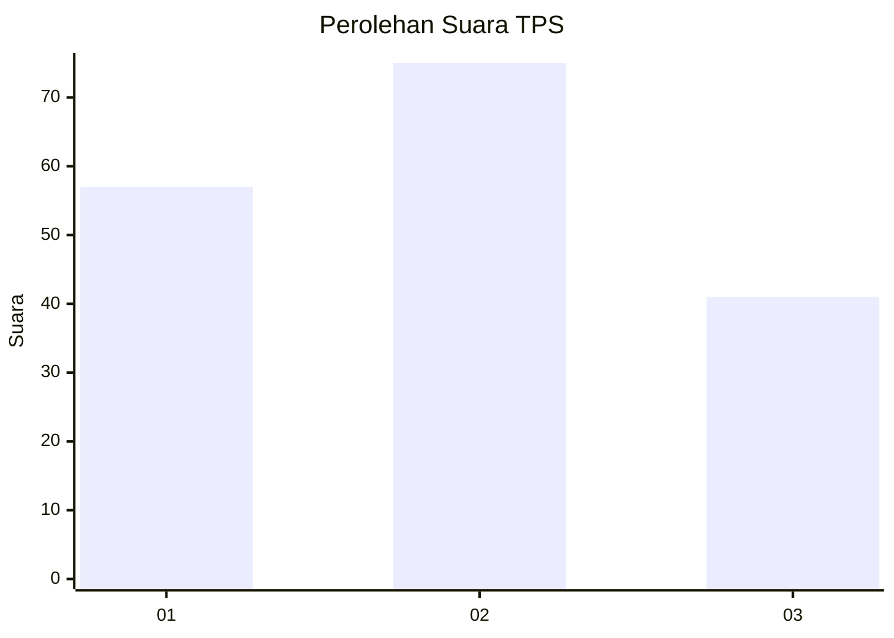
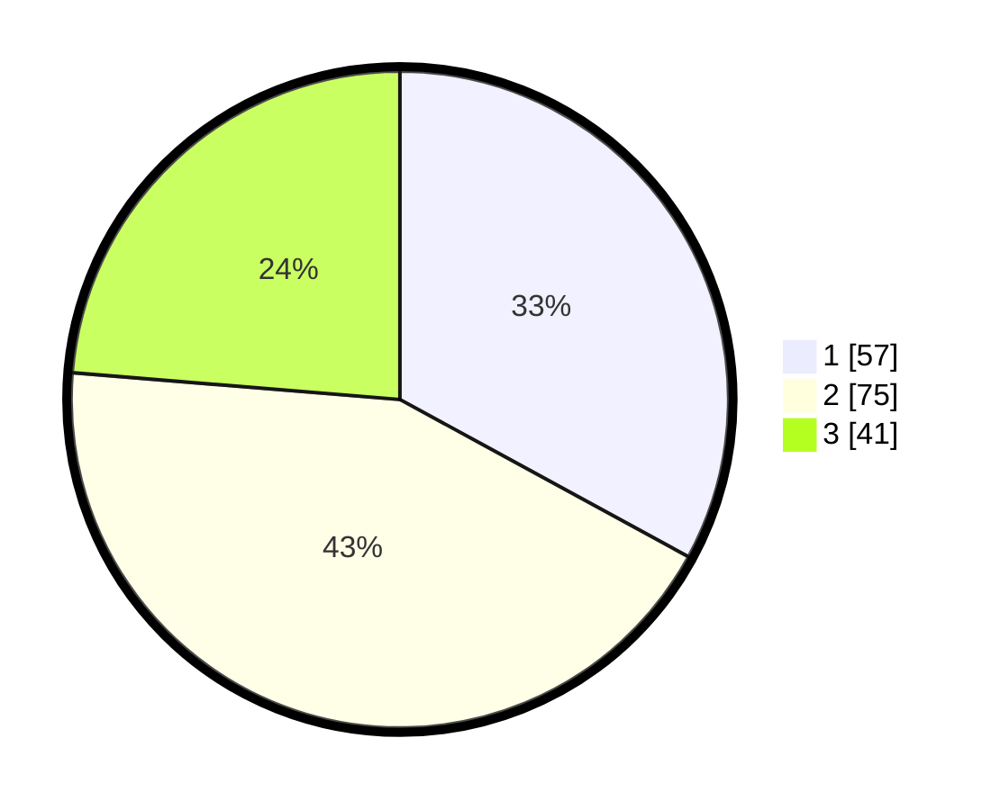

# Hasil

## Grafik

## Tabel

| No. | Nama Paslon    | Suara | Suara (raw) | Persentase |
|:--- |:-------------- | -----:| -----------:| ----------:|
| 1   | ANIES MUHAIMIN | 57    | [57][p-1]   | 32,95      |
| 2   | PRABOWO GIBRAN | 75    | [75][p-2]   | 43,35      |
| 3   | GANJAR MAHFUD  | 41    | [41][p-3]   | 23,70      |

[p-1]: https://github.com/gigit-pemilu/pemilu-2024-35-jawa-timur/blob/main/pilpres/hitung-suara/sub/35-jawa-timur/sub/25-gresik/sub/15-driyorejo/sub/2009-randegansari/sub/007-tps/sub/paslon-1.txt
[p-2]: https://github.com/gigit-pemilu/pemilu-2024-35-jawa-timur/blob/main/pilpres/hitung-suara/sub/35-jawa-timur/sub/25-gresik/sub/15-driyorejo/sub/2009-randegansari/sub/007-tps/sub/paslon-2.txt
[p-3]: https://github.com/gigit-pemilu/pemilu-2024-35-jawa-timur/blob/main/pilpres/hitung-suara/sub/35-jawa-timur/sub/25-gresik/sub/15-driyorejo/sub/2009-randegansari/sub/007-tps/sub/paslon-3.txt

## Foto C Plano

https://sirekap-obj-formc.kpu.go.id/a401/pemilu/ppwp/35/25/15/20/09/3525152009007-20240221-171103--9cd5c035-9f50-4bef-97e6-bd82bb2c4c02.jpg

https://sirekap-obj-formc.kpu.go.id/a401/pemilu/ppwp/35/25/15/20/09/3525152009007-20240221-171114--97e949c4-215b-4918-916c-27c3278a9966.jpg

https://sirekap-obj-formc.kpu.go.id/a401/pemilu/ppwp/35/25/15/20/09/3525152009007-20240221-171125--691e57ea-baf7-4244-a987-dc0648cbf2b2.jpg

## Metadata

| Key        | Value               |
| ---------- | ------------------- |
| Time Stamp | 2024-02-21 19:00:00 |

## DATA PEMILIH TETAP

Jumlah pemilih dalam DPT: **224**.
 * L: **225**.
 * P: **222**.

## DATA PENGGUNA HAK PILIH

Jumlah pengguna hak pilih dalam DPT: **757**.
 * L: **505**.
 * P: **725**.

Jumlah pengguna hak pilih dalam DPTb: **552**.
 * L: **552**.
 * P: **725**.

Jumlah pengguna hak pilih dalam DPK: **824**.
 * L: **752**.
 * P: **457**.

Jumlah pengguna hak pilih: **2**.
 * L: **20**.
 * P: **200**.

## JUMLAH SUARA SAH DAN TIDAK SAH

JUMLAH SELURUH SUARA SAH: **233**.

JUMLAH SUARA TIDAK SAH: **7**.

JUMLAH SELURUH SUARA SAH DAN SUARA TIDAK SAH: **240**.

