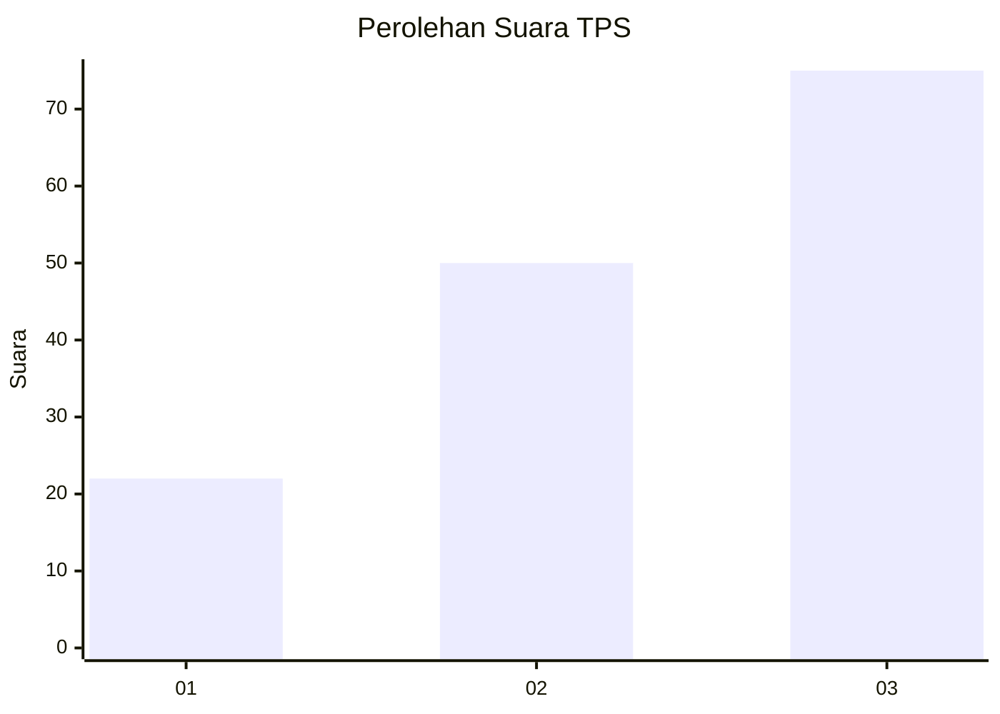
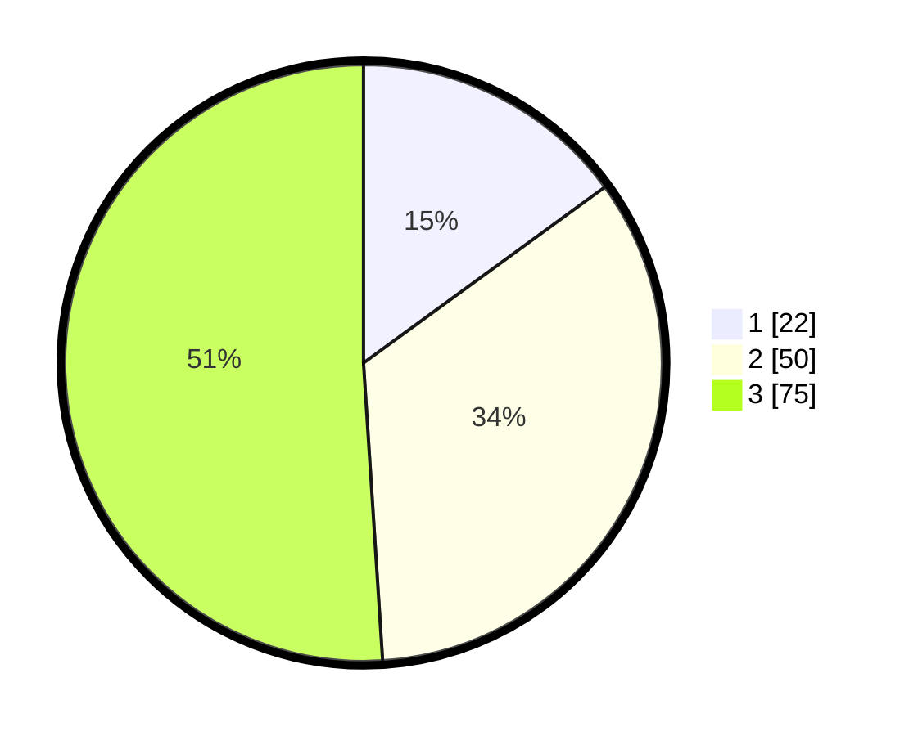

# Hasil

## Grafik

## Tabel

| No. | Nama Paslon    | Suara | Suara (raw) | Persentase |
|:--- |:-------------- | -----:| -----------:| ----------:|
| 1   | ANIES MUHAIMIN | 22    | [22][p-1]   | 14,97      |
| 2   | PRABOWO GIBRAN | 50    | [50][p-2]   | 34,01      |
| 3   | GANJAR MAHFUD  | 75    | [75][p-3]   | 51,02      |

[p-1]: https://github.com/gigit-pemilu/pemilu-2024/blob/main/pilpres/hitung-suara/sub/35-jawa-timur/sub/25-gresik/sub/15-driyorejo/sub/2010-tenaru/sub/005-tps/sub/paslon-1.txt
[p-2]: https://github.com/gigit-pemilu/pemilu-2024/blob/main/pilpres/hitung-suara/sub/35-jawa-timur/sub/25-gresik/sub/15-driyorejo/sub/2010-tenaru/sub/005-tps/sub/paslon-2.txt
[p-3]: https://github.com/gigit-pemilu/pemilu-2024/blob/main/pilpres/hitung-suara/sub/35-jawa-timur/sub/25-gresik/sub/15-driyorejo/sub/2010-tenaru/sub/005-tps/sub/paslon-3.txt

## Foto C Plano

https://sirekap-obj-formc.kpu.go.id/c6f2/pemilu/ppwp/35/25/15/20/10/3525152010005-20240221-182928--4a510995-07cd-4a78-aba9-4cbae736020e.jpg

https://sirekap-obj-formc.kpu.go.id/c6f2/pemilu/ppwp/35/25/15/20/10/3525152010005-20240221-182937--c51ae348-be61-41da-9b12-799effa02fd3.jpg

https://sirekap-obj-formc.kpu.go.id/c6f2/pemilu/ppwp/35/25/15/20/10/3525152010005-20240221-182945--07d85738-1319-4cd5-b4de-5b555e6724b8.jpg

## Metadata

| Key        | Value               |
| ---------- | ------------------- |
| Time Stamp | 2024-02-21 19:00:00 |

## DATA PEMILIH TETAP

Jumlah pemilih dalam DPT: **582**.
 * L: **27**.
 * P: **469**.

## DATA PENGGUNA HAK PILIH

Jumlah pengguna hak pilih dalam DPT: **575**.
 * L: **920**.
 * P: **897**.

Jumlah pengguna hak pilih dalam DPTb: **200**.
 * L: **888**.
 * P: **22**.

Jumlah pengguna hak pilih dalam DPK: **0**.
 * L: **882**.
 * P: **886**.

Jumlah pengguna hak pilih: **200**.
 * L: **260**.
 * P: **544**.

## JUMLAH SUARA SAH DAN TIDAK SAH

JUMLAH SELURUH SUARA SAH: **202**.

JUMLAH SUARA TIDAK SAH: **21**.

JUMLAH SELURUH SUARA SAH DAN SUARA TIDAK SAH: **217**.

