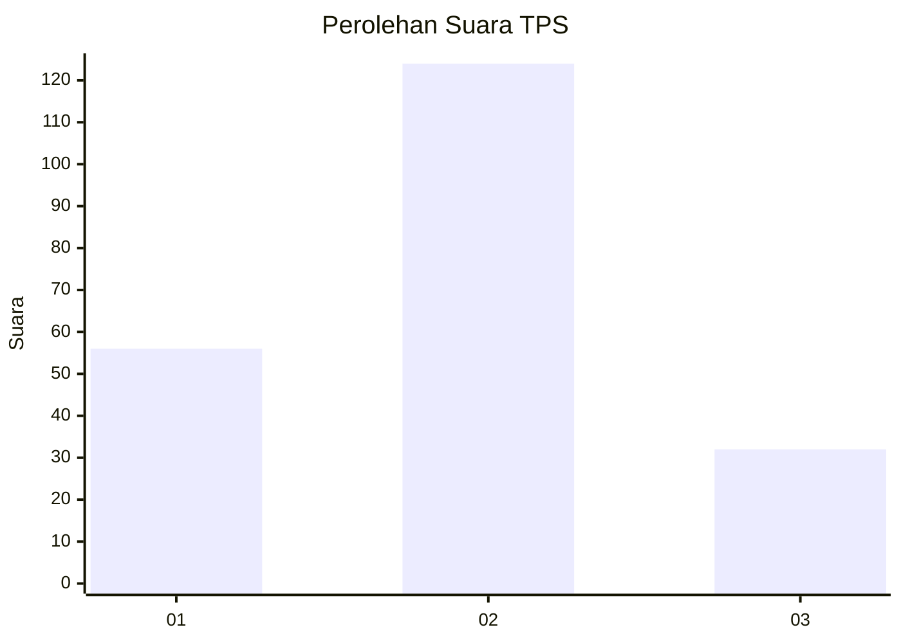
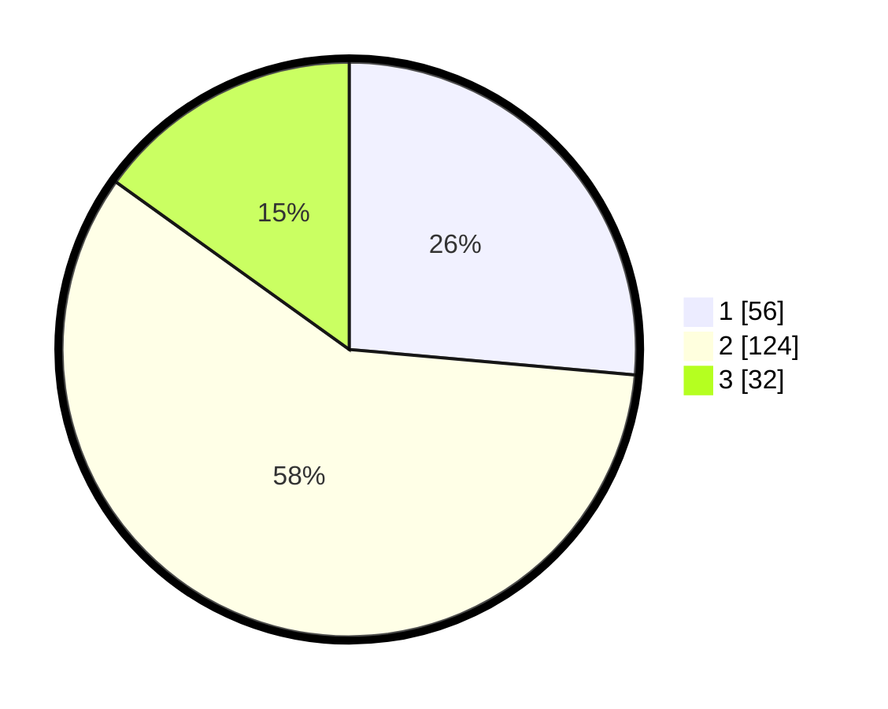

# Hasil

## Grafik

## Tabel

| No. | Nama Paslon    | Suara | Suara (raw) | Persentase |
|:--- |:-------------- | -----:| -----------:| ----------:|
| 1   | ANIES MUHAIMIN | 56    | [56][p-1]   | 26,42      |
| 2   | PRABOWO GIBRAN | 124   | [124][p-2]  | 58,49      |
| 3   | GANJAR MAHFUD  | 32    | [32][p-3]   | 15,09      |

[p-1]: https://github.com/gigit-pemilu/pemilu-2024-35-jawa-timur/blob/main/pilpres/hitung-suara/sub/35-jawa-timur/sub/25-gresik/sub/15-driyorejo/sub/2012-petiken/sub/029-tps/sub/paslon-1.txt
[p-2]: https://github.com/gigit-pemilu/pemilu-2024-35-jawa-timur/blob/main/pilpres/hitung-suara/sub/35-jawa-timur/sub/25-gresik/sub/15-driyorejo/sub/2012-petiken/sub/029-tps/sub/paslon-2.txt
[p-3]: https://github.com/gigit-pemilu/pemilu-2024-35-jawa-timur/blob/main/pilpres/hitung-suara/sub/35-jawa-timur/sub/25-gresik/sub/15-driyorejo/sub/2012-petiken/sub/029-tps/sub/paslon-3.txt

## Foto C Plano

https://sirekap-obj-formc.kpu.go.id/5ceb/pemilu/ppwp/35/25/15/20/12/3525152012029-20240214-235343--05cee755-81e9-49dd-a652-a3bd3423f19f.jpg

https://sirekap-obj-formc.kpu.go.id/5ceb/pemilu/ppwp/35/25/15/20/12/3525152012029-20240214-235402--f4ff689d-1e60-451e-b978-12eaa066b14e.jpg

https://sirekap-obj-formc.kpu.go.id/5ceb/pemilu/ppwp/35/25/15/20/12/3525152012029-20240214-235526--38e1cfe3-253a-42bc-8098-78956ef1acfd.jpg

## Metadata

| Key        | Value               |
| ---------- | ------------------- |
| Time Stamp | 2024-02-19 06:16:00 |

## DATA PEMILIH TETAP

Jumlah pemilih dalam DPT: **273**.
 * L: **430**.
 * P: **57**.

## DATA PENGGUNA HAK PILIH

Jumlah pengguna hak pilih dalam DPT: **745**.
 * L: **22**.
 * P: **424**.

Jumlah pengguna hak pilih dalam DPTb: **4**.
 * L: **87**.
 * P: **404**.

Jumlah pengguna hak pilih dalam DPK: **42**.
 * L: **7**.
 * P: **87**.

Jumlah pengguna hak pilih: **234**.
 * L: **702**.
 * P: **442**.

## JUMLAH SUARA SAH DAN TIDAK SAH

JUMLAH SELURUH SUARA SAH: **212**.

JUMLAH SUARA TIDAK SAH: **2**.

JUMLAH SELURUH SUARA SAH DAN SUARA TIDAK SAH: **214**.

