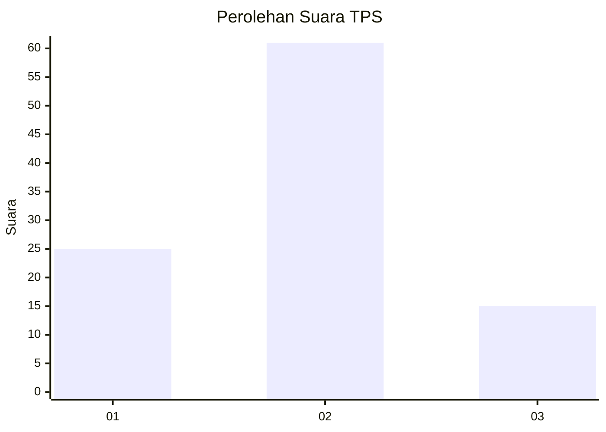
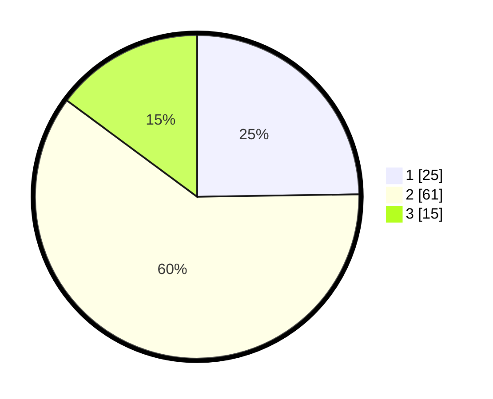

# Hasil

## Grafik

## Tabel

| No. | Nama Paslon    | Suara | Suara (raw) | Persentase |
|:--- |:-------------- | -----:| -----------:| ----------:|
| 1   | ANIES MUHAIMIN | 25    | [25][p-1]   | 24,75      |
| 2   | PRABOWO GIBRAN | 61    | [61][p-2]   | 60,40      |
| 3   | GANJAR MAHFUD  | 15    | [15][p-3]   | 14,85      |

[p-1]: https://github.com/gigit-pemilu/pemilu-2024-35-jawa-timur/blob/main/pilpres/hitung-suara/sub/35-jawa-timur/sub/25-gresik/sub/15-driyorejo/sub/2016-bambe/sub/001-tps/sub/paslon-1.txt
[p-2]: https://github.com/gigit-pemilu/pemilu-2024-35-jawa-timur/blob/main/pilpres/hitung-suara/sub/35-jawa-timur/sub/25-gresik/sub/15-driyorejo/sub/2016-bambe/sub/001-tps/sub/paslon-2.txt
[p-3]: https://github.com/gigit-pemilu/pemilu-2024-35-jawa-timur/blob/main/pilpres/hitung-suara/sub/35-jawa-timur/sub/25-gresik/sub/15-driyorejo/sub/2016-bambe/sub/001-tps/sub/paslon-3.txt

## Foto C Plano

https://sirekap-obj-formc.kpu.go.id/ecb7/pemilu/ppwp/35/25/15/20/16/3525152016001-20240221-192059--98b4e513-79b3-4d86-a27d-eaea2bed6c0f.jpg

https://sirekap-obj-formc.kpu.go.id/ecb7/pemilu/ppwp/35/25/15/20/16/3525152016001-20240221-192108--c97a4d73-f702-4e50-a91f-37cc096b9d9b.jpg

https://sirekap-obj-formc.kpu.go.id/ecb7/pemilu/ppwp/35/25/15/20/16/3525152016001-20240221-192115--5ee00295-a8f4-4ace-8332-efb84fe98c02.jpg

## Metadata

| Key        | Value               |
| ---------- | ------------------- |
| Time Stamp | 2024-02-21 20:00:00 |

## DATA PEMILIH TETAP

Jumlah pemilih dalam DPT: **223**.
 * L: **342**.
 * P: **433**.

## DATA PENGGUNA HAK PILIH

Jumlah pengguna hak pilih dalam DPT: **200**.
 * L: **898**.
 * P: **302**.

Jumlah pengguna hak pilih dalam DPTb: **84**.
 * L: **2**.
 * P: **2**.

Jumlah pengguna hak pilih dalam DPK: **80**.
 * L: **80**.
 * P: **80**.

Jumlah pengguna hak pilih: **204**.
 * L: **500**.
 * P: **4**.

## JUMLAH SUARA SAH DAN TIDAK SAH

JUMLAH SELURUH SUARA SAH: **202**.

JUMLAH SUARA TIDAK SAH: **2**.

JUMLAH SELURUH SUARA SAH DAN SUARA TIDAK SAH: **204**.

