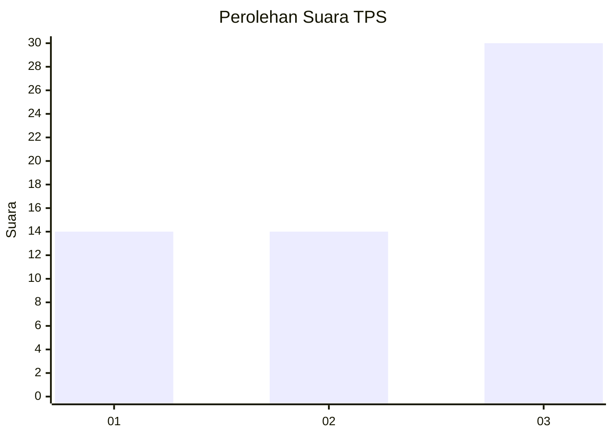
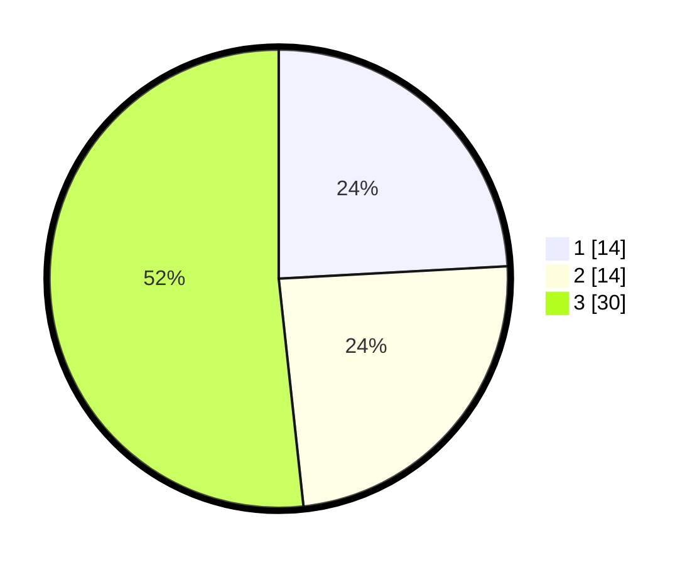

# Hasil

## Grafik

## Tabel

| No. | Nama Paslon    | Suara | Suara (raw) | Persentase |
|:--- |:-------------- | -----:| -----------:| ----------:|
| 1   | ANIES MUHAIMIN | 14    | [14][p-1]   | 24,14      |
| 2   | PRABOWO GIBRAN | 14    | [14][p-2]   | 24,14      |
| 3   | GANJAR MAHFUD  | 30    | [30][p-3]   | 51,72      |

[p-1]: https://github.com/gigit-pemilu/pemilu-2024/blob/main/pilpres/hitung-suara/sub/35-jawa-timur/sub/25-gresik/sub/15-driyorejo/sub/2016-bambe/sub/003-tps/sub/paslon-1.txt
[p-2]: https://github.com/gigit-pemilu/pemilu-2024/blob/main/pilpres/hitung-suara/sub/35-jawa-timur/sub/25-gresik/sub/15-driyorejo/sub/2016-bambe/sub/003-tps/sub/paslon-2.txt
[p-3]: https://github.com/gigit-pemilu/pemilu-2024/blob/main/pilpres/hitung-suara/sub/35-jawa-timur/sub/25-gresik/sub/15-driyorejo/sub/2016-bambe/sub/003-tps/sub/paslon-3.txt

## Foto C Plano

https://sirekap-obj-formc.kpu.go.id/2bcb/pemilu/ppwp/35/25/15/20/16/3525152016003-20240221-192219--4857698d-1fa8-4baa-85de-870660bfa967.jpg

https://sirekap-obj-formc.kpu.go.id/2bcb/pemilu/ppwp/35/25/15/20/16/3525152016003-20240221-192232--3192ecb6-312e-42e3-8e5f-f30ca4420fb3.jpg

## Metadata

| Key        | Value               |
| ---------- | ------------------- |
| Time Stamp | 2024-02-21 20:00:00 |

