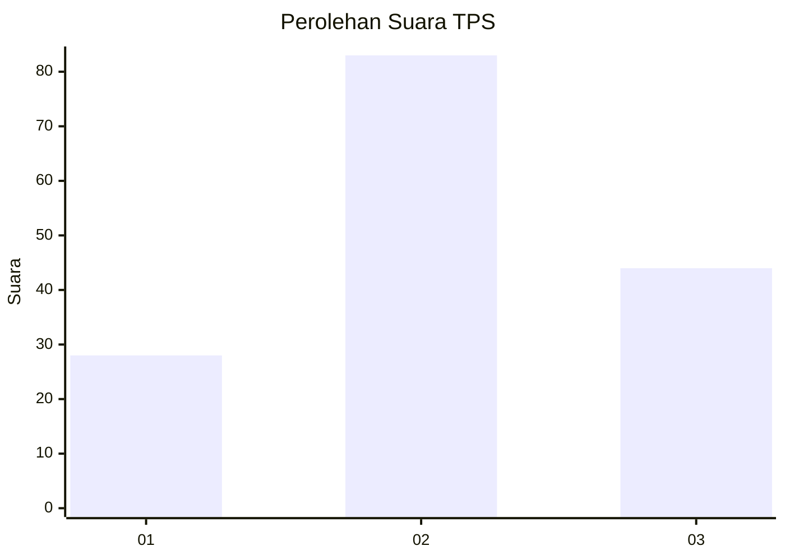
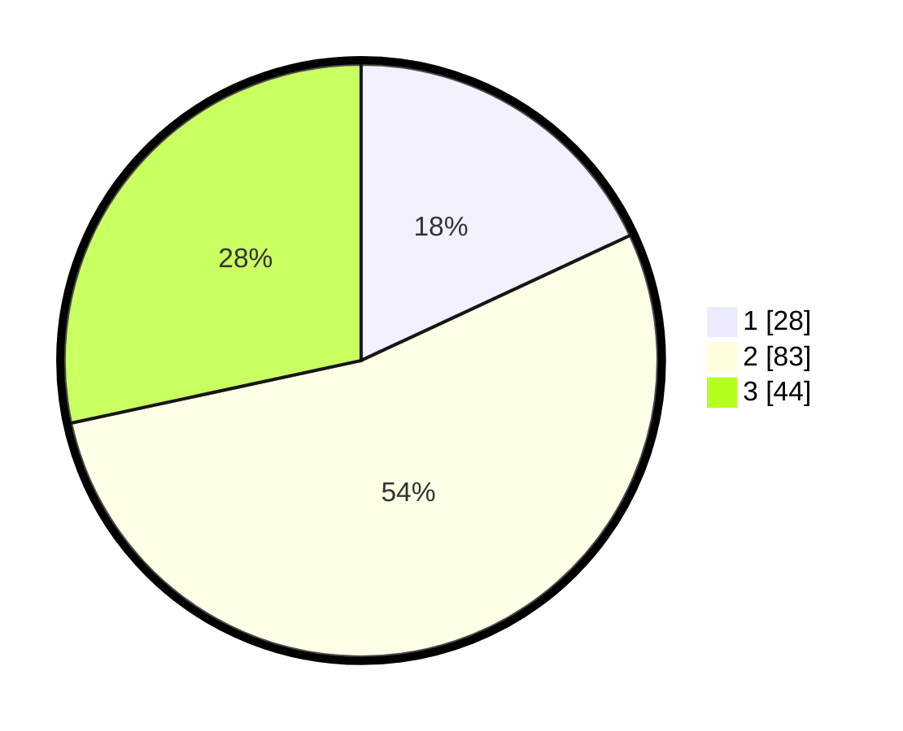

# Hasil

## Grafik

## Tabel

| No. | Nama Paslon    | Suara | Suara (raw) | Persentase |
|:--- |:-------------- | -----:| -----------:| ----------:|
| 1   | ANIES MUHAIMIN | 28    | [28][p-1]   | 18,06      |
| 2   | PRABOWO GIBRAN | 83    | [83][p-2]   | 53,55      |
| 3   | GANJAR MAHFUD  | 44    | [44][p-3]   | 28,39      |

[p-1]: https://github.com/gigit-pemilu/pemilu-2024-35-jawa-timur/blob/main/pilpres/hitung-suara/sub/35-jawa-timur/sub/25-gresik/sub/15-driyorejo/sub/2016-bambe/sub/004-tps/sub/paslon-1.txt
[p-2]: https://github.com/gigit-pemilu/pemilu-2024-35-jawa-timur/blob/main/pilpres/hitung-suara/sub/35-jawa-timur/sub/25-gresik/sub/15-driyorejo/sub/2016-bambe/sub/004-tps/sub/paslon-2.txt
[p-3]: https://github.com/gigit-pemilu/pemilu-2024-35-jawa-timur/blob/main/pilpres/hitung-suara/sub/35-jawa-timur/sub/25-gresik/sub/15-driyorejo/sub/2016-bambe/sub/004-tps/sub/paslon-3.txt

## Foto C Plano

https://sirekap-obj-formc.kpu.go.id/eae2/pemilu/ppwp/35/25/15/20/16/3525152016004-20240221-192331--6866d10c-8609-47c9-ad7b-8b1fee3cec12.jpg

https://sirekap-obj-formc.kpu.go.id/eae2/pemilu/ppwp/35/25/15/20/16/3525152016004-20240221-192342--395aa7b6-35e6-442c-9165-7dd99f5e521c.jpg

https://sirekap-obj-formc.kpu.go.id/eae2/pemilu/ppwp/35/25/15/20/16/3525152016004-20240221-192351--7a5d5be8-39d2-4064-b036-9534c70dd4db.jpg

## Metadata

| Key        | Value               |
| ---------- | ------------------- |
| Time Stamp | 2024-02-21 20:00:00 |

## DATA PEMILIH TETAP

Jumlah pemilih dalam DPT: **139**.
 * L: **271**.
 * P: **132**.

## DATA PENGGUNA HAK PILIH

Jumlah pengguna hak pilih dalam DPT: **423**.
 * L: **921**.
 * P: **512**.

Jumlah pengguna hak pilih dalam DPTb: **2**.
 * L: **1**.
 * P: **6**.

Jumlah pengguna hak pilih dalam DPK: **3**.
 * L: **2**.
 * P: **5**.

Jumlah pengguna hak pilih: **244**.
 * L: **118**.
 * P: **626**.

## JUMLAH SUARA SAH DAN TIDAK SAH

JUMLAH SELURUH SUARA SAH: **235**.

JUMLAH SUARA TIDAK SAH: **9**.

JUMLAH SELURUH SUARA SAH DAN SUARA TIDAK SAH: **244**.

