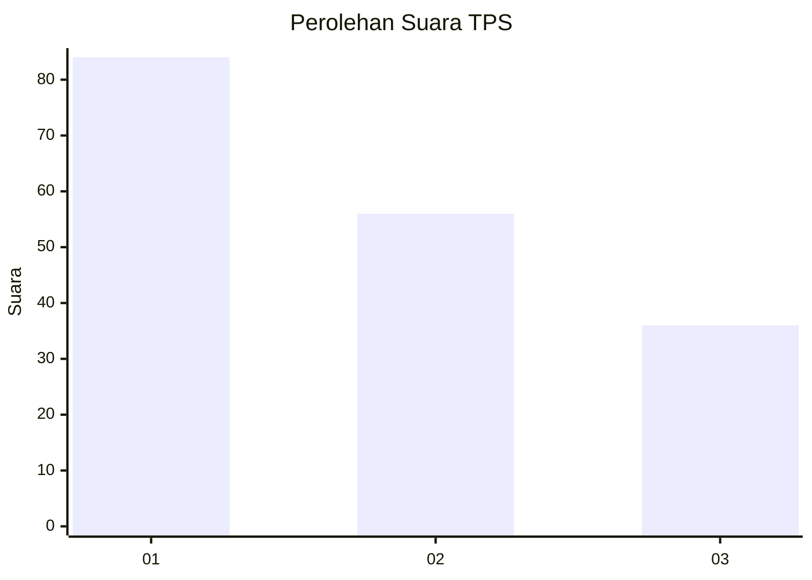
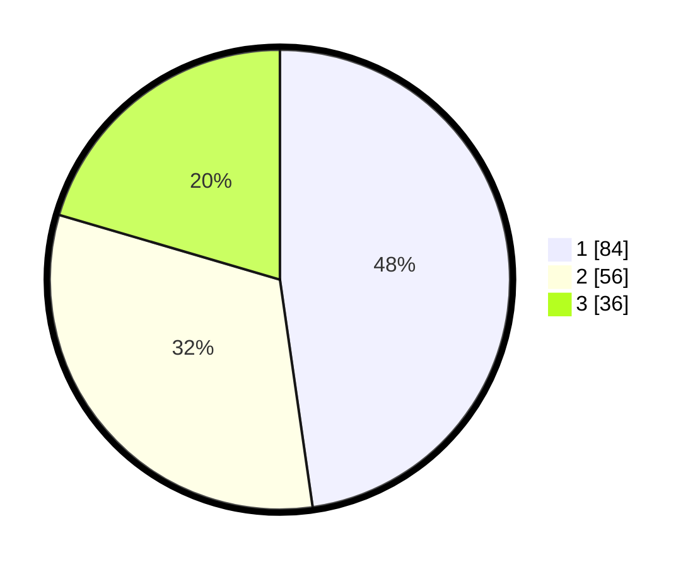

# Hasil

## Grafik

## Tabel

| No. | Nama Paslon    | Suara | Suara (raw) | Persentase |
|:--- |:-------------- | -----:| -----------:| ----------:|
| 1   | ANIES MUHAIMIN | 84    | [84][p-1]   | 47,73      |
| 2   | PRABOWO GIBRAN | 56    | [56][p-2]   | 31,82      |
| 3   | GANJAR MAHFUD  | 36    | [36][p-3]   | 20,45      |

[p-1]: https://github.com/gigit-pemilu/pemilu-2024-35-jawa-timur/blob/main/pilpres/hitung-suara/sub/35-jawa-timur/sub/25-gresik/sub/16-gresik/sub/1003-karang-turi/sub/012-tps/sub/paslon-1.txt
[p-2]: https://github.com/gigit-pemilu/pemilu-2024-35-jawa-timur/blob/main/pilpres/hitung-suara/sub/35-jawa-timur/sub/25-gresik/sub/16-gresik/sub/1003-karang-turi/sub/012-tps/sub/paslon-2.txt
[p-3]: https://github.com/gigit-pemilu/pemilu-2024-35-jawa-timur/blob/main/pilpres/hitung-suara/sub/35-jawa-timur/sub/25-gresik/sub/16-gresik/sub/1003-karang-turi/sub/012-tps/sub/paslon-3.txt

## Foto C Plano

https://sirekap-obj-formc.kpu.go.id/052e/pemilu/ppwp/35/25/16/10/03/3525161003012-20240214-224436--b177635d-18f2-4f66-908d-089fb35384b2.jpg

https://sirekap-obj-formc.kpu.go.id/052e/pemilu/ppwp/35/25/16/10/03/3525161003012-20240215-022342--fd116df1-8369-46b2-949a-70ac35c82da8.jpg

https://sirekap-obj-formc.kpu.go.id/052e/pemilu/ppwp/35/25/16/10/03/3525161003012-20240215-022346--3c9a6736-e3d7-4468-8072-eaa6e9878409.jpg

## Metadata

| Key        | Value               |
| ---------- | ------------------- |
| Time Stamp | 2024-02-16 13:00:29 |

