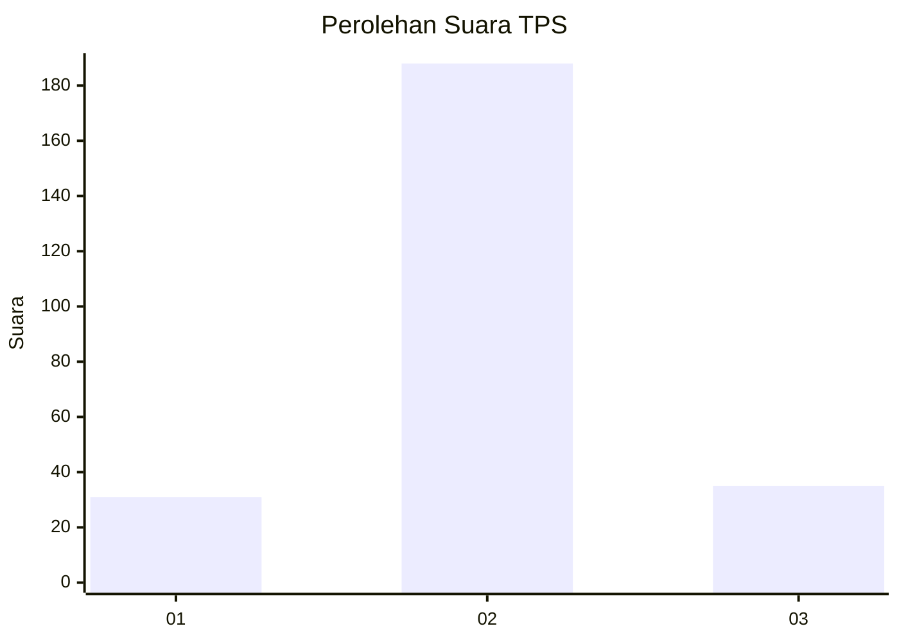
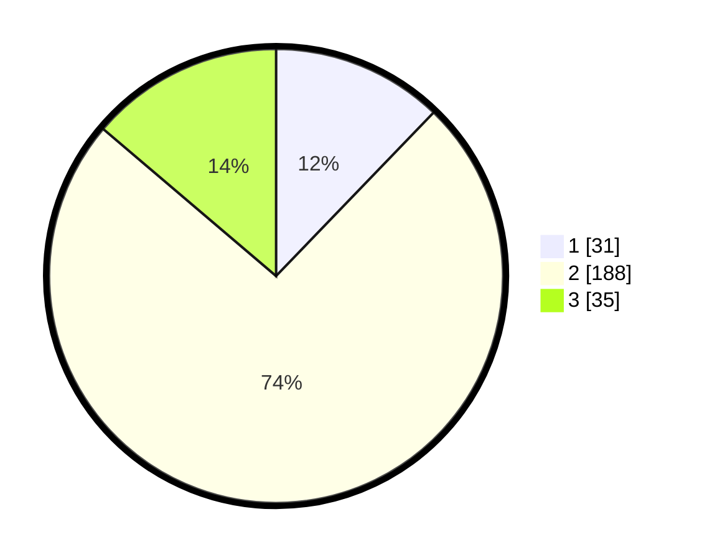

# Hasil

## Grafik

## Tabel

| No. | Nama Paslon    | Suara | Suara (raw) | Persentase |
|:--- |:-------------- | -----:| -----------:| ----------:|
| 1   | ANIES MUHAIMIN | 31    | [31][p-1]   | 12,20      |
| 2   | PRABOWO GIBRAN | 188   | [188][p-2]  | 74,02      |
| 3   | GANJAR MAHFUD  | 35    | [35][p-3]   | 13,78      |

[p-1]: https://github.com/gigit-pemilu/pemilu-2024/blob/main/pilpres/hitung-suara/sub/35-jawa-timur/sub/25-gresik/sub/16-gresik/sub/1004-tlogo-patut/sub/004-tps/sub/paslon-1.txt
[p-2]: https://github.com/gigit-pemilu/pemilu-2024/blob/main/pilpres/hitung-suara/sub/35-jawa-timur/sub/25-gresik/sub/16-gresik/sub/1004-tlogo-patut/sub/004-tps/sub/paslon-2.txt
[p-3]: https://github.com/gigit-pemilu/pemilu-2024/blob/main/pilpres/hitung-suara/sub/35-jawa-timur/sub/25-gresik/sub/16-gresik/sub/1004-tlogo-patut/sub/004-tps/sub/paslon-3.txt

## Foto C Plano

https://sirekap-obj-formc.kpu.go.id/2496/pemilu/ppwp/35/25/16/10/04/3525161004004-20240215-010050--5193677b-8665-4184-a625-1ee7e5c9a3d8.jpg

https://sirekap-obj-formc.kpu.go.id/2496/pemilu/ppwp/35/25/16/10/04/3525161004004-20240215-010215--f6950334-fbba-4bc7-9921-7d163fb41fc0.jpg

https://sirekap-obj-formc.kpu.go.id/2496/pemilu/ppwp/35/25/16/10/04/3525161004004-20240215-010330--6afa1bba-1792-4417-af29-f56203ea99a8.jpg

## Metadata

| Key        | Value               |
| ---------- | ------------------- |
| Time Stamp | 2024-02-16 13:30:32 |

