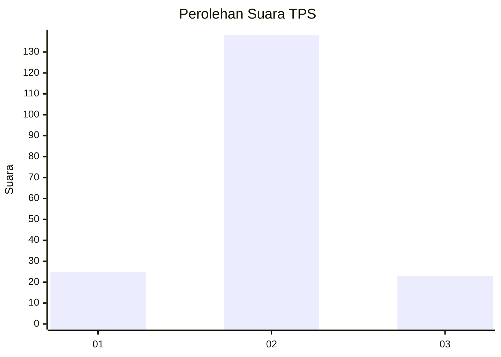
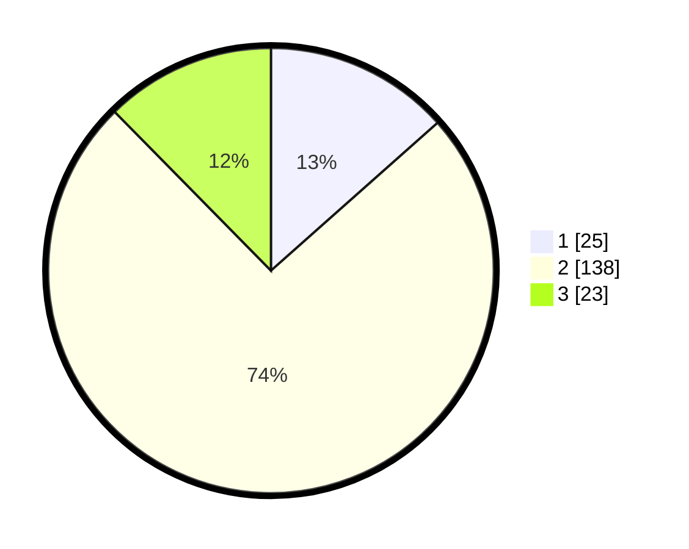

# Hasil

## Grafik

## Tabel

| No. | Nama Paslon    | Suara | Suara (raw) | Persentase |
|:--- |:-------------- | -----:| -----------:| ----------:|
| 1   | ANIES MUHAIMIN | 25    | [25][p-1]   | 13,44      |
| 2   | PRABOWO GIBRAN | 138   | [138][p-2]  | 74,19      |
| 3   | GANJAR MAHFUD  | 23    | [23][p-3]   | 12,37      |

[p-1]: https://github.com/gigit-pemilu/pemilu-2024/blob/main/pilpres/hitung-suara/sub/35-jawa-timur/sub/25-gresik/sub/16-gresik/sub/1006-lumpur/sub/001-tps/sub/paslon-1.txt
[p-2]: https://github.com/gigit-pemilu/pemilu-2024/blob/main/pilpres/hitung-suara/sub/35-jawa-timur/sub/25-gresik/sub/16-gresik/sub/1006-lumpur/sub/001-tps/sub/paslon-2.txt
[p-3]: https://github.com/gigit-pemilu/pemilu-2024/blob/main/pilpres/hitung-suara/sub/35-jawa-timur/sub/25-gresik/sub/16-gresik/sub/1006-lumpur/sub/001-tps/sub/paslon-3.txt

## Foto C Plano

https://sirekap-obj-formc.kpu.go.id/ed0e/pemilu/ppwp/35/25/16/10/06/3525161006001-20240214-214850--e15062f5-dbf0-4190-94b3-2ebe9119cc5e.jpg

https://sirekap-obj-formc.kpu.go.id/ed0e/pemilu/ppwp/35/25/16/10/06/3525161006001-20240214-223427--0fb52db0-9365-4aeb-8fff-7fc0fe16b85b.jpg

https://sirekap-obj-formc.kpu.go.id/ed0e/pemilu/ppwp/35/25/16/10/06/3525161006001-20240214-214024--c076ec5f-2370-4022-8b32-dedd293887bd.jpg

## Metadata

| Key        | Value               |
| ---------- | ------------------- |
| Time Stamp | 2024-02-16 14:00:34 |

