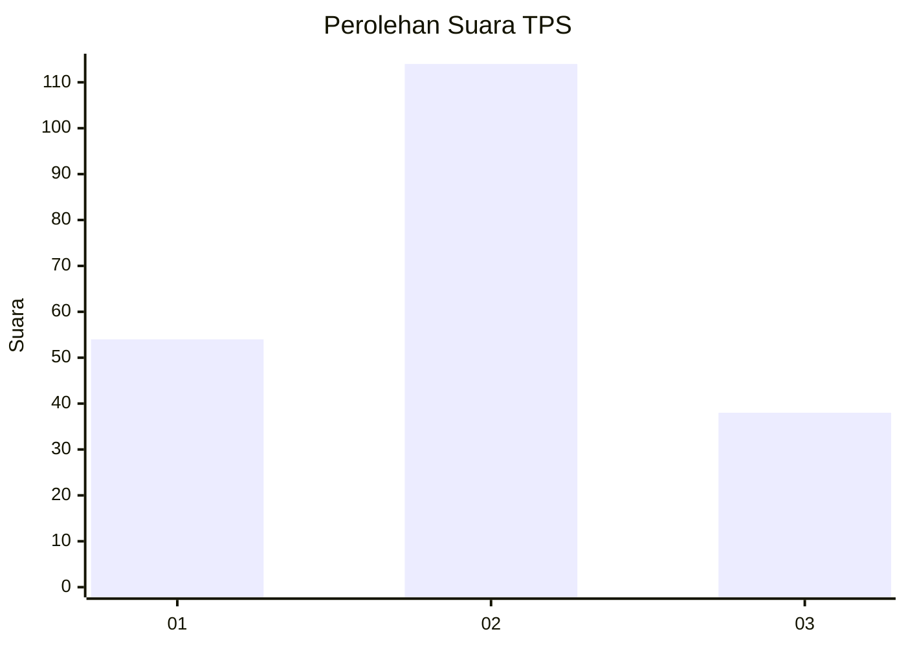
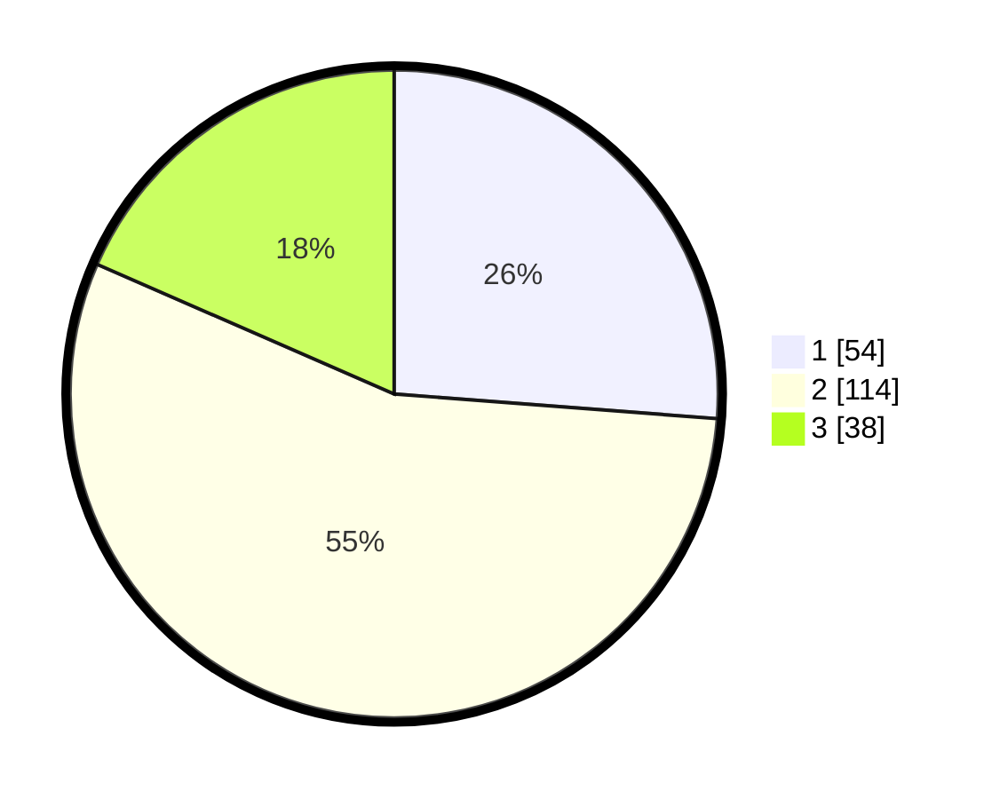

# Hasil

## Grafik

## Tabel

| No. | Nama Paslon    | Suara | Suara (raw) | Persentase |
|:--- |:-------------- | -----:| -----------:| ----------:|
| 1   | ANIES MUHAIMIN | 54    | [54][p-1]   | 26,21      |
| 2   | PRABOWO GIBRAN | 114   | [114][p-2]  | 55,34      |
| 3   | GANJAR MAHFUD  | 38    | [38][p-3]   | 18,45      |

[p-1]: https://github.com/gigit-pemilu/pemilu-2024/blob/main/pilpres/hitung-suara/sub/35-jawa-timur/sub/25-gresik/sub/16-gresik/sub/1007-karang-poh/sub/003-tps/sub/paslon-1.txt
[p-2]: https://github.com/gigit-pemilu/pemilu-2024/blob/main/pilpres/hitung-suara/sub/35-jawa-timur/sub/25-gresik/sub/16-gresik/sub/1007-karang-poh/sub/003-tps/sub/paslon-2.txt
[p-3]: https://github.com/gigit-pemilu/pemilu-2024/blob/main/pilpres/hitung-suara/sub/35-jawa-timur/sub/25-gresik/sub/16-gresik/sub/1007-karang-poh/sub/003-tps/sub/paslon-3.txt

## Foto C Plano

https://sirekap-obj-formc.kpu.go.id/06ca/pemilu/ppwp/35/25/16/10/07/3525161007003-20240215-042144--3033b242-0874-4bdc-adac-58f7cae0c364.jpg

https://sirekap-obj-formc.kpu.go.id/06ca/pemilu/ppwp/35/25/16/10/07/3525161007003-20240215-042257--5b1d264b-16ef-4c50-b444-0d87a2e904b6.jpg

https://sirekap-obj-formc.kpu.go.id/06ca/pemilu/ppwp/35/25/16/10/07/3525161007003-20240217-122727--3e111b9f-7825-4f8f-97b2-dd7d814a9447.jpg

## Metadata

| Key        | Value               |
| ---------- | ------------------- |
| Time Stamp | 2024-02-17 13:37:34 |

