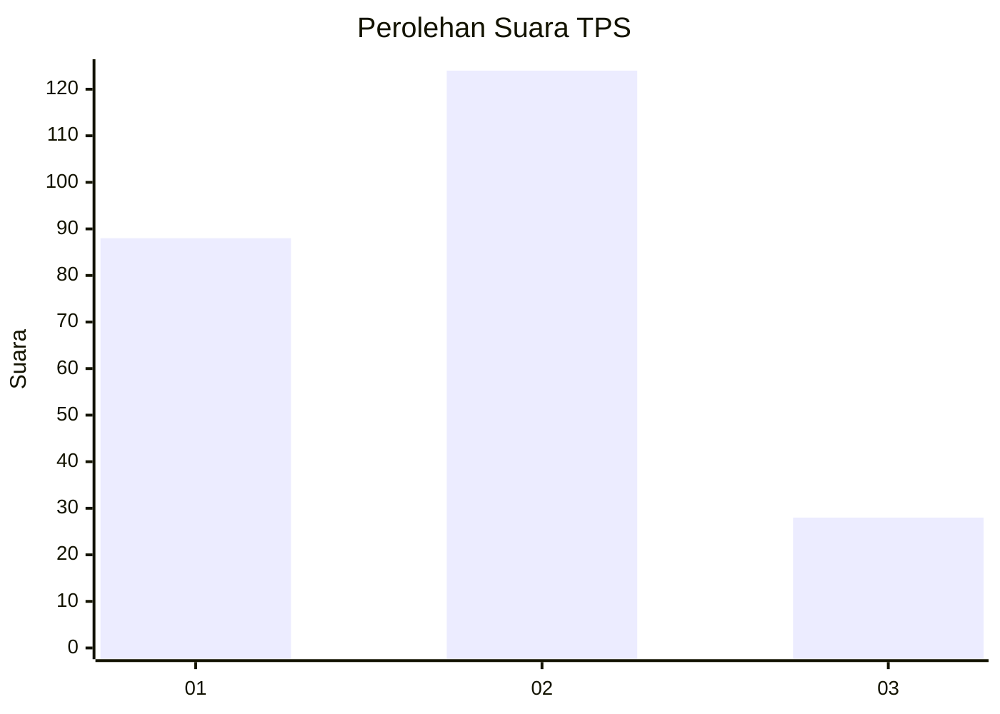
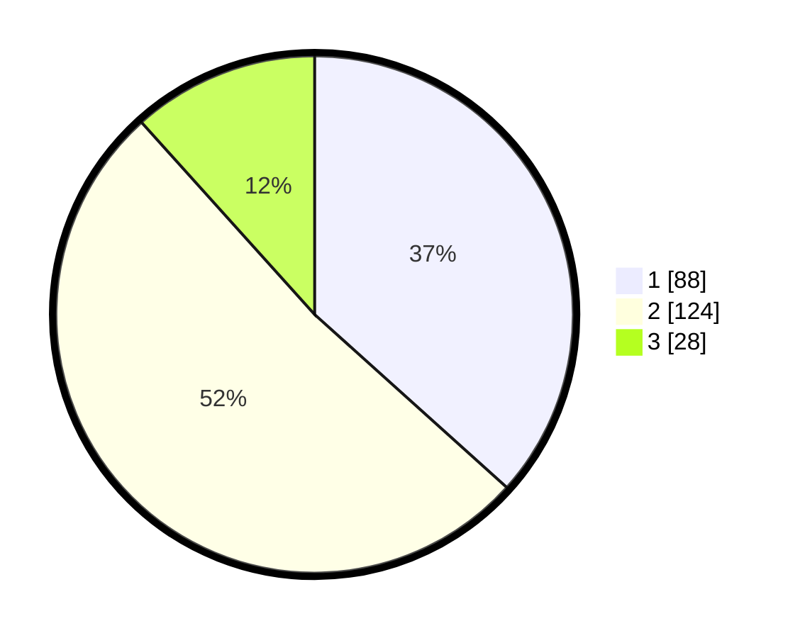

# Hasil

## Grafik

## Tabel

| No. | Nama Paslon    | Suara | Suara (raw) | Persentase |
|:--- |:-------------- | -----:| -----------:| ----------:|
| 1   | ANIES MUHAIMIN | 88    | [88][p-1]   | 36,67      |
| 2   | PRABOWO GIBRAN | 124   | [124][p-2]  | 51,67      |
| 3   | GANJAR MAHFUD  | 28    | [28][p-3]   | 11,67      |

[p-1]: https://github.com/gigit-pemilu/pemilu-2024/blob/main/pilpres/hitung-suara/sub/35-jawa-timur/sub/25-gresik/sub/16-gresik/sub/1010-sido-kumpul/sub/023-tps/sub/paslon-1.txt
[p-2]: https://github.com/gigit-pemilu/pemilu-2024/blob/main/pilpres/hitung-suara/sub/35-jawa-timur/sub/25-gresik/sub/16-gresik/sub/1010-sido-kumpul/sub/023-tps/sub/paslon-2.txt
[p-3]: https://github.com/gigit-pemilu/pemilu-2024/blob/main/pilpres/hitung-suara/sub/35-jawa-timur/sub/25-gresik/sub/16-gresik/sub/1010-sido-kumpul/sub/023-tps/sub/paslon-3.txt

## Foto C Plano

https://sirekap-obj-formc.kpu.go.id/53a5/pemilu/ppwp/35/25/16/10/10/3525161010023-20240214-213621--46c3f97f-3db1-4c63-96f7-d47d31655275.jpg

https://sirekap-obj-formc.kpu.go.id/53a5/pemilu/ppwp/35/25/16/10/10/3525161010023-20240214-213527--dfaa5563-801c-44cf-9ca7-7c362c90aa6c.jpg

https://sirekap-obj-formc.kpu.go.id/53a5/pemilu/ppwp/35/25/16/10/10/3525161010023-20240214-213820--e9277a0b-5203-4ecf-a6d5-87f004711d66.jpg

## Metadata

| Key        | Value               |
| ---------- | ------------------- |
| Time Stamp | 2024-02-16 14:00:34 |

