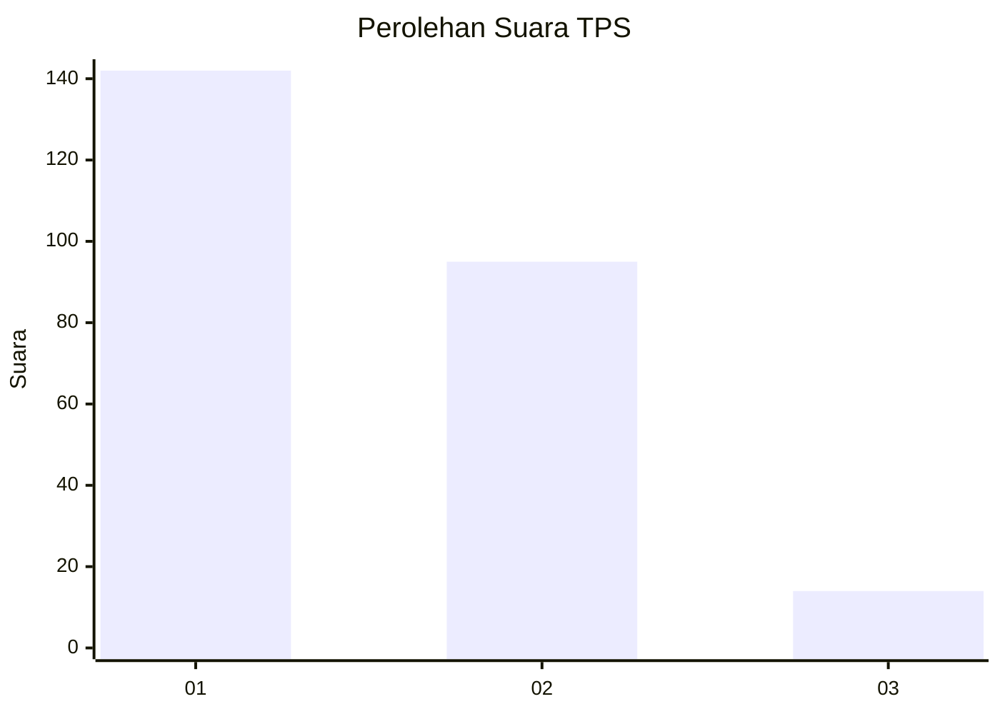
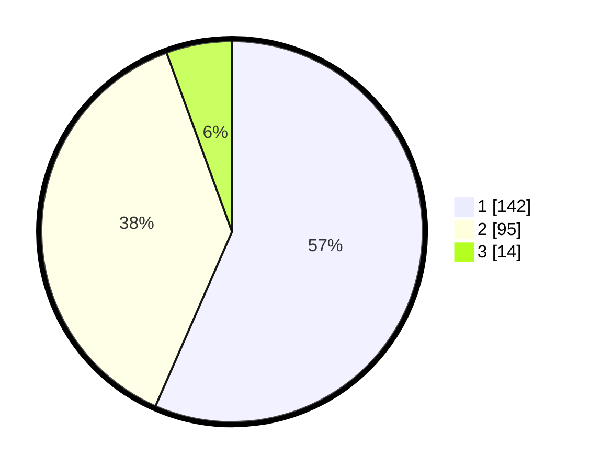

# Hasil

## Grafik

## Tabel

| No. | Nama Paslon    | Suara | Suara (raw) | Persentase |
|:--- |:-------------- | -----:| -----------:| ----------:|
| 1   | ANIES MUHAIMIN | 142   | [142][p-1]  | 56,57      |
| 2   | PRABOWO GIBRAN | 95    | [95][p-2]   | 37,85      |
| 3   | GANJAR MAHFUD  | 14    | [14][p-3]   | 5,58       |

[p-1]: https://github.com/gigit-pemilu/pemilu-2024/blob/main/pilpres/hitung-suara/sub/35-jawa-timur/sub/25-gresik/sub/16-gresik/sub/2018-gapuro-sukolilo/sub/003-tps/sub/paslon-1.txt
[p-2]: https://github.com/gigit-pemilu/pemilu-2024/blob/main/pilpres/hitung-suara/sub/35-jawa-timur/sub/25-gresik/sub/16-gresik/sub/2018-gapuro-sukolilo/sub/003-tps/sub/paslon-2.txt
[p-3]: https://github.com/gigit-pemilu/pemilu-2024/blob/main/pilpres/hitung-suara/sub/35-jawa-timur/sub/25-gresik/sub/16-gresik/sub/2018-gapuro-sukolilo/sub/003-tps/sub/paslon-3.txt

## Foto C Plano

https://sirekap-obj-formc.kpu.go.id/4fa8/pemilu/ppwp/35/25/16/20/18/3525162018003-20240215-053844--a4561be5-43ee-49f9-9add-ee0dbd2643f5.jpg

https://sirekap-obj-formc.kpu.go.id/4fa8/pemilu/ppwp/35/25/16/20/18/3525162018003-20240215-054103--68268953-d0fc-4240-890f-15d8323b2ece.jpg

https://sirekap-obj-formc.kpu.go.id/4fa8/pemilu/ppwp/35/25/16/20/18/3525162018003-20240215-054229--c041b3e0-17f5-4721-ae0f-080e61f90d11.jpg

## Metadata

| Key        | Value               |
| ---------- | ------------------- |
| Time Stamp | 2024-02-16 14:00:34 |

