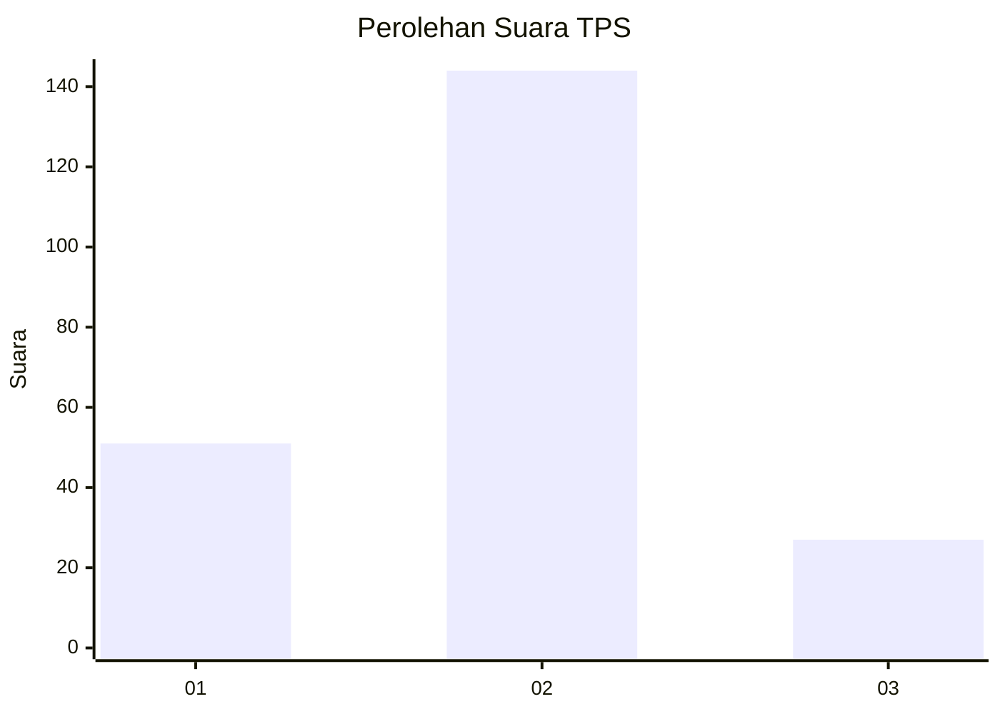
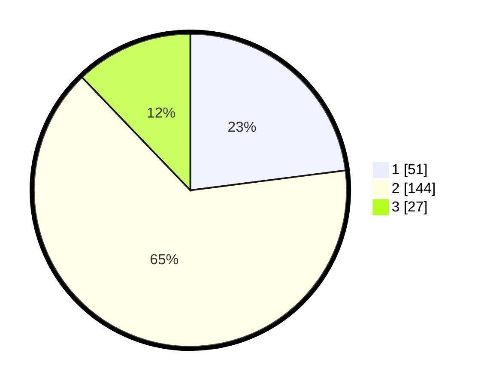

# Hasil

## Grafik

## Tabel

| No. | Nama Paslon    | Suara | Suara (raw) | Persentase |
|:--- |:-------------- | -----:| -----------:| ----------:|
| 1   | ANIES MUHAIMIN | 51    | [51][p-1]   | 22,97      |
| 2   | PRABOWO GIBRAN | 144   | [144][p-2]  | 64,86      |
| 3   | GANJAR MAHFUD  | 27    | [27][p-3]   | 12,16      |

[p-1]: https://github.com/gigit-pemilu/pemilu-2024/blob/main/pilpres/hitung-suara/sub/35-jawa-timur/sub/25-gresik/sub/16-gresik/sub/2021-sidorukun/sub/004-tps/sub/paslon-1.txt
[p-2]: https://github.com/gigit-pemilu/pemilu-2024/blob/main/pilpres/hitung-suara/sub/35-jawa-timur/sub/25-gresik/sub/16-gresik/sub/2021-sidorukun/sub/004-tps/sub/paslon-2.txt
[p-3]: https://github.com/gigit-pemilu/pemilu-2024/blob/main/pilpres/hitung-suara/sub/35-jawa-timur/sub/25-gresik/sub/16-gresik/sub/2021-sidorukun/sub/004-tps/sub/paslon-3.txt

## Foto C Plano

https://sirekap-obj-formc.kpu.go.id/5b41/pemilu/ppwp/35/25/16/20/21/3525162021004-20240215-061631--e3348104-f5fa-42d4-afa7-d31ac296fbb3.jpg

https://sirekap-obj-formc.kpu.go.id/5b41/pemilu/ppwp/35/25/16/20/21/3525162021004-20240215-061809--5efdee35-3d8b-4855-b9fb-13dbcaaee755.jpg

https://sirekap-obj-formc.kpu.go.id/5b41/pemilu/ppwp/35/25/16/20/21/3525162021004-20240215-061953--fcb7e33c-1490-48e3-9426-94e6577ad770.jpg

## Metadata

| Key        | Value               |
| ---------- | ------------------- |
| Time Stamp | 2024-02-16 14:00:34 |

