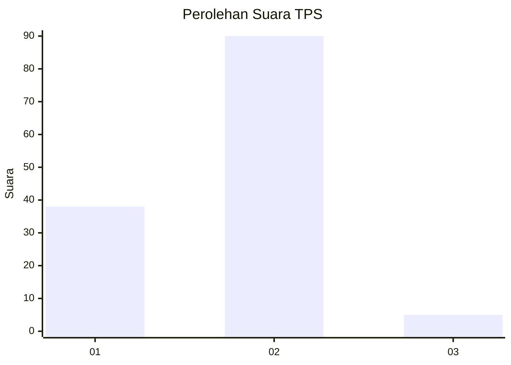
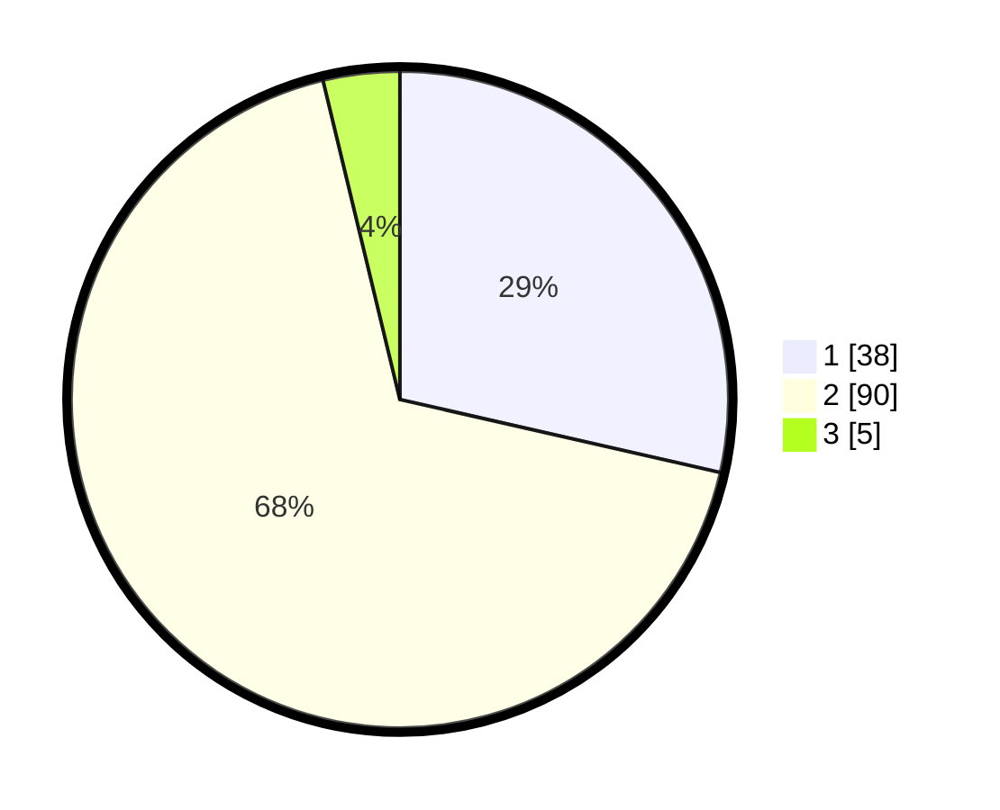

# Hasil

## Grafik

## Tabel

| No. | Nama Paslon    | Suara | Suara (raw) | Persentase |
|:--- |:-------------- | -----:| -----------:| ----------:|
| 1   | ANIES MUHAIMIN | 38    | [38][p-1]   | 28,57      |
| 2   | PRABOWO GIBRAN | 90    | [90][p-2]   | 67,67      |
| 3   | GANJAR MAHFUD  | 5     | [5][p-3]    | 3,76       |

[p-1]: https://github.com/gigit-pemilu/pemilu-2024/blob/main/pilpres/hitung-suara/sub/35-jawa-timur/sub/25-gresik/sub/17-sangkapura/sub/2001-dekatagung/sub/001-tps/sub/paslon-1.txt
[p-2]: https://github.com/gigit-pemilu/pemilu-2024/blob/main/pilpres/hitung-suara/sub/35-jawa-timur/sub/25-gresik/sub/17-sangkapura/sub/2001-dekatagung/sub/001-tps/sub/paslon-2.txt
[p-3]: https://github.com/gigit-pemilu/pemilu-2024/blob/main/pilpres/hitung-suara/sub/35-jawa-timur/sub/25-gresik/sub/17-sangkapura/sub/2001-dekatagung/sub/001-tps/sub/paslon-3.txt

## Foto C Plano

https://sirekap-obj-formc.kpu.go.id/22fe/pemilu/ppwp/35/25/17/20/01/3525172001001-20240215-022217--5649f427-410b-4ddf-9929-d3761f4d1d87.jpg

https://sirekap-obj-formc.kpu.go.id/22fe/pemilu/ppwp/35/25/17/20/01/3525172001001-20240214-232434--b72cc2e4-cc36-45c7-a60a-1ced145a602a.jpg

https://sirekap-obj-formc.kpu.go.id/22fe/pemilu/ppwp/35/25/17/20/01/3525172001001-20240215-022629--25adb608-b9ca-43a0-a867-b0d1e816ce90.jpg

## Metadata

| Key        | Value               |
| ---------- | ------------------- |
| Time Stamp | 2024-02-16 16:25:10 |

