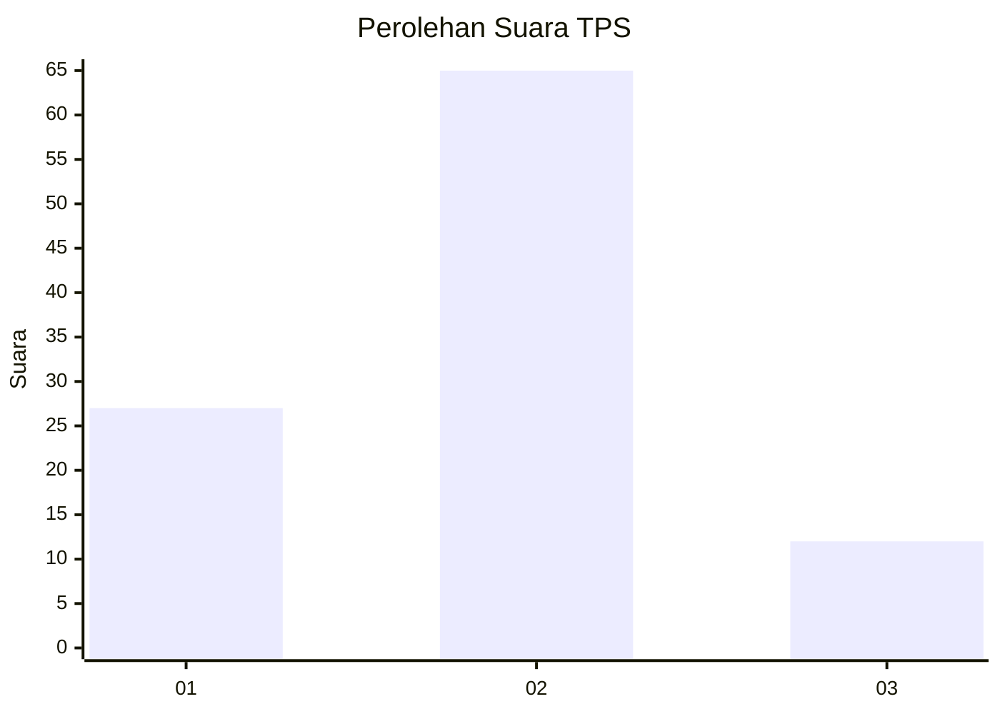
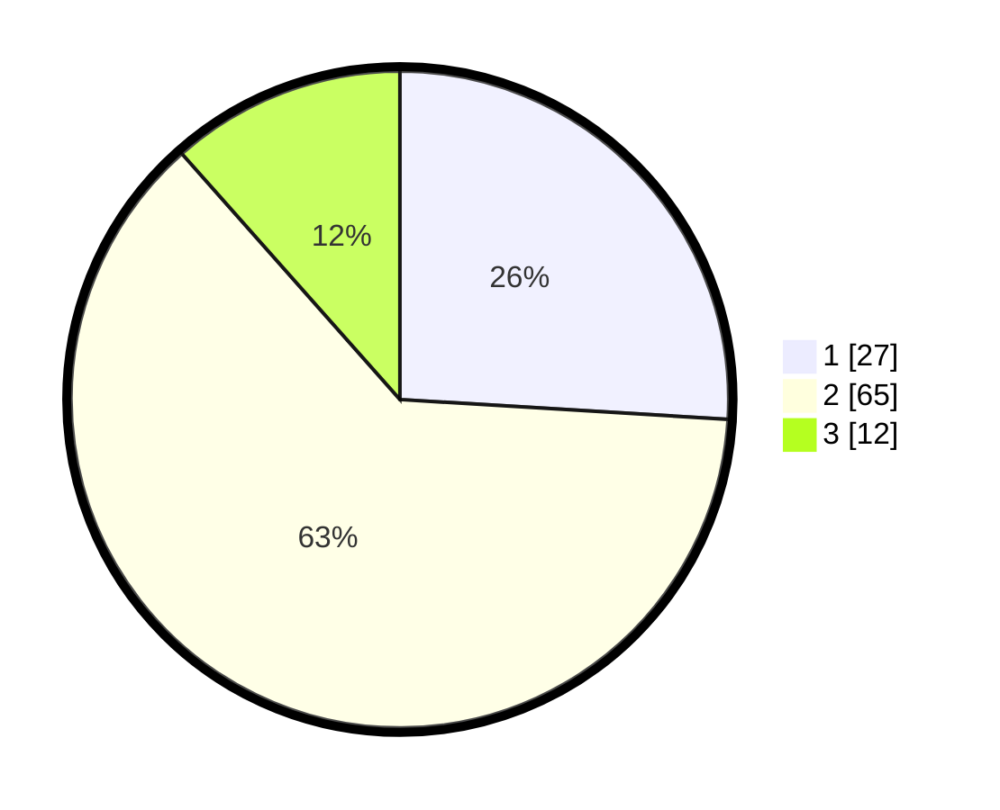

# Hasil

## Grafik

## Tabel

| No. | Nama Paslon    | Suara | Suara (raw) | Persentase |
|:--- |:-------------- | -----:| -----------:| ----------:|
| 1   | ANIES MUHAIMIN | 27    | [27][p-1]   | 25,96      |
| 2   | PRABOWO GIBRAN | 65    | [65][p-2]   | 62,50      |
| 3   | GANJAR MAHFUD  | 12    | [12][p-3]   | 11,54      |

[p-1]: https://github.com/gigit-pemilu/pemilu-2024/blob/main/pilpres/hitung-suara/sub/35-jawa-timur/sub/25-gresik/sub/17-sangkapura/sub/2001-dekatagung/sub/002-tps/sub/paslon-1.txt
[p-2]: https://github.com/gigit-pemilu/pemilu-2024/blob/main/pilpres/hitung-suara/sub/35-jawa-timur/sub/25-gresik/sub/17-sangkapura/sub/2001-dekatagung/sub/002-tps/sub/paslon-2.txt
[p-3]: https://github.com/gigit-pemilu/pemilu-2024/blob/main/pilpres/hitung-suara/sub/35-jawa-timur/sub/25-gresik/sub/17-sangkapura/sub/2001-dekatagung/sub/002-tps/sub/paslon-3.txt

## Foto C Plano

https://sirekap-obj-formc.kpu.go.id/6566/pemilu/ppwp/35/25/17/20/01/3525172001002-20240216-130603--aea7b09c-37a6-42ad-a924-bf44c799d545.jpg

https://sirekap-obj-formc.kpu.go.id/6566/pemilu/ppwp/35/25/17/20/01/3525172001002-20240215-033604--d494141b-6264-4dc4-80f7-4585e4a003f7.jpg

https://sirekap-obj-formc.kpu.go.id/6566/pemilu/ppwp/35/25/17/20/01/3525172001002-20240215-033749--dfc51db8-a44e-4a15-b7dd-a89c91d80fec.jpg

## Metadata

| Key        | Value               |
| ---------- | ------------------- |
| Time Stamp | 2024-02-24 22:31:28 |

