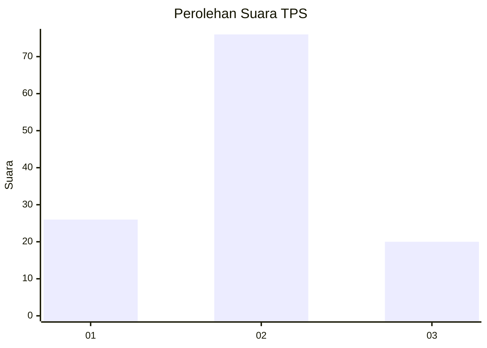
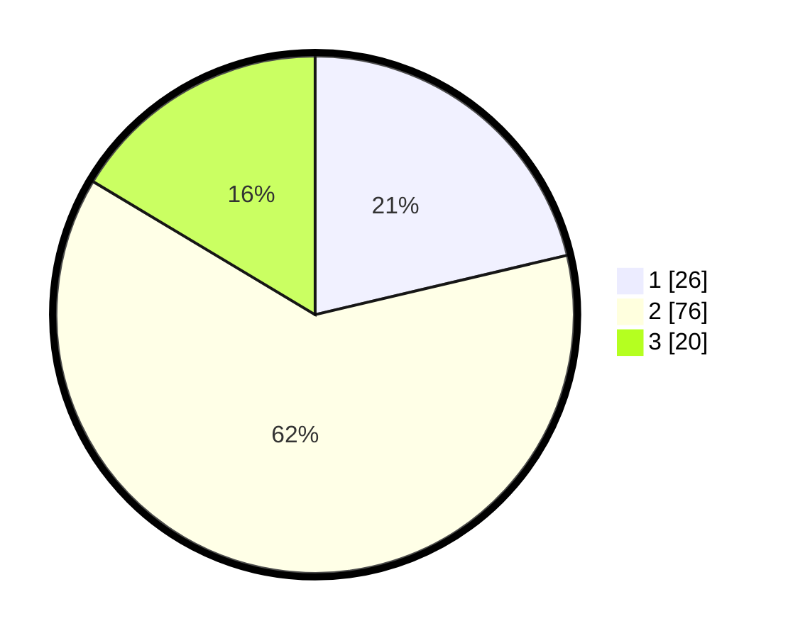

# Hasil

## Grafik

## Tabel

| No. | Nama Paslon    | Suara | Suara (raw) | Persentase |
|:--- |:-------------- | -----:| -----------:| ----------:|
| 1   | ANIES MUHAIMIN | 26    | [26][p-1]   | 21,31      |
| 2   | PRABOWO GIBRAN | 76    | [76][p-2]   | 62,30      |
| 3   | GANJAR MAHFUD  | 20    | [20][p-3]   | 16,39      |

[p-1]: https://github.com/gigit-pemilu/pemilu-2024-35-jawa-timur/blob/main/pilpres/hitung-suara/sub/35-jawa-timur/sub/25-gresik/sub/17-sangkapura/sub/2001-dekatagung/sub/003-tps/sub/paslon-1.txt
[p-2]: https://github.com/gigit-pemilu/pemilu-2024-35-jawa-timur/blob/main/pilpres/hitung-suara/sub/35-jawa-timur/sub/25-gresik/sub/17-sangkapura/sub/2001-dekatagung/sub/003-tps/sub/paslon-2.txt
[p-3]: https://github.com/gigit-pemilu/pemilu-2024-35-jawa-timur/blob/main/pilpres/hitung-suara/sub/35-jawa-timur/sub/25-gresik/sub/17-sangkapura/sub/2001-dekatagung/sub/003-tps/sub/paslon-3.txt

## Foto C Plano

https://sirekap-obj-formc.kpu.go.id/68b0/pemilu/ppwp/35/25/17/20/01/3525172001003-20240215-001652--2124f54c-8560-44c5-84d5-ed8d95e0c656.jpg

https://sirekap-obj-formc.kpu.go.id/68b0/pemilu/ppwp/35/25/17/20/01/3525172001003-20240215-112822--46b910d9-4a9d-4ed7-b07b-42e06639db4f.jpg

https://sirekap-obj-formc.kpu.go.id/68b0/pemilu/ppwp/35/25/17/20/01/3525172001003-20240215-001815--e203f6e6-7183-4823-9cdd-98c1c0e45b1b.jpg

## Metadata

| Key        | Value               |
| ---------- | ------------------- |
| Time Stamp | 2024-02-16 16:25:10 |

## DATA PEMILIH TETAP

Jumlah pemilih dalam DPT: **197**.
 * L: **108**.
 * P: **89**.

## DATA PENGGUNA HAK PILIH

Jumlah pengguna hak pilih dalam DPT: **136**.
 * L: **62**.
 * P: **74**.

Jumlah pengguna hak pilih dalam DPTb: **0**.
 * L: **0**.
 * P: **0**.

Jumlah pengguna hak pilih dalam DPK: **0**.
 * L: **0**.
 * P: **0**.

Jumlah pengguna hak pilih: **136**.
 * L: **62**.
 * P: **74**.

## JUMLAH SUARA SAH DAN TIDAK SAH

JUMLAH SELURUH SUARA SAH: **122**.

JUMLAH SUARA TIDAK SAH: **14**.

JUMLAH SELURUH SUARA SAH DAN SUARA TIDAK SAH: **136**.

