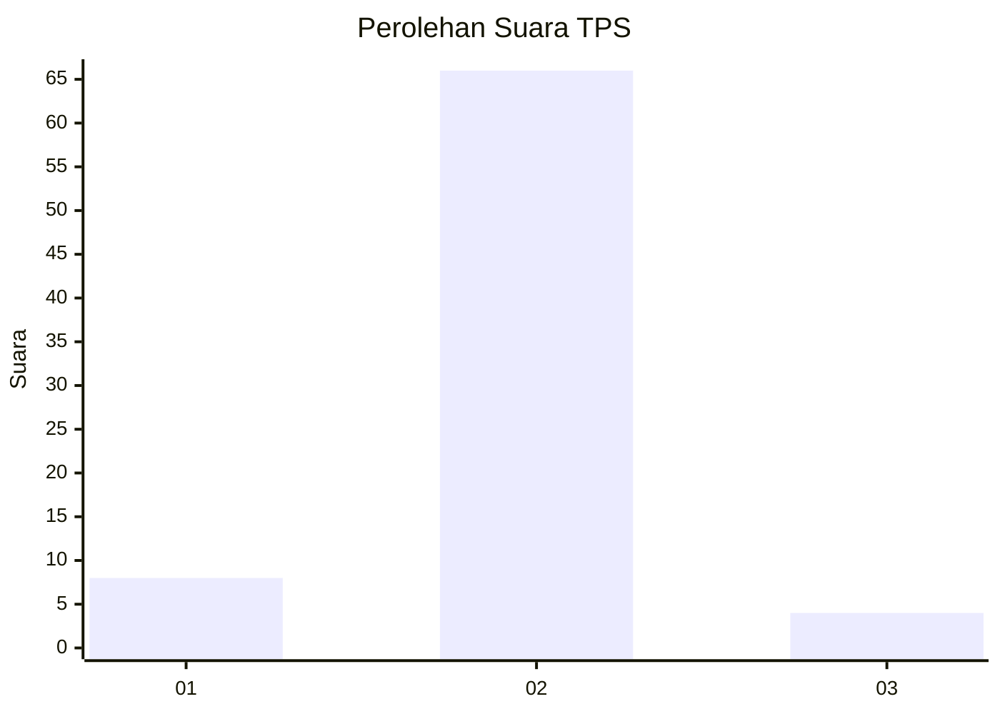
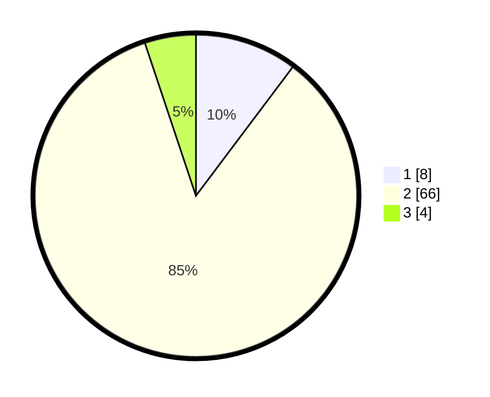

# Hasil

## Grafik

## Tabel

| No. | Nama Paslon    | Suara | Suara (raw) | Persentase |
|:--- |:-------------- | -----:| -----------:| ----------:|
| 1   | ANIES MUHAIMIN | 8     | [8][p-1]    | 10,26      |
| 2   | PRABOWO GIBRAN | 66    | [66][p-2]   | 84,62      |
| 3   | GANJAR MAHFUD  | 4     | [4][p-3]    | 5,13       |

[p-1]: https://github.com/gigit-pemilu/pemilu-2024/blob/main/pilpres/hitung-suara/sub/35-jawa-timur/sub/25-gresik/sub/17-sangkapura/sub/2001-dekatagung/sub/006-tps/sub/paslon-1.txt
[p-2]: https://github.com/gigit-pemilu/pemilu-2024/blob/main/pilpres/hitung-suara/sub/35-jawa-timur/sub/25-gresik/sub/17-sangkapura/sub/2001-dekatagung/sub/006-tps/sub/paslon-2.txt
[p-3]: https://github.com/gigit-pemilu/pemilu-2024/blob/main/pilpres/hitung-suara/sub/35-jawa-timur/sub/25-gresik/sub/17-sangkapura/sub/2001-dekatagung/sub/006-tps/sub/paslon-3.txt

## Foto C Plano

https://sirekap-obj-formc.kpu.go.id/0a64/pemilu/ppwp/35/25/17/20/01/3525172001006-20240214-225756--9d9426db-06b1-4956-811c-ca3bfb66b5a4.jpg

https://sirekap-obj-formc.kpu.go.id/0a64/pemilu/ppwp/35/25/17/20/01/3525172001006-20240214-225838--521a223e-1922-4bb5-a614-49784974377c.jpg

https://sirekap-obj-formc.kpu.go.id/0a64/pemilu/ppwp/35/25/17/20/01/3525172001006-20240214-225935--9b01d337-1b0c-4f96-ae19-39b45d7901de.jpg

## Metadata

| Key        | Value               |
| ---------- | ------------------- |
| Time Stamp | 2024-02-16 16:25:10 |

