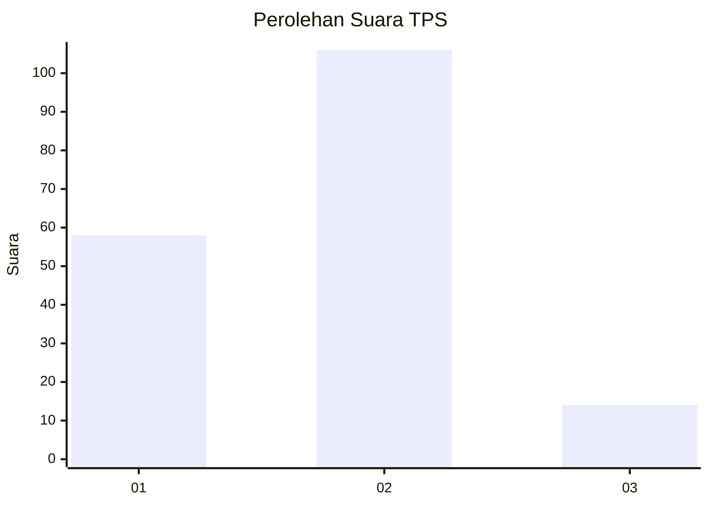
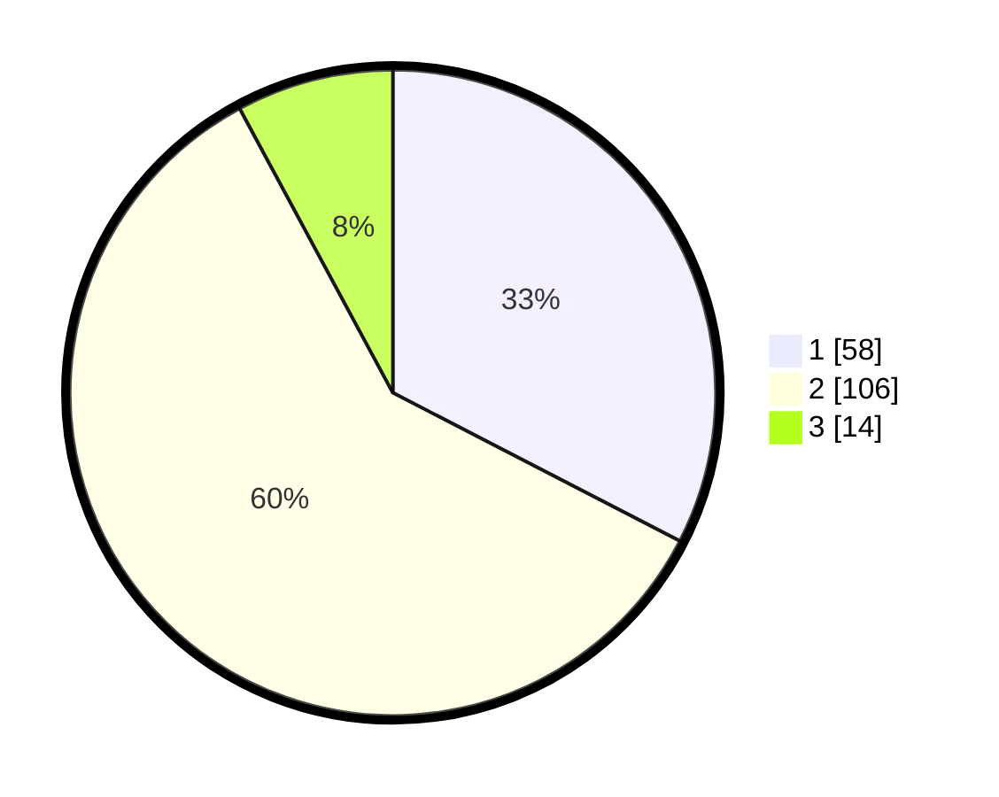

# Hasil

## Grafik

## Tabel

| No. | Nama Paslon    | Suara | Suara (raw) | Persentase |
|:--- |:-------------- | -----:| -----------:| ----------:|
| 1   | ANIES MUHAIMIN | 58    | [58][p-1]   | 32,58      |
| 2   | PRABOWO GIBRAN | 106   | [106][p-2]  | 59,55      |
| 3   | GANJAR MAHFUD  | 14    | [14][p-3]   | 7,87       |

[p-1]: https://github.com/gigit-pemilu/pemilu-2024/blob/main/pilpres/hitung-suara/sub/35-jawa-timur/sub/25-gresik/sub/17-sangkapura/sub/2004-pudakitbarat/sub/001-tps/sub/paslon-1.txt
[p-2]: https://github.com/gigit-pemilu/pemilu-2024/blob/main/pilpres/hitung-suara/sub/35-jawa-timur/sub/25-gresik/sub/17-sangkapura/sub/2004-pudakitbarat/sub/001-tps/sub/paslon-2.txt
[p-3]: https://github.com/gigit-pemilu/pemilu-2024/blob/main/pilpres/hitung-suara/sub/35-jawa-timur/sub/25-gresik/sub/17-sangkapura/sub/2004-pudakitbarat/sub/001-tps/sub/paslon-3.txt

## Foto C Plano

https://sirekap-obj-formc.kpu.go.id/ac0e/pemilu/ppwp/35/25/17/20/04/3525172004001-20240215-072024--68e0b118-d9f4-4361-b886-f6fb8dfd11ae.jpg

https://sirekap-obj-formc.kpu.go.id/ac0e/pemilu/ppwp/35/25/17/20/04/3525172004001-20240215-072052--d88d431b-6ac5-475b-88e9-7496b56ecba6.jpg

https://sirekap-obj-formc.kpu.go.id/ac0e/pemilu/ppwp/35/25/17/20/04/3525172004001-20240215-072111--59723885-4ec3-433f-bd39-878f29088bf4.jpg

## Metadata

| Key        | Value               |
| ---------- | ------------------- |
| Time Stamp | 2024-02-20 15:00:00 |

