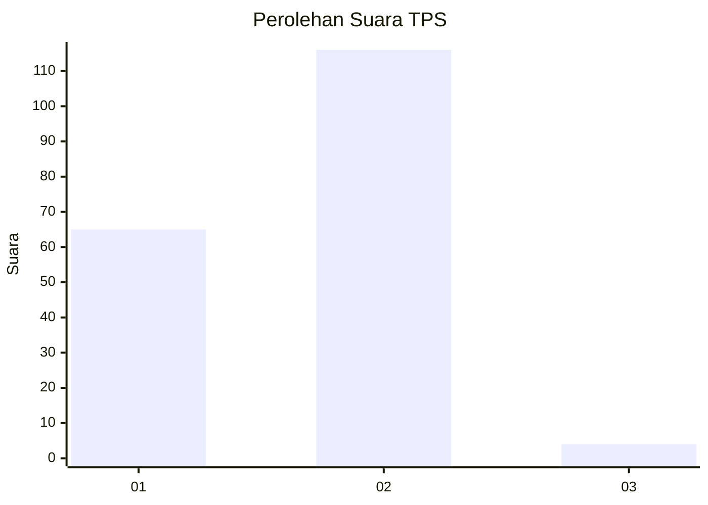
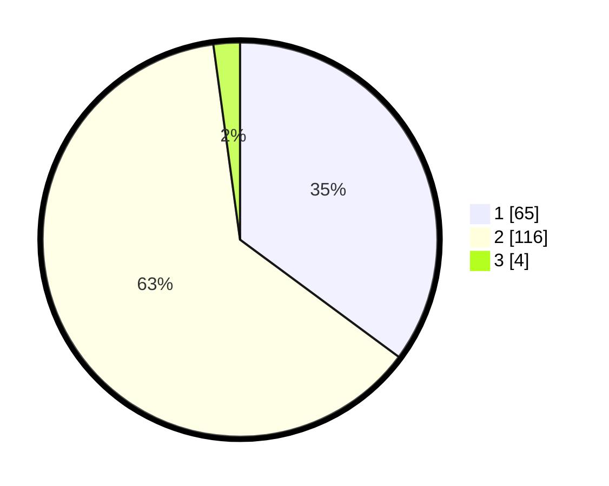

# Hasil

## Grafik

## Tabel

| No. | Nama Paslon    | Suara | Suara (raw) | Persentase |
|:--- |:-------------- | -----:| -----------:| ----------:|
| 1   | ANIES MUHAIMIN | 65    | [65][p-1]   | 35,14      |
| 2   | PRABOWO GIBRAN | 116   | [116][p-2]  | 62,70      |
| 3   | GANJAR MAHFUD  | 4     | [4][p-3]    | 2,16       |

[p-1]: https://github.com/gigit-pemilu/pemilu-2024/blob/main/pilpres/hitung-suara/sub/35-jawa-timur/sub/25-gresik/sub/17-sangkapura/sub/2005-pudakittimur/sub/002-tps/sub/paslon-1.txt
[p-2]: https://github.com/gigit-pemilu/pemilu-2024/blob/main/pilpres/hitung-suara/sub/35-jawa-timur/sub/25-gresik/sub/17-sangkapura/sub/2005-pudakittimur/sub/002-tps/sub/paslon-2.txt
[p-3]: https://github.com/gigit-pemilu/pemilu-2024/blob/main/pilpres/hitung-suara/sub/35-jawa-timur/sub/25-gresik/sub/17-sangkapura/sub/2005-pudakittimur/sub/002-tps/sub/paslon-3.txt

## Foto C Plano

https://sirekap-obj-formc.kpu.go.id/db21/pemilu/ppwp/35/25/17/20/05/3525172005002-20240215-010347--f027ee29-37b0-48c2-a3b1-db056c481d18.jpg

https://sirekap-obj-formc.kpu.go.id/db21/pemilu/ppwp/35/25/17/20/05/3525172005002-20240215-005319--47fb8e9a-a936-4cdf-8398-db2a75298fd3.jpg

https://sirekap-obj-formc.kpu.go.id/db21/pemilu/ppwp/35/25/17/20/05/3525172005002-20240215-010655--1bd2f40f-51cc-4ce4-baeb-a75166110503.jpg

## Metadata

| Key        | Value               |
| ---------- | ------------------- |
| Time Stamp | 2024-02-20 15:00:00 |

