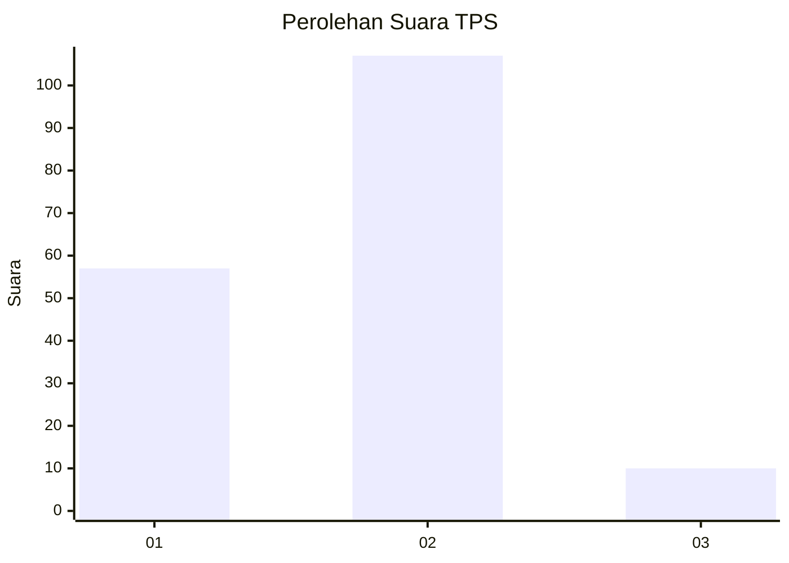
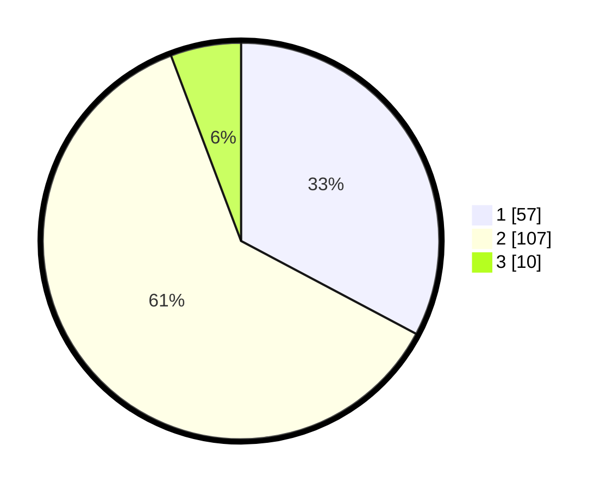

# Hasil

## Grafik

## Tabel

| No. | Nama Paslon    | Suara | Suara (raw) | Persentase |
|:--- |:-------------- | -----:| -----------:| ----------:|
| 1   | ANIES MUHAIMIN | 57    | [57][p-1]   | 32,76      |
| 2   | PRABOWO GIBRAN | 107   | [107][p-2]  | 61,49      |
| 3   | GANJAR MAHFUD  | 10    | [10][p-3]   | 5,75       |

[p-1]: https://github.com/gigit-pemilu/pemilu-2024/blob/main/pilpres/hitung-suara/sub/35-jawa-timur/sub/25-gresik/sub/17-sangkapura/sub/2005-pudakittimur/sub/004-tps/sub/paslon-1.txt
[p-2]: https://github.com/gigit-pemilu/pemilu-2024/blob/main/pilpres/hitung-suara/sub/35-jawa-timur/sub/25-gresik/sub/17-sangkapura/sub/2005-pudakittimur/sub/004-tps/sub/paslon-2.txt
[p-3]: https://github.com/gigit-pemilu/pemilu-2024/blob/main/pilpres/hitung-suara/sub/35-jawa-timur/sub/25-gresik/sub/17-sangkapura/sub/2005-pudakittimur/sub/004-tps/sub/paslon-3.txt

## Foto C Plano

https://sirekap-obj-formc.kpu.go.id/541c/pemilu/ppwp/35/25/17/20/05/3525172005004-20240214-223322--3ea55afe-63ff-4fbd-a98e-c5b895733b3d.jpg

https://sirekap-obj-formc.kpu.go.id/541c/pemilu/ppwp/35/25/17/20/05/3525172005004-20240215-013731--9853d3e3-20f6-4ce7-a64b-3f3062691bb9.jpg

https://sirekap-obj-formc.kpu.go.id/541c/pemilu/ppwp/35/25/17/20/05/3525172005004-20240215-013848--baef86c6-208c-45e8-b1cc-7cc80ca06a4d.jpg

## Metadata

| Key        | Value               |
| ---------- | ------------------- |
| Time Stamp | 2024-02-16 16:25:10 |

